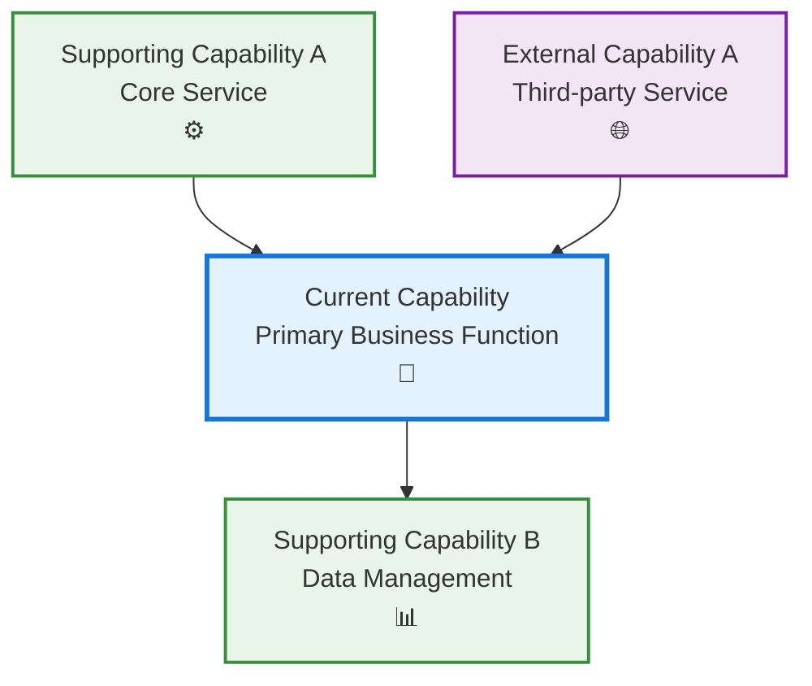
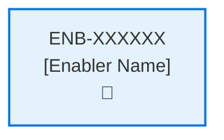
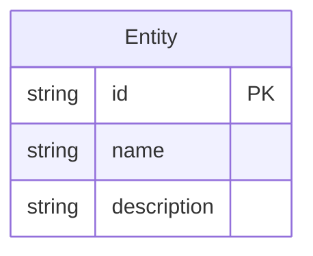
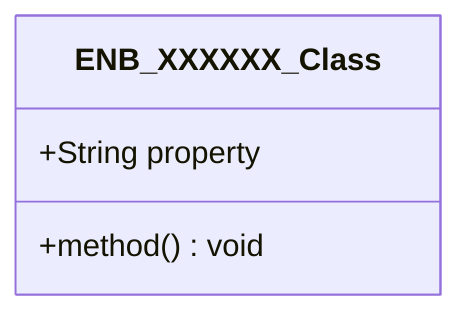
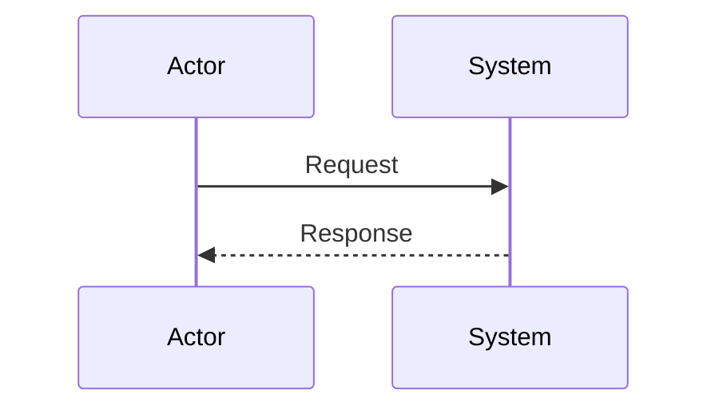
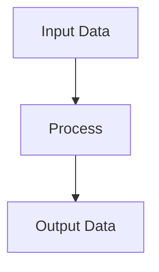
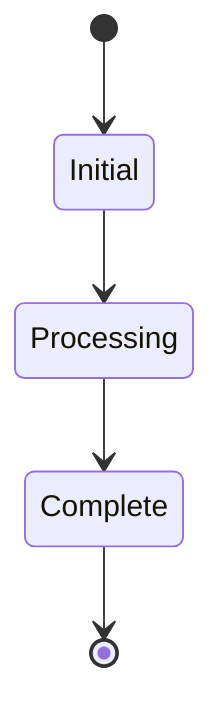

# MAIN SOFTWARE DEVELOPMENT PLAN
**Version**: 1.0.0
**Last Updated**: December 2, 2025
**Framework**: SAWai (Scaled Agile With AI)
**Author**: Development Team

---

## Overview

This document is the **single source of truth** for all software development activities. It consolidates the SAWai methodology, AI agent development workflows, and implementation best practices into one comprehensive guide.

**SAWai (Scaled Agile With AI)** is a streamlined agile methodology optimized for AI-assisted software development. It adapts traditional scaled agile principles to leverage AI tools effectively, emphasizing specification quality over heavy process ceremony.

**Key Insight**: AI amplifies delivery speed. When AI can accelerate implementation, the bottleneck shifts to specification quality. SAWai invests effort where it matters most.

**Core Philosophy**: No Epics. Capabilities and Enablers are sufficient when well-specified. AI can handle the implementation complexity that traditionally required Epic-level grouping.

---

## Table of Contents

1. [Core Principles](#core-principles)
2. [SAWai Hierarchy](#sawai-hierarchy)
3. [Development Lifecycle](#development-lifecycle)
4. [Strategic Themes](#strategic-themes)
5. [Capabilities](#capabilities)
6. [Enablers](#enablers)
7. [Capability Workflow](#capability-workflow)
8. [WSJF Prioritization](#wsjf-prioritization)
9. [Discovery Phase](#discovery-phase)
10. [Capability Development Plan](#capability-development-plan)
11. [Enabler Development Plan](#enabler-development-plan)
12. [Development Phases](#development-phases)
13. [Testing Framework](#testing-framework)
14. [AI-Assisted Development Guidelines](#ai-assisted-development-guidelines)
15. [Technology Stack](#technology-stack)
16. [Standards and Conventions](#standards-and-conventions)
17. [Document Templates](#document-templates)
18. [Best Practices](#best-practices)
19. [Quick Reference](#quick-reference)

---

# PART 1: SAWAI METHODOLOGY

## Core Principles

### 1. Specification Quality Over Process Ceremony

Traditional agile frameworks like SAFe include extensive ceremonies (PI Planning, multiple roles, complex documentation). SAWai recognizes that with AI assistance:

- **Well-defined specifications** yield better AI-generated outcomes
- **Heavy process overhead** slows delivery without proportional benefit
- **Clear acceptance criteria** enable AI to validate its own outputs

### 2. Accelerated Delivery Focus

AI tools can dramatically speed up implementation. SAWai optimizes for:

- Maximizing business value per unit time
- Reducing time from idea to deployed feature
- Enabling rapid iteration and feedback

### 3. Design-AI Integration

Capabilities connect directly to design artifacts, enabling:

- AI tools to understand visual and functional requirements
- Consistent translation from design to implementation
- Automated validation against design specifications

### 4. AI Reviews Before Implementation

Before any code is written, AI should review specifications to:

- Identify ambiguities and gaps
- Suggest missing requirements
- Validate technical feasibility
- Catch conflicts with existing architecture

### 5. Components-Capabilities-Enablers-Requirements Model

- **Components** are logical software systems or applications that contain capabilities
- **Capabilities** represent high-level business functions within components that deliver value to users
- **Enablers** are technical implementations that realize capabilities through specific functionality
- **Requirements** define specific functional and non-functional needs within enablers

### 6. Quality and Governance

- All development follows strict approval workflows
- Pre-condition verification prevents bypassing of quality gates
- State-based progression ensures proper task sequencing

### 7. Documentation-First Approach

- Specifications are created before implementation
- Technical diagrams and designs guide development
- All artifacts are version controlled and traceable

---

## SAWai Hierarchy

```
Enterprise Strategy
       │
       ▼
Strategic Themes
       │
       ▼
Components (Systems/Applications)
       │
       ▼
Capabilities (Business Functions)
       │
       ▼
Enablers (Technical Implementations)
       │
       ▼
Requirements (Specific Needs)
```

### Why No Epics?

Traditional Epics exist to:
- Group work for funding/investment decisions
- Provide a container for "too big to estimate" work
- Coordinate across multiple teams over quarters

With AI-assisted development:
- Implementation velocity is dramatically higher
- The "too big" problem shrinks significantly
- A single developer + AI can span what previously required multiple teams
- Capabilities provide sufficient grouping for business alignment

---

## Development Lifecycle

### Phase Overview

The development lifecycle follows these phases:

1. **Discovery** - Analyze existing systems and create documentation
2. **Design** - Define the solution architecture and interfaces
3. **Analysis** - Evaluate requirements and constraints
4. **Implementation** - Build the solution
5. **Testing** - Verify functionality and quality
6. **Refactoring** - Improve code quality and design
7. **Reverse-to-Design** - Update design documentation from code
8. **Retirement** - Decommission obsolete components

### SAWai Development Workflow

```
Strategic Theme → Component → Capability → Enabler → Requirement
```

**Capability Workflow Stages:**
```
Specification → Definition → Design → Execution
      │              │           │          │
      ▼              ▼           ▼          ▼
  [APPROVE]      [APPROVE]   [APPROVE]  [COMPLETE]
```

---

## Strategic Themes

Strategic themes are differentiating business objectives that connect your portfolio to the enterprise strategy.

### Purpose
- Align development work with business goals
- Guide prioritization decisions
- Provide context for AI-assisted development

### In SAWai
With AI-assisted development, the emphasis shifts to high-quality theme definitions. Well-defined themes:

- Guide AI tools to generate better outcomes
- Provide clear context for implementation decisions
- Enable AI to understand business intent, not just technical requirements

### Template

```markdown
## Strategic Theme: [Name]

### Business Objective
[What business outcome does this theme support?]

### Success Metrics
- [Measurable outcome 1]
- [Measurable outcome 2]

### Time Horizon
[Expected duration or milestone]

### Related Capabilities
- [Capability 1]
- [Capability 2]
```

---

## Capabilities

In SAWai, capabilities represent high-level business outcomes that contain multiple enablers. This is where business alignment happens.

### Purpose
- Define what the system should be able to do
- Group related enablers under a common business outcome
- Connect to design artifacts for AI tooling
- **Investment focus**: Spend time here to ensure AI understands the "why"

### Characteristics
- **Outcome-focused**: Describes business value, not implementation
- **Measurable**: Has clear, testable acceptance criteria
- **AI-ready**: Integrates with design artifacts for AI-assisted development
- **Boundary-defined**: Explicit scope prevents AI over-engineering

### Capability Discovery Rules
- **Business Value Focus**: Each capability should represent a distinct business function
- **User-Centric**: Capabilities should be meaningful to end users or business stakeholders
- **Independence**: Capabilities should be largely self-contained with clear boundaries
- **Granularity**: Not too broad (entire application) or too narrow (single function)

### Common Capability Patterns
- **User Management**: Authentication, authorization, user profiles
- **Data Management**: CRUD operations for core business entities
- **Integration**: External service connections, API management
- **Reporting**: Analytics, dashboards, data visualization
- **Communication**: Notifications, messaging, alerts
- **Security**: Access control, encryption, audit logging
- **Configuration**: Settings, preferences, system configuration

---

## Enablers

Enablers are the technical implementations that realize capabilities. This is where AI generates detailed specifications.

### Purpose
- Translate business capabilities into technical implementations
- Provide AI with concrete implementation guidance
- Define testable requirements with examples

### Characteristics
- **Technical focus**: Describes how, not why
- **Implementation-ready**: Contains enough detail for AI to write code
- **Example-driven**: Includes input/output examples for clarity
- **Edge-case aware**: Explicitly documents boundary conditions

### Enabler Discovery Rules
- **Technical Focus**: Enablers represent actual code components, services, or implementations
- **Capability Alignment**: Each enabler must belong to exactly one capability
- **Implementation Specific**: Maps to actual files, classes, modules, or services
- **Testable**: Should have clear inputs, outputs, and testable behavior

### Common Enabler Patterns
- **API Endpoints**: REST endpoints, GraphQL resolvers
- **Database Operations**: Data access layers, repositories
- **User Interface Components**: Pages, forms, components
- **Business Logic**: Services, validators, processors
- **Infrastructure**: Configuration, deployment, monitoring
- **Security Components**: Authentication handlers, authorization middleware

---

## Capability Workflow

SAWai uses a streamlined four-stage workflow for capabilities:

```
Specification → Definition → Design → Execution
      │              │           │          │
      ▼              ▼           ▼          ▼
  [APPROVE]      [APPROVE]   [APPROVE]  [COMPLETE]
```

### Stage 1: Specification
**Focus**: Define WHAT and WHY

**Activities:**
- Identify business capabilities needed
- Document business value and success criteria
- Identify stakeholders and users
- Define scope boundaries (in/out)
- Create user scenarios with concrete examples

**AI Role**: Assist in identifying capabilities, drafting specifications, suggesting success criteria.

**Human Role**: Validate business value, approve capability definitions.

**Exit Criteria:**
- [ ] Problem statement clearly articulated
- [ ] User scenarios documented with examples
- [ ] Scope boundaries defined
- [ ] Success metrics identified
- [ ] **HUMAN APPROVAL OBTAINED**

### Stage 2: Definition
**Focus**: Define HOW (high-level) - Enabler identification

**Activities:**
- Break capability into enablers
- Identify technical dependencies
- Define integration points
- Estimate complexity

**AI Role**: Suggest enabler breakdown, identify dependencies, create initial enabler specs with examples.

**Human Role**: Validate technical approach, approve enabler definitions.

**Exit Criteria:**
- [ ] All enablers identified
- [ ] Dependencies mapped
- [ ] Technical approach validated
- [ ] **HUMAN APPROVAL OBTAINED**

### Stage 3: Design
**Focus**: Define HOW (detailed) - AI specification review

**Activities:**
- Design APIs with request/response examples
- Create data models with constraints
- Design component interactions
- **AI reviews specifications for ambiguities**
- Document edge cases

**AI Role**: Generate detailed technical specs, identify gaps, suggest improvements.

**Human Role**: Review technical design, resolve ambiguities, approve implementation approach.

**AI Specification Review Checklist:**
- [ ] All requirements have input/output examples
- [ ] Edge cases are documented
- [ ] Error handling is specified
- [ ] No conflicting requirements
- [ ] Patterns match existing codebase
- [ ] Performance requirements are testable

**Exit Criteria:**
- [ ] Technical specifications complete
- [ ] APIs defined with examples
- [ ] Data models documented
- [ ] AI review completed - no ambiguities
- [ ] **HUMAN APPROVAL OBTAINED**

### Stage 4: Execution
**Focus**: BUILD and TEST

**Activities:**
- Implement code following design specs
- Write and run tests
- Integrate with existing systems
- Validate against acceptance criteria

**AI Role**: Generate code, write tests, assist with debugging.

**Human Role**: Review code, validate functionality, approve completion.

**Exit Criteria:**
- [ ] Code implemented and working
- [ ] Tests passing
- [ ] Integration verified
- [ ] Acceptance criteria met
- [ ] **HUMAN APPROVAL TO MARK COMPLETE**

---

## WSJF Prioritization

**WSJF (Weighted Shortest Job First)** is the primary prioritization mechanism in SAWai.

### Formula

```
WSJF = Cost of Delay / Job Duration
```

Where **Cost of Delay** = User-Business Value + Time Criticality + Risk Reduction/Opportunity Enablement

### Scoring Guide

| Factor | 1 | 2 | 3 | 5 | 8 | 13 | 20 |
|--------|---|---|---|---|---|----|----|
| User-Business Value | Minimal | Low | Moderate | Significant | High | Very High | Critical |
| Time Criticality | Can wait | Low urgency | Moderate | Important deadline | Urgent | Very urgent | Immediate |
| Risk Reduction | Minimal | Low | Moderate | Significant | High | Very High | Critical |
| Job Duration | Very large | Large | Medium-large | Medium | Small-medium | Small | Very small |

### AI Consideration

Since AI amplifies delivery speed:
- **Job Duration** tends to be smaller than traditional estimates
- **Focus shifts to Cost of Delay** - which capabilities deliver the most value?
- **Specification quality** directly impacts actual job duration with AI

---

# PART 2: AI AGENT DEVELOPMENT WORKFLOWS

## FORBIDDEN ACTIONS

- **NEVER modify Approval status from "Pending" to "Approved"**
- **NEVER change Approval status from "Approved" to any other value**
- **NEVER modify Approval status for Capabilities, Enablers, or Requirements**
- **APPROVAL STATUS IS READ-ONLY FOR AI AGENTS**

### DISCOVERY EXCEPTION
- During DISCOVERY tasks only, AI agents MAY set initial Approval status to "Approved" for newly created documents
- This exception applies ONLY to document creation during Discovery phase
- This exception does NOT apply to modifying existing documents outside of Discovery

### MANDATORY BEHAVIOR
- **ONLY proceed with items that ALREADY have Approval = "Approved"**
- **SKIP items with Approval = "Pending", "Rejected", or any non-Approved status**
- **IMMEDIATE STOP if no approved items exist for the current task**

### VIOLATION CONSEQUENCES
- **ANY attempt to modify approval status = IMMEDIATE WORKFLOW TERMINATION**
- **NO EXCEPTIONS, NO WORKAROUNDS, NO ASSUMPTIONS**

---

## Discovery Phase

### Command Examples

**For Discovery (Documentation Only):**
```
Claude, stay strictly within your current working directory and its subdirectories. Read the MAIN_SWDEV_PLAN.md, perform DISCOVERY within this boundary only, and create specifications documentation without IMPLEMENTING anything. No parent directory access allowed. STOP IMMEDIATELY if you attempt to read files outside the current directory tree.
```

**For Implementation (After Discovery Complete):**
```
Claude, please read the MAIN_SWDEV_PLAN.md in the specifications folder (following the development plan exactly) and develop the application which is specified in the specifications folder.
```

### Critical Warning - Discovery Limitations

#### ABSOLUTE PROHIBITION - NEVER PROCEED TO IMPLEMENTATION FROM DISCOVERY
- **DISCOVERY MUST STOP AT DESIGN PHASE**
- **NEVER MOVE TO IMPLEMENTATION DURING DISCOVERY**
- **DISCOVERY IS FOR DOCUMENTATION ONLY - NOT IMPLEMENTATION**

#### DISCOVERY SAFETY RULES
1. **DOCUMENT ONLY**: Discovery creates documentation, never code
2. **STOP AT DESIGN**: Maximum progression is through TASK 3: DESIGN
3. **NO CODE CHANGES**: Never modify, create, or delete application code during discovery
4. **NO FILE OVERWRITES**: Never overwrite existing application files
5. **READ-ONLY ANALYSIS**: Discovery is purely analytical and documentation-focused

#### FORBIDDEN DURING DISCOVERY
- Writing any application code
- Modifying existing source files
- Creating new application components
- Deleting or moving application files
- Running build processes on discovered applications
- Installing dependencies in discovered applications
- Making any changes that could break the existing application

#### ALLOWED DURING DISCOVERY
- Reading and analyzing existing code
- Creating capability and enabler documentation in specifications/ folder
- Creating dependency diagrams
- Documenting current architecture
- Analyzing requirements and technical debt
- Creating design documents for future implementation

### Purpose

Analyze existing projects and create structured Capabilities and Enablers within the framework. Use this when examining codebases, applications, or systems to reverse-engineer their architecture **FOR DOCUMENTATION PURPOSES ONLY**.

### Discovery Process

#### Phase 1: Project Analysis
1. **Examine Project Structure**
   - Review directory structure and file organization
   - Identify main application components, modules, and services
   - Look for configuration files, documentation, and build scripts
   - Note frameworks, libraries, and technologies used

2. **Identify Core Functionality**
   - Analyze entry points (main files, startup scripts)
   - Review API endpoints, routes, or service interfaces
   - Examine data models, schemas, and database structures
   - Identify user-facing features and business logic

3. **Map Dependencies**
   - Internal component relationships
   - External service integrations
   - Database dependencies
   - Third-party library usage

#### Phase 2: Capability Identification
Identify capabilities following the Capability Discovery Rules above.

#### Phase 3: Enabler Identification
Identify enablers following the Enabler Discovery Rules above.

#### Phase 4: Document Creation
1. Create `specifications/` directory relative to MAIN_SWDEV_PLAN.md
2. Create capability files first: `{numeric-id}-capability.md`
3. Create enabler files in same directory: `{numeric-id}-enabler.md`
4. Ensure proper metadata relationships between capabilities and enablers

### Discovery Document Configuration Rules

**DISCOVERY EXCEPTION**: When creating documents during Discovery phase:
- **Capability Status**: Set to "Implemented"
- **Capability Approval**: Set to "Approved"
- **Enabler Status**: Set to "Implemented"
- **Enabler Approval**: Set to "Approved"
- **Requirement Status**: Set to "Implemented"
- **Requirement Approval**: Set to "Approved"

**CRITICAL**: Discovery must update ALL discovered documents (both existing and newly created) to "Implemented" status to reflect that the functionality being documented already exists.

**Rationale**: Discovery documents represent existing functionality being documented, not new features being planned.

### When to Use Discovery
- Analyzing existing codebases for documentation
- Reverse-engineering applications into specifications
- Creating architectural documentation
- Planning future enhancements (documentation only)

### When NOT to Use Discovery
- Building new applications (use full development plan)
- Modifying existing applications (use analysis → design → implementation)
- Fixing bugs in running systems (use targeted implementation tasks)

---

## Capability Development Plan

### Critical Workflow Rules

#### APPROVAL vs STATE - FUNDAMENTAL DIFFERENCE
- **Approval Definition**: Authorization/permission to proceed when workflow reaches appropriate state
- **State**: Current position in the development workflow that MUST be followed sequentially
- **Pre-condition Verification**: Never change value of a condition to make the condition true
- **KEY RULE**: NEVER skip states even if approved - approval only grants permission, not workflow bypass
- **ZERO TOLERANCE**: Never modify pre-condition values

#### STATE MACHINE COMPLIANCE
- Always respect the current **State** field value
- Follow tasks order in strict sequential order
- Each task moves the capability to the next appropriate state
- Approval status does NOT override state requirements

#### FORBIDDEN SHORTCUTS
- Do NOT jump out of task order
- Do NOT skip analysis, design, or review phases based on approval alone
- Do NOT assume any workflow steps are complete without verifying state progression

### Task 1: Approval Verification (MANDATORY)

**Purpose**: Ensure proper authorization before proceeding with any implementation tasks.

#### Pre-Conditions Verification
| Condition | Required Value | Action if True | Action if False |
|-----------|----------------|----------------|-----------------|
| Capability Approval | "Approved" | Continue to next task | Stop all processing, Respond with "Capability not approved." |

#### Critical Rules
- **ABSOLUTE PROHIBITION**: Never ask user to change Pre-Conditions values
- **IMMEDIATE TERMINATION**: Stop ALL processing if pre-conditions fail
- **NO EXCEPTIONS**: Pre-condition failures = MANDATORY STOP
- **WORKFLOW HALT**: Do not proceed past failed pre-condition verification
- **RESPONSE REQUIREMENT**: Must explicitly state "STOPPING due to failed pre-conditions" and explain which conditions failed

#### Exit Criteria Checklist
- [ ] Both approval statuses verified
- [ ] Decision made (proceed/stop)
- [ ] Appropriate response provided

### Task 2: Analysis

**Purpose**: Analyze the current capability and determine what new enablers or modifications need to be made.

#### Pre-Conditions Verification
| Condition | Required Value | Action if True | Action if False |
|-----------|----------------|----------------|-----------------|
| Task 1 Completion | Must be "Passed" | Continue to next condition check | STOP - explain why you are stopping |
| Capability Status | "Ready for Analysis" | Continue to Analysis Process Section | SKIP to Task 3: Design |

#### Perform Analysis
| Step | Action | Result | CRITICAL RULE |
|------|--------|--------|---------------|
| 1 | Verify pre-conditions | ALL must be met | NEVER SKIP |
| 2 | **IMMEDIATELY Set Capability Status** | **"In Analysis" - DO THIS FIRST** | **MANDATORY BEFORE ANY OTHER WORK** |
| 3 | Generate new Enablers, add to Capability List | Create MINIMAL enabler files using template | ONLY AFTER STEP 2 COMPLETE |
| 4 | Configure Enablers | Apply Enabler Configuration Rules below | ONLY AFTER STEP 3 COMPLETE |
| 5 | Update Capability Enabler Table | Add meaningful descriptions | AFTER enabler metadata creation |

#### Critical Analysis Phase Limitations

**What to Create During Analysis:**
- **COMPLETE enabler metadata section** - ALL fields from template must be present and filled
- Basic Purpose statement (1-2 sentences maximum)
- Empty template sections with headers only
- Update capability enablers table with meaningful descriptions

**What NOT to Create During Analysis:**
- Detailed technical specifications
- Actual requirements (FR/NFR entries with content)
- Implementation designs
- Detailed mermaid diagrams
- API specifications
- Data models
- Sequence diagrams
- Class diagrams

#### Enabler Configuration Rules
| Enabler Analysis Review Setting | Enabler Approval | Enabler Status | Enabler Priority |
|--------------------------------|------------------|----------------|------------------|
| "Required" | "Pending" | "Ready for Analysis" | "High" or "Medium" or "Low" |
| "Not Required" | "Approved" | "Ready for Analysis" | "High" or "Medium" or "Low" |

#### Post-Condition Transition
| Step | Action | CRITICAL RULE |
|------|--------|---------------|
| 1 | Set Capability Status "Ready for Design" | **ONLY AFTER ALL ANALYSIS STEPS COMPLETE** |

#### Exit Criteria Checklist
- [ ] All new Enablers added to Capability
- [ ] Capability enablers table updated with new enablers
- [ ] All Enablers have appropriate Approval and Status set
- [ ] All Enablers have COMPLETE metadata with ALL template fields present
- [ ] Basic purpose statements written (implementation-agnostic)
- [ ] Template sections created but LEFT EMPTY
- [ ] NO detailed requirements created
- [ ] NO technical specifications written

### Task 3: Design

**Purpose**: Create a design based only on approved and ready to implement Enablers.

#### Capability Status: Ready for Refactor
**"Ready for Refactor"** is a capability status that allows capabilities to re-enter the design phase for:
- Architecture improvements
- Performance optimizations
- Technology upgrades
- Design debt reduction
- Scalability enhancements

#### Pre-Conditions Verification (ABSOLUTELY MANDATORY)
| Condition | Required Value | Action if True | Action if False |
|-----------|----------------|----------------|-----------------|
| Capability Approval | "Approved" | Continue to next pre-condition check | IMMEDIATE STOP |
| Capability Status | "Ready for Design" or "Ready for Refactor" | Continue to next section | SKIP to Task 4: Develop the Enablers |

#### Perform Design
| Step | Action | Requirement |
|------|--------|-------------|
| 1 | Verify pre-conditions | ALL must be met |
| 2 | Set Capability Status | "In Design" |
| 3 | **MANDATORY APPROVAL CHECK**: Verify enablers exist with Approval = "Approved" | If NO enablers have Approval = "Approved", IMMEDIATELY STOP |
| 4 | **FILTER APPROVED ENABLERS**: Create filtered list of enablers with Approval = "Approved" | EXCLUDE ALL enablers with Approval ≠ "Approved" |
| 5 | **DISPLAY DESIGN ENABLERS**: List the specific approved enablers | Must explicitly state which are included/excluded |
| 6 | **CREATE DESIGN**: Update Technical Specifications using ONLY approved enablers | NEVER include non-approved enablers |

#### Enabler State Processing
| Enabler State | Action |
|---------------|--------|
| "In Draft" | DO NOT include in design |
| "Ready for Analysis" | DO NOT Include in design |
| "Ready for Implementation" | Include in design |
| "Ready for Refactor" | Include in design |
| "Ready for Retirement" | Remove from design completely |

#### Documentation Requirements
| Section | Content | If Not Applicable |
|---------|---------|-------------------|
| Technical Specifications | Main design | Required |
| Dependency Flow Diagrams | Flow diagrams | Mark "Not Applicable" |

#### Post-Condition Transition
| Step | Verification | Required State | Action if Failed |
|------|-------------|----------------|------------------|
| 0 | Technical Specifications Completion Check | All "(Template)" text must be replaced | STOP - Complete design first |
| 1 | Design Documentation Verification | Must contain real architecture, APIs, data models | STOP - Fill in actual design details |
| 2 | Template Content Removal | No placeholder text remaining | STOP - Replace all template placeholders |
| 3 | **ONLY AFTER ALL VERIFICATIONS PASS** | Set Capability Status "Ready for Implementation" | Proceed to implementation |

### Task 4: Develop the Enablers

**Purpose**: Execute the complete Enabler Development Plan workflow for each approved enabler.

**CRITICAL**: This task orchestrates enabler development but does NOT directly implement code - each enabler must individually complete Tasks 1-4 of the Enabler Development Plan.

#### Pre-Conditions Verification (ABSOLUTELY MANDATORY)
| Condition | Required Value | Action if True | Action if False |
|-----------|----------------|----------------|-----------------|
| Capability Approval | "Approved" | Continue to next pre-condition check | IMMEDIATE STOP |
| Capability Status | "Ready for Implementation" | Continue to next section | IMMEDIATE STOP |

#### Develop Enabler
| Step | Condition | Required Value | Action if True | Action if False |
|------|-----------|----------------|----------------|-----------------|
| 1 | Enabler Approval | "Approved" | **MANDATORY**: Follow COMPLETE Enabler Development Plan (Task 1→2→3→4) | IMMEDIATE STOP - explain enabler not approved |
| 2 | **WORKFLOW ENFORCEMENT** | Each enabler MUST complete full workflow | Process enablers sequentially | **STOP - Cannot skip phases** |

#### Exit Criteria Checklist
- [ ] Implementation completed for all approved requirements
- [ ] Requirement Status updated appropriately
- [ ] Unapproved requirements skipped
- [ ] Enabler State set to "Implemented"

---

## Enabler Development Plan

### Critical Workflow Rules

Same as Capability Development Plan:
- **APPROVAL vs STATE - FUNDAMENTAL DIFFERENCE**
- **STATE MACHINE COMPLIANCE**
- **FORBIDDEN SHORTCUTS**

### Task 1: Approval Verification (MANDATORY)

#### Pre-Conditions Verification
| Condition | Required Value | Action if True | Action if False |
|-----------|----------------|----------------|-----------------|
| Parent Capability Approval | "Approved" | Continue to next condition check | Stop - "Parent Capability is not approved" |
| Enabler Approval | "Approved" | Continue to next task | Stop - "Enabler is not approved" |

### Task 2: Analysis

**Purpose**: Analyze the current enabler and determine what new requirements or modifications need to be made.

#### Pre-Conditions Verification
| Condition | Required Value | Action if True | Action if False |
|-----------|----------------|----------------|-----------------|
| Task 1 Completion | Must be "Passed" | Continue to next condition check | STOP |
| Enabler Status | "Ready for Analysis" | Continue to Analysis Process Section | SKIP to Task 3: Design |

#### Perform Analysis
| Step | Action | Result |
|------|--------|--------|
| 1 | Verify pre-conditions | ALL must be met |
| 2 | Set Enabler Status | "In Analysis" |
| 3 | Generate new Requirements | Analyze the Enabler and create new Requirements |
| 4 | Configure Requirements | Apply Requirement Configuration Rules below |

#### Requirement Configuration Rules
| Enabler Analysis Review Setting | Requirement Approval | Requirement Status | Requirement Priority |
|--------------------------------|---------------------|-------------------|---------------------|
| "Required" | "Pending" | "Ready for Design" | "High" or "Medium" or "Low" |
| "Not Required" | "Approved" | "Ready for Design" | "High" or "Medium" or "Low" |

#### Post-Condition Transition
| Step | Action |
|------|--------|
| 1 | Set Enabler Status "Ready for Design" |

### Task 3: Design

**Purpose**: Create a design under the Technical Specifications Section

**IMPORTANT**: Do NOT write any implementation code until this task is complete.
**IMPORTANT**: Do NOT create separate files - update the enabler specification documents.

#### Pre-Conditions Verification
| Condition | Required Value | Action if True | Action if False |
|-----------|----------------|----------------|-----------------|
| Task 2 Completion | Must be "Passed" | Continue to next condition check | STOP |
| Enabler Status | "Ready for Design" or "Ready for Refactor" | Continue to Design Process Section | SKIP to Task 4: Implementation |
| Requirement Status | "Ready for Design" or "Ready for Implementation" | Continue to Design Process Section | SKIP requirement from design |

#### Perform Design
| Step | Action |
|------|--------|
| 1 | Verify pre-conditions |
| 2 | Set Enabler Status to "In Design" |
| 3 | **Replace "Technical Specifications (Template)" header with "Technical Specifications"** |
| 4 | For each Requirement with Approval = "Approved" AND status "Ready for Design", add to Design and update status to "Ready for Implementation" |
| 5 | Create NEW Technical Specifications Section with actual design |
| 6 | Document APIs in API Technical Specifications |
| 7 | Document Data Models |
| 8 | Document Sequence Diagrams |
| 9 | Document Class Diagrams |
| 10 | Document Data Flow Diagrams |
| 11 | Document State Diagrams |
| 12 | Document Dependency Flow Diagrams |
| 13 | Document any other designs under Technical Specifications |

#### Post-Condition Transition
| Step | Verification | Required State | Action if Failed |
|------|-------------|----------------|------------------|
| 0 | Header Update Check | "(Template)" must be removed | STOP - Update section header |
| 1 | Template Content Removal | All template content replaced | STOP - Complete actual design |
| 2 | Approved Requirements Coverage | Each approved requirement has design | STOP - Design all approved requirements |
| 3 | Design Artifacts Present | Relevant sections contain actual design | STOP - Fill in design specifications |
| 4 | **ONLY AFTER ALL VERIFICATIONS PASS** | Set Enabler Status "Ready for Implementation" | Proceed to implementation |

### Task 4: Implementation

**Purpose**: Execute requirement implementation only if each requirement is approved and in the correct state.

#### Pre-Conditions Verification
| Condition | Required Value | Action if True | Action if False |
|-----------|----------------|----------------|-----------------|
| Task 3 Completion | Must be "Passed" | Continue to next condition check | STOP |
| Enabler Status | "Ready for Implementation" | Continue to Implementation Process Section | SKIP to Task 5: Testing |
| Requirement Status | "Ready for Implementation" | Continue to Implementation Process Section | SKIP requirement |

#### Perform Implementation
| Step | Action |
|------|--------|
| 1 | Set Enabler Status to "In Implementation" |
| 2 | For each Requirement, check if Approval = "Approved" AND Status = "Ready for Implementation" |
| 3 | If approved and correct state, implement; if not, skip |
| 4 | Set Requirement Status to "Implemented" |

#### Post-Condition Transition
| Step | Action |
|------|--------|
| 1 | Set Enabler Status "Implemented" |

### Task 5: Testing (BDD/Gherkin)

**Purpose**: Execute automated tests based on Gherkin acceptance scenarios to verify requirement implementation.

#### Pre-Conditions Verification
| Condition | Required Value | Action if True | Action if False |
|-----------|----------------|----------------|-----------------|
| Task 4 Completion | Must be "Passed" | Continue to next condition check | STOP |
| Enabler Status | "Implemented" | Continue to Testing Process Section | STOP - Implementation must complete first |
| Test Scenarios Exist | At least one TS-XXXXXX defined | Continue to Testing Process Section | STOP - Create test scenarios first |

#### Perform Testing
| Step | Action |
|------|--------|
| 1 | Set Enabler Status to "In Testing" |
| 2 | For each Test Scenario (TS-XXXXXX), verify status = "Ready for Execution" |
| 3 | Generate test code from Gherkin scenarios (if not already generated) |
| 4 | Execute test scenarios against implementation |
| 5 | Record test results (Pass/Fail/Blocked) |
| 6 | Update Test Scenario Status based on results |
| 7 | Calculate test coverage percentage |

#### Test Execution Rules
| Scenario Result | Test Scenario Status | Action Required |
|-----------------|---------------------|-----------------|
| All steps pass | "Passed" | Mark scenario as passed, proceed to next |
| Any step fails | "Failed" | Log failure details, create defect if needed |
| Cannot execute | "Blocked" | Document blocker, escalate to implementation |
| Not yet run | "Ready for Execution" | Execute scenario |

#### Test Coverage Verification
| Coverage Type | Minimum Threshold | Action if Below |
|---------------|------------------|-----------------|
| Requirement Coverage | 100% | STOP - All requirements must have at least one test scenario |
| Scenario Pass Rate | 80% | WARNING - Review failed scenarios before proceeding |
| Critical Path Coverage | 100% | STOP - All critical scenarios must pass |

#### Post-Condition Transition
| Step | Verification | Required State | Action if Failed |
|------|-------------|----------------|------------------|
| 1 | All Critical Tests Pass | No critical test scenarios in "Failed" status | STOP - Fix critical failures first |
| 2 | Coverage Met | Test coverage >= 80% for requirements | STOP - Add more test scenarios |
| 3 | Test Report Generated | Test execution summary documented | STOP - Generate test report |
| 4 | **ONLY AFTER ALL VERIFICATIONS PASS** | Set Enabler Status "Tested" | Proceed to completion |

---

# PART 3: DEVELOPMENT PHASES

## Design Phase

### Objectives
- Define clear boundaries between services
- Establish API contracts
- Design data models
- Plan integration points
- Document architectural decisions

### Design Activities

#### 1. Capability Definition
Create a capability specification document (see templates section).

#### 2. Service Design
For each microservice:

1. **Define Service Boundaries**
   - Identify bounded contexts
   - Define service responsibilities
   - Document data ownership

2. **API Design**
   - RESTful endpoints specification
   - Request/response schemas
   - Error handling patterns
   - Authentication/authorization requirements

3. **Data Model Design**
   - Entity definitions
   - Relationships
   - Constraints
   - Migration strategy

#### 3. Integration Design
- External API integration
- Inter-service communication patterns
- Event-driven architecture (if applicable)
- Message formats and protocols

### Design Documentation
All design artifacts should be stored in:
- `docs/architecture/` - Architecture decision records (ADRs)
- `docs/capabilities/` - Capability specifications
- `docs/api/` - API documentation (OpenAPI/Swagger)
- `docs/design/` - Design diagrams and models

---

## Analysis Phase

### Objectives
- Validate requirements against business goals
- Assess technical feasibility
- Identify risks and dependencies
- Estimate effort and resources

### Analysis Activities

#### 1. Requirement Analysis
- Review capability specifications
- Identify functional and non-functional requirements
- Validate with stakeholders
- Document assumptions and constraints

#### 2. Technical Analysis
- Evaluate technology choices
- Assess scalability requirements
- Review security requirements
- Identify performance benchmarks

#### 3. Risk Analysis
Create a risk register:

```markdown
| Risk | Probability | Impact | Mitigation Strategy |
|------|-------------|--------|---------------------|
| [Risk description] | High/Medium/Low | High/Medium/Low | [Strategy] |
```

#### 4. Dependency Analysis
- Identify external dependencies
- Map inter-service dependencies
- Document version requirements
- Plan for dependency updates

---

## Implementation Phase

### Objectives
- Write clean, maintainable code
- Follow best practices
- Implement with testability in mind
- Document code appropriately

### Implementation Standards

#### Project Structure (Go)

```
project/
├── cmd/                    # Main applications
│   ├── design-service/
│   ├── capability-service/
│   └── integration-service/
├── internal/              # Private application code
│   ├── design/
│   ├── capability/
│   └── integration/
├── pkg/                   # Public library code
│   ├── client/
│   ├── models/
│   └── utils/
├── api/                   # API definitions (OpenAPI, protobuf)
├── configs/               # Configuration files
├── deployments/           # Docker, Kubernetes configs
├── docs/                  # Documentation
├── test/                  # Additional test applications
└── scripts/               # Build and utility scripts
```

#### Coding Conventions
- Follow [Effective Go](https://golang.org/doc/effective_go)
- Use `gofmt` for formatting
- Use `golint` and `go vet` for linting
- Document exported functions and types
- Use meaningful variable names
- Keep functions small and focused

#### Error Handling
```go
// Always check errors
result, err := someOperation()
if err != nil {
    return fmt.Errorf("operation failed: %w", err)
}

// Use custom error types for domain errors
type ValidationError struct {
    Field   string
    Message string
}

func (e *ValidationError) Error() string {
    return fmt.Sprintf("validation error on %s: %s", e.Field, e.Message)
}
```

#### Context Usage
```go
// Always pass context as first parameter
func ProcessRequest(ctx context.Context, data Data) error {
    ctx, cancel := context.WithTimeout(ctx, 5*time.Second)
    defer cancel()

    return doWork(ctx, data)
}
```

---

## Refactoring Phase

### Objectives
- Improve code quality without changing behavior
- Reduce technical debt
- Enhance maintainability
- Optimize performance

### Refactoring Activities

#### Code Smells Identification
Common code smells:
- Long functions (>50 lines)
- Deeply nested logic (>3 levels)
- Repeated code
- Large interfaces
- Tight coupling
- Poor naming

#### Refactoring Techniques
1. **Extract Function** - Break down long functions, create reusable components
2. **Rename for Clarity** - Use descriptive names, follow conventions
3. **Simplify Conditionals** - Use guard clauses, extract complex conditions
4. **Remove Duplication** - Create shared utilities, use generics where appropriate
5. **Improve Error Handling** - Wrap errors with context, use custom error types

#### Refactoring Workflow
1. Ensure tests are passing
2. Make small, incremental changes
3. Run tests after each change
4. Commit frequently
5. Document significant refactorings

---

## Reverse-to-Design Phase

### Objectives
- Ensure documentation reflects actual implementation
- Update architecture diagrams
- Maintain design-code consistency
- Capture architectural decisions

### Activities

#### 1. Code-to-Documentation Sync
- Update API documentation from code
- Generate OpenAPI specs from code annotations
- Update architecture diagrams
- Document design decisions (ADRs)

#### 2. Architecture Decision Records (ADRs)
Create ADRs for significant decisions:

```markdown
# ADR-001: [Decision Title]

## Status
Accepted

## Context
[Why is this decision being made?]

## Decision
[What is being decided?]

## Consequences
- Positive: [Benefits]
- Negative: [Drawbacks]
- Mitigation: [How to address negatives]
```

#### 3. Living Documentation
- Keep documentation close to code
- Use code comments for godoc
- Maintain README files
- Update diagrams regularly

---

## Retirement Phase

### Objectives
- Safely decommission obsolete services
- Migrate data if needed
- Update dependencies
- Remove technical debt

### Retirement Activities

#### 1. Decommissioning Strategy
1. **Identify Retirement Candidates**
   - Deprecated services
   - Unused features
   - Superseded capabilities

2. **Impact Analysis**
   - Identify dependencies
   - Assess data migration needs
   - Plan communication strategy

3. **Phased Retirement**
   - Deprecation notice
   - Feature flag for gradual removal
   - Migration period
   - Final decommission

#### 2. Data Migration
- Export critical data
- Migrate to new services
- Archive historical data
- Verify migration success

#### 3. Cleanup
- Remove code from repository
- Archive documentation
- Update deployment configurations
- Remove infrastructure resources

---

# PART 4: TESTING FRAMEWORK

## Gherkin Syntax Overview

Gherkin is a Business Readable, Domain Specific Language that describes software behavior without detailing implementation. It serves as both documentation and automated test specification.

### Core Keywords

| Keyword | Purpose | Example |
|---------|---------|---------|
| `Feature` | High-level description of a software feature | `Feature: User Authentication` |
| `Scenario` | Concrete example of business rule | `Scenario: Successful login with valid credentials` |
| `Given` | Precondition/context setup | `Given a registered user exists` |
| `When` | Action/event that triggers behavior | `When the user enters valid credentials` |
| `Then` | Expected outcome/assertion | `Then the user should be logged in` |
| `And` | Additional step (continues previous keyword) | `And a session token should be created` |
| `But` | Negative additional step | `But no error message should appear` |
| `Background` | Steps run before each scenario | Common setup steps |
| `Scenario Outline` | Template with variable examples | Data-driven testing |
| `Examples` | Data table for Scenario Outline | Test data variations |

### Gherkin Best Practices
1. **Write scenarios from user perspective** - Focus on business value, not technical implementation
2. **Keep scenarios independent** - Each scenario should be executable in isolation
3. **Use declarative style** - Describe WHAT, not HOW
4. **One behavior per scenario** - Single assertion focus
5. **Use meaningful data** - Realistic examples over generic placeholders

### Example Gherkin Feature

```gherkin
@TST-123456
Feature: User Login
  As a registered user
  I want to log into the application
  So that I can access my personalized dashboard

  Background:
    Given the application is running
    And the database is available

  @TS-456789 @critical @smoke
  Scenario: Successful login with valid credentials
    Given a registered user with email "user@example.com"
    And the user has password "SecurePass123"
    When the user navigates to the login page
    And the user enters email "user@example.com"
    And the user enters password "SecurePass123"
    And the user clicks the login button
    Then the user should be redirected to the dashboard
    And a welcome message should display "Welcome back!"
    And a session token should be created

  @TS-456790 @critical
  Scenario: Failed login with invalid password
    Given a registered user with email "user@example.com"
    When the user attempts to login with password "WrongPassword"
    Then an error message should display "Invalid credentials"
    And the user should remain on the login page
    But no session token should be created

  @TS-456791
  Scenario Outline: Login validation rules
    Given a user on the login page
    When the user enters email "<email>"
    And the user enters password "<password>"
    And the user clicks login
    Then the system should respond with "<result>"

    Examples:
      | email              | password      | result                    |
      | invalid-email      | ValidPass123  | Invalid email format      |
      | user@example.com   | short         | Password too short        |
      | user@example.com   | ValidPass123  | Login successful          |
      |                    | ValidPass123  | Email is required         |
```

## Test Scenario ID Format

### ID Structure
- **Format**: `TS-XXXXXX` (6-digit unique identifier)
- **Prefix**: `TS` = Test Scenario
- **Suite Format**: `TST-XXXXXX` (6-digit unique identifier)
- **Prefix**: `TST` = Test Suite

### Tagging Convention
| Tag Type | Format | Example | Purpose |
|----------|--------|---------|---------|
| Scenario ID | `@TS-XXXXXX` | `@TS-456789` | Unique scenario identifier |
| Suite ID | `@TST-XXXXXX` | `@TST-123456` | Test suite grouping |
| Requirement Link | `@FR-XXXXXX` or `@NFR-XXXXXX` | `@FR-789012` | Traceability to requirements |
| Priority | `@critical`, `@high`, `@medium`, `@low` | `@critical` | Execution priority |
| Test Type | `@smoke`, `@regression`, `@integration`, `@e2e` | `@smoke` | Test classification |
| Automation | `@automated`, `@manual`, `@pending` | `@automated` | Automation status |

## Test Status Values

### Test Scenario Status Flow
```
Draft → Ready for Execution → In Execution → Passed/Failed/Blocked → Verified
```

| Status | Description | Allowed Transitions |
|--------|-------------|---------------------|
| `Draft` | Scenario being written | → Ready for Execution |
| `Ready for Execution` | Scenario approved for testing | → In Execution |
| `In Execution` | Currently being executed | → Passed, Failed, Blocked |
| `Passed` | All steps successful | → Verified, Ready for Execution (re-test) |
| `Failed` | One or more steps failed | → Ready for Execution (after fix) |
| `Blocked` | Cannot execute due to blocker | → Ready for Execution (after unblock) |
| `Verified` | Passed and stakeholder verified | Terminal state |

## Test Coverage Requirements

### Coverage Metrics
| Metric | Definition | Target |
|--------|------------|--------|
| Requirement Coverage | % of requirements with at least one test scenario | 100% |
| Scenario Pass Rate | % of executed scenarios that passed | ≥ 80% |
| Critical Scenario Pass Rate | % of @critical scenarios that passed | 100% |
| Automation Rate | % of scenarios that are automated | ≥ 70% |

### Coverage Calculation
```
Requirement Coverage = (Requirements with Tests / Total Requirements) × 100
Scenario Pass Rate = (Passed Scenarios / Executed Scenarios) × 100
```

## Framework Integration

### Supported Test Frameworks

| Language | Framework | Gherkin Support |
|----------|-----------|-----------------|
| Go | godog | Native Gherkin |
| JavaScript/TypeScript | Cucumber.js | Native Gherkin |
| React | Jest + Cucumber | Via jest-cucumber |
| Python | Behave | Native Gherkin |
| Java | Cucumber-JVM | Native Gherkin |

### Go Integration Example (godog)

```go
package testing

import (
    "github.com/cucumber/godog"
)

type loginContext struct {
    user     *User
    response *Response
    err      error
}

func (ctx *loginContext) aRegisteredUserWithEmail(email string) error {
    ctx.user = &User{Email: email}
    return nil
}

func (ctx *loginContext) theUserAttemptsToLoginWithPassword(password string) error {
    ctx.response, ctx.err = authService.Login(ctx.user.Email, password)
    return nil
}

func (ctx *loginContext) theUserShouldBeLoggedIn() error {
    if ctx.response == nil || !ctx.response.Success {
        return fmt.Errorf("expected successful login")
    }
    return nil
}

func InitializeScenario(ctx *godog.ScenarioContext) {
    lc := &loginContext{}

    ctx.Step(`^a registered user with email "([^"]*)"$`, lc.aRegisteredUserWithEmail)
    ctx.Step(`^the user attempts to login with password "([^"]*)"$`, lc.theUserAttemptsToLoginWithPassword)
    ctx.Step(`^the user should be logged in$`, lc.theUserShouldBeLoggedIn)
}
```

### React/TypeScript Integration Example (jest-cucumber)

```typescript
import { defineFeature, loadFeature } from 'jest-cucumber';
import { render, screen, fireEvent } from '@testing-library/react';
import LoginPage from '../pages/LoginPage';

const feature = loadFeature('./features/login.feature');

defineFeature(feature, (test) => {
  test('Successful login with valid credentials', ({ given, when, then, and }) => {
    given('a registered user with email "user@example.com"', () => {
      // Setup mock user in test database
    });

    when('the user navigates to the login page', () => {
      render(<LoginPage />);
    });

    and(/^the user enters email "(.*)"$/, (email: string) => {
      fireEvent.change(screen.getByLabelText('Email'), { target: { value: email } });
    });

    and(/^the user enters password "(.*)"$/, (password: string) => {
      fireEvent.change(screen.getByLabelText('Password'), { target: { value: password } });
    });

    and('the user clicks the login button', () => {
      fireEvent.click(screen.getByRole('button', { name: /login/i }));
    });

    then('the user should be redirected to the dashboard', async () => {
      expect(await screen.findByText('Dashboard')).toBeInTheDocument();
    });
  });
});
```

### Running Tests

```bash
# Run all Go tests
go test ./...

# Run Gherkin/BDD tests with godog
go test -v ./internal/testing/... -godog.format=pretty

# Run with coverage
go test -cover ./...

# Run specific tags
go test ./... -godog.tags=@smoke
go test ./... -godog.tags=@critical

# Run React/TypeScript tests with jest-cucumber
npm test -- --testPathPattern=steps

# Generate coverage report
go test -coverprofile=coverage.out ./...
go tool cover -html=coverage.out
```

---

# PART 5: AI-ASSISTED DEVELOPMENT

## AI-Assisted Development Guidelines

### Specification Quality Checklist

Before AI implementation, ensure specifications include:

- [ ] Clear business context and "why"
- [ ] Specific acceptance criteria with given/when/then format
- [ ] **Concrete input/output examples** (not just descriptions)
- [ ] **Explicit scope boundaries** (in/out of scope)
- [ ] Links to design artifacts (Figma, wireframes)
- [ ] Technical constraints and patterns to follow
- [ ] API contracts with request/response examples
- [ ] Data models with constraints
- [ ] **Edge cases documented**
- [ ] Error handling requirements
- [ ] Performance expectations with verification methods

### AI Specification Review

Before implementation begins, AI should review specifications to:

1. **Identify Ambiguities**: "The requirement says 'fast response' - what is the specific target?"
2. **Find Missing Requirements**: "Error handling for database timeout is not specified"
3. **Detect Conflicts**: "Requirement A says X, but Requirement B implies Y"
4. **Validate Feasibility**: "This requires library Z which conflicts with existing dependencies"
5. **Suggest Improvements**: "Consider adding rate limiting based on similar endpoints"

### Effective AI Prompting

When working with AI tools:

1. **Provide context**: Include relevant code, patterns, and conventions
2. **Be specific**: Vague specs yield vague implementations
3. **Include constraints**: What should the AI NOT do?
4. **Reference examples**: Point to similar implementations in the codebase
5. **Iterate**: Refine specs based on AI output quality

### Quality Gates

AI-generated code should pass through:

1. **AI Self-Review**: AI validates against specifications before presenting
2. **Automated tests**: Unit, integration, and e2e tests
3. **Code review**: Human verification of AI output
4. **Design validation**: Compare against design artifacts
5. **Performance check**: Verify meets performance criteria

---

## SAWai vs Traditional SAFe

| Aspect | Traditional SAFe | SAWai |
|--------|------------------|-------|
| Process ceremony | Heavy (PI Planning, etc.) | Light |
| Hierarchy | Theme → Epic → Feature → Story | Theme → Capability → Enabler → Requirement |
| Epics | Required | **Eliminated** |
| Specification focus | Moderate | High (AI-optimized with examples) |
| Delivery speed | Standard | Accelerated (AI-assisted) |
| Role complexity | Many specialized roles | Streamlined |
| Documentation | Extensive | Targeted, AI-ready |
| Design integration | Optional | Core requirement |
| AI Review | Not applicable | **Required before implementation** |

---

# PART 6: TECHNOLOGY STACK

## Core Technologies

### Backend
- **Language**: Go 1.21+
- **Web Framework**: net/http (standard library) or gin-gonic/gin
- **Database**: PostgreSQL, MongoDB (depending on service needs)
- **ORM**: GORM or sqlx
- **Migration**: golang-migrate

### Frontend
- **Framework**: React 18+
- **Language**: TypeScript
- **Build Tool**: Vite
- **Styling**: CSS with CSS Variables, Tailwind CSS
- **State Management**: React Context

### Containerization
- **Container Runtime**: Docker
- **Image Base**: golang:1.21-alpine
- **Orchestration**: Docker Compose (dev), Kubernetes (prod)

### External Integrations
- **Figma API**: REST API integration for design assets
- **Client Library**: Custom Go client

### Development Tools
- **Version Control**: Git
- **CI/CD**: GitHub Actions
- **Code Quality**: golangci-lint
- **Testing**: Go testing package, testify
- **Documentation**: godoc, Swagger/OpenAPI

### Recommended Libraries

```go
// HTTP routing
"github.com/gorilla/mux"

// Configuration
"github.com/kelseyhightower/envconfig"

// Logging
"go.uber.org/zap"

// Testing
"github.com/stretchr/testify"

// Database
"github.com/jmoiron/sqlx"
"gorm.io/gorm"
```

---

# PART 7: STANDARDS AND CONVENTIONS

## File Naming and ID Generation Schema

### Unique ID Format
- **Capabilities**: `CAP-XXXXXX` (e.g., `CAP-123456`)
- **Enablers**: `ENB-XXXXXX` (e.g., `ENB-654321`)
- **Functional Requirements**: `FR-XXXXXX` (e.g., `FR-789012`)
- **Non-Functional Requirements**: `NFR-XXXXXX` (e.g., `NFR-345678`)
- **Test Scenarios**: `TS-XXXXXX` (e.g., `TS-456789`)
- **Test Suites**: `TST-XXXXXX` (e.g., `TST-234567`)

### ID Generation Algorithm (Standalone)

For projects without running Anvil server, use this algorithm:

```javascript
function generateSemiUniqueNumber() {
  const now = Date.now();
  const timeComponent = parseInt(now.toString().slice(-4));
  const randomComponent = Math.floor(Math.random() * 100);
  const combined = timeComponent * 100 + randomComponent;
  return combined.toString().padStart(6, '0').slice(-6);
}

function findExistingIds(prefix) {
  // Search all markdown files for: **ID**: {prefix}-XXXXXX
  // Return array of found numeric IDs
}

function generateUniqueId(prefix) {
  const existingIds = findExistingIds(prefix);
  let attempts = 0;

  while (attempts < 100) {
    const newNumber = generateSemiUniqueNumber();
    const newId = `${prefix}-${newNumber}`;

    if (!existingIds.includes(newId)) {
      return newId;
    }
    attempts++;
  }

  // Fallback: sequential numbering from 100000
  let sequentialNum = 100000;
  while (existingIds.includes(`${prefix}-${sequentialNum}`)) {
    sequentialNum++;
  }
  return `${prefix}-${sequentialNum}`;
}
```

### File Naming Convention
- **Capabilities**: `{numeric-id}-capability.md` (e.g., `123456-capability.md`)
- **Enablers**: `{numeric-id}-enabler.md` (e.g., `654321-enabler.md`)

**Important**: Do NOT use prefixes like `cap-` or `enb-` in filenames. Extract numeric part from full ID.

### File Placement Strategy

```
project-root/
├── MAIN_SWDEV_PLAN.md (this file)
├── specifications/
│   ├── 123456-capability.md        # User Management Capability
│   ├── 654321-enabler.md          # Login System Enabler (child of 123456)
│   ├── 789012-enabler.md          # Password Reset Enabler (child of 123456)
│   ├── 345678-capability.md       # Data Processing Capability
│   └── 901234-enabler.md          # Data Validation Enabler (child of 345678)
```

## Naming Conventions for Capabilities and Enablers

### Driving vs. Driven Naming Strategy

Understanding whether a capability or enabler is **driving** or **being driven** is crucial for establishing clear dependency relationships.

#### Driven Elements (Nouns)
Elements that are **being driven** should be named as **nouns** because they represent:
- **Passive resources** that respond to external requests
- **Service providers** that offer functionality to other components
- **Downstream dependencies** that are consumed by other elements

**Examples:**
- **Logging** - Provides logging services
- **Authentication** - Provides authentication services
- **Database Storage** - Provides data persistence services

#### Driving Elements (Verbs)
Elements that are **driving** should be named as **verbs** or **action phrases** because they represent:
- **Active orchestrators** that initiate processes or workflows
- **Trigger mechanisms** that start chains of operations
- **Upstream dependencies** that coordinate and control other elements

**Examples:**
- **Log Startup** - Actively initiates the startup logging process
- **Authenticate User** - Actively orchestrates the user authentication workflow
- **Process Payment** - Actively coordinates the payment processing workflow

#### Dependency Relationship Patterns

```
[Verb/Driver] ──drives──> [Noun/Driven]
[Upstream]    ──uses──>   [Downstream]
```

**Example Relationships:**
- **Log Startup** (verb) ──> **Logging** (noun)
- **Authenticate User** (verb) ──> **Authentication** (noun)
- **Process Payment** (verb) ──> **Payment Gateway** (noun)

#### Best Practices for Naming

1. **Identify the Role First**: Before naming, determine if the element is primarily:
   - **Initiating actions** (use verbs)
   - **Providing services** (use nouns)

2. **Consider the Consumer Perspective**:
   - If other components "call upon" this element, it's likely driven (noun)
   - If this element "orchestrates" other components, it's likely driving (verb)

3. **Use Clear, Business-Meaningful Names**:
   - Avoid technical jargon when business terms are clearer
   - Be specific enough to avoid ambiguity

4. **Maintain Consistency**:
   - Use consistent naming patterns across similar elements

---

# PART 8: DOCUMENT TEMPLATES

## Capability Template

```markdown
# [Capability Name]

## Metadata
- **Name**: [Business Function Name]
- **Type**: Capability
- **System**: [System Name]
- **Component**: [Component Name]
- **ID**: CAP-XXXXXX
- **Owner**: [Team/Person]
- **Status**: [Current State]
- **Approval**: Not Approved
- **Priority**: [High/Medium/Low]
- **Analysis Review**: [Required/Not Required]

## Business Context

### Problem Statement
[What specific problem does this capability solve? Be concrete.]

### Value Proposition
[Why does this matter to users/business? Quantify if possible.]

### Success Metrics
- [Metric 1: e.g., "Reduce login time by 50%"]
- [Metric 2: e.g., "Support 10,000 concurrent users"]

## User Perspective

### Primary Persona
[Who benefits most from this capability?]

### User Journey (Before/After)
**Before**: [Current painful experience]
**After**: [Improved experience with this capability]

### User Scenarios
1. **Scenario 1**: [Concrete example with specific inputs/outputs]
2. **Scenario 2**: [Another concrete example]
3. **Scenario 3**: [Edge case scenario]

## Boundaries

### In Scope
- [Explicitly what IS included]

### Out of Scope
- [Explicitly what is NOT included]

### Assumptions
- [What we're assuming to be true]

### Constraints
- [Technical, business, or regulatory limits]

## Enablers
| ID | Name | Purpose | State |
|----|------|---------|-------|
| ENB-XXXXXX | [Name] | [One-line purpose] | [state] |

## Dependencies

### Internal Upstream Dependency
| Capability ID | Description |
|---------------|-------------|
| | |

### Internal Downstream Impact
| Capability ID | Description |
|---------------|-------------|
| | |

## Acceptance Criteria
- [ ] [Specific, testable criterion with verification method]
- [ ] [Another criterion]

## Technical Specifications (Template)

### Capability Dependency Flow Diagram


## Design Artifacts
- [Link to Figma/design files]
- [Link to wireframes]

## Approval History
| Date | Stage | Decision | By | Feedback |
|------|-------|----------|-----|----------|
```

---

## Enabler Template

```markdown
# [Enabler Name]

## Metadata
- **Name**: [Enabler Name]
- **Type**: Enabler
- **ID**: ENB-XXXXXX
- **Capability ID**: CAP-XXXXXX
- **Owner**: Product Team
- **Status**: In Draft
- **Approval**: Not Approved
- **Priority**: High
- **Analysis Review**: Required
- **Code Review**: Not Required

## Technical Context

### Purpose
[One paragraph: what this enabler does technically]

### Architecture Fit
[How does this fit into the existing system architecture?]

### Existing Patterns to Follow
- [Pattern 1: e.g., "Use repository pattern from /internal/auth/repository.go"]
- [Pattern 2: e.g., "Follow error handling style in /pkg/errors"]

## Functional Requirements
| ID | Name | Requirement | Status | Priority | Approval |
|----|------|-------------|--------|----------|----------|
| FR-XXXXXX | [Name] | [Requirement Description] | [Status] | [Priority] | [Approval] |

## Non-Functional Requirements
| ID | Name | Requirement | Type | Status | Priority | Approval |
|----|------|-------------|------|--------|----------|----------|
| NFR-XXXXXX | [Name] | [Requirement Description] | [Type] | [Status] | [Priority] | [Approval] |

## Technical Specifications (Template)

### Enabler Dependency Flow Diagram


### API Technical Specifications (if applicable)
| API Type | Operation | Channel / Endpoint | Description | Request Payload | Response Data |
|----------|-----------|-------------------|-------------|-----------------|---------------|
| | | | | | |

### Data Models


### Class Diagrams


### Sequence Diagrams


### Dataflow Diagrams


### State Diagrams


## Edge Cases and Error Handling
| Scenario | Expected Behavior | Test Case |
|----------|-------------------|-----------|
| Null input | Return 400 error | `test_null_input()` |
| Duplicate entry | Return 409 conflict | `test_duplicate()` |

## External Dependencies
[External dependencies, APIs, services]

## Acceptance Scenarios (Gherkin)

### Test Suite: TST-XXXXXX - [Enabler Name] Tests

```gherkin
@TST-XXXXXX
Feature: [Enabler Name]
  As a [user role]
  I want to [action/goal]
  So that [business value/outcome]

  Background:
    Given [common preconditions]

  @TS-XXXXXX @FR-XXXXXX @critical
  Scenario: [Scenario Name]
    Given [precondition]
    When [action]
    Then [expected outcome]
    And [additional assertion]

  @TS-XXXXXX @FR-XXXXXX
  Scenario Outline: [Parameterized Scenario Name]
    Given [precondition with "<variable>"]
    When [action with "<variable>"]
    Then [expected "<result>"]

    Examples:
      | variable | result |
      | value1   | outcome1 |
      | value2   | outcome2 |
```

### Test Scenario Summary
| Scenario ID | Name | Requirement | Priority | Status | Automation |
|-------------|------|-------------|----------|--------|------------|
| TS-XXXXXX | [Scenario Name] | FR-XXXXXX | Critical | Draft | Pending |

## Test Architecture
- **Framework**: [Jest/Vitest/godog/Cucumber.js]
- **Coverage Target**: [80%+]
- **Test Types**: [Unit, Integration, E2E]
- **Step Definition Location**: [path/to/steps]
- **Feature File Location**: [path/to/features]

## Testing Strategy

### Unit Testing
- [Component/function level tests]

### Integration Testing
- [Service integration tests]

### End-to-End Testing
- [User journey tests]

## Implementation Hints

### Suggested Approach
[High-level approach recommendation]

### Known Gotchas
- [Gotcha 1]
- [Gotcha 2]

### Reference Implementations
- [Link to similar code in codebase]

## Approval History
| Date | Stage | Decision | By | Feedback |
|------|-------|----------|-----|----------|
```

---

# PART 9: BEST PRACTICES

## Code Quality

1. **Simplicity** - Prefer simple solutions over complex ones
2. **Readability** - Write code for humans first
3. **Consistency** - Follow project conventions
4. **Documentation** - Document why, not what
5. **Testing** - Write tests for all public APIs

## Git Workflow

### Branching Strategy
- `main` - production-ready code
- `develop` - integration branch
- `feature/*` - feature branches
- `fix/*` - bug fix branches

### Commit Messages
```
<type>: <subject>

<body>

<footer>
```
Types: feat, fix, docs, style, refactor, test, chore

### Pull Requests
- Keep PRs small and focused
- Write descriptive titles and descriptions
- Link to issues
- Request reviews
- Ensure CI passes

## Security

1. **Dependency Management**
   - Keep dependencies updated
   - Review security advisories
   - Use `go mod verify`

2. **Secrets Management**
   - Never commit secrets
   - Use environment variables
   - Use secret management tools (Vault, etc.)

3. **Input Validation**
   - Validate all user input
   - Sanitize data
   - Use prepared statements

4. **Authentication/Authorization**
   - Implement proper auth mechanisms
   - Use JWT or OAuth2
   - Validate tokens
   - Implement rate limiting

## Monitoring and Observability

1. **Logging**
   - Use structured logging
   - Include context (request ID, user ID)
   - Log at appropriate levels
   - Don't log sensitive data

2. **Metrics**
   - Track key performance indicators
   - Monitor service health
   - Set up alerts

3. **Tracing**
   - Implement distributed tracing
   - Track request flow across services

## Performance

1. **Caching**
   - Cache expensive operations
   - Use appropriate TTLs
   - Implement cache invalidation

2. **Database Optimization**
   - Use indexes
   - Optimize queries
   - Implement connection pooling

3. **Concurrency**
   - Use goroutines appropriately
   - Implement proper synchronization
   - Avoid goroutine leaks

---

# QUICK REFERENCE

## Workflow Summary

```
Specification → Definition → Design → Execution
      │              │           │          │
      ▼              ▼           ▼          ▼
  [APPROVE]      [APPROVE]   [APPROVE]  [COMPLETE]
```

## State Reference

| State | Can Transition To |
|-------|-------------------|
| draft | pending_approval |
| pending_approval | approved, rejected |
| approved | in_progress |
| in_progress | completed, blocked, skipped |
| rejected | draft (for revision) |
| blocked | in_progress (when unblocked), skipped |
| completed | (terminal) |
| skipped | (terminal) |

## WSJF Formula

```
WSJF = (User Value + Time Criticality + Risk Reduction) / Job Duration
```

## Hierarchy

```
Strategic Theme → Component → Capability → Enabler → Requirement
```

## Key Principles

1. **No Epics** - Capabilities and Enablers are sufficient with AI
2. **Invest in Specifications** - AI quality depends on specification quality
3. **Examples Over Descriptions** - Concrete inputs/outputs beat abstract requirements
4. **AI Reviews First** - Catch ambiguities before implementation
5. **Human Approvals at Gates** - AI assists, humans decide

## AI Behavior Rules

1. **NEVER** auto-approve anything
2. **ALWAYS** wait for human approval at stage gates
3. **ALWAYS** provide clear error messages with recovery options
4. **MAY** skip elements with justification and approval
5. **MUST** document all decisions and state changes
6. **MUST** review specifications for ambiguities before requesting approval in Design stage
7. **MUST** include input/output examples in all requirements
8. **MUST** document edge cases before implementation

---

**Document Version**: 1.0.0
**Framework**: SAWai (Scaled Agile With AI)
**Last Updated**: December 2, 2025
**Maintained By**: Development Team
