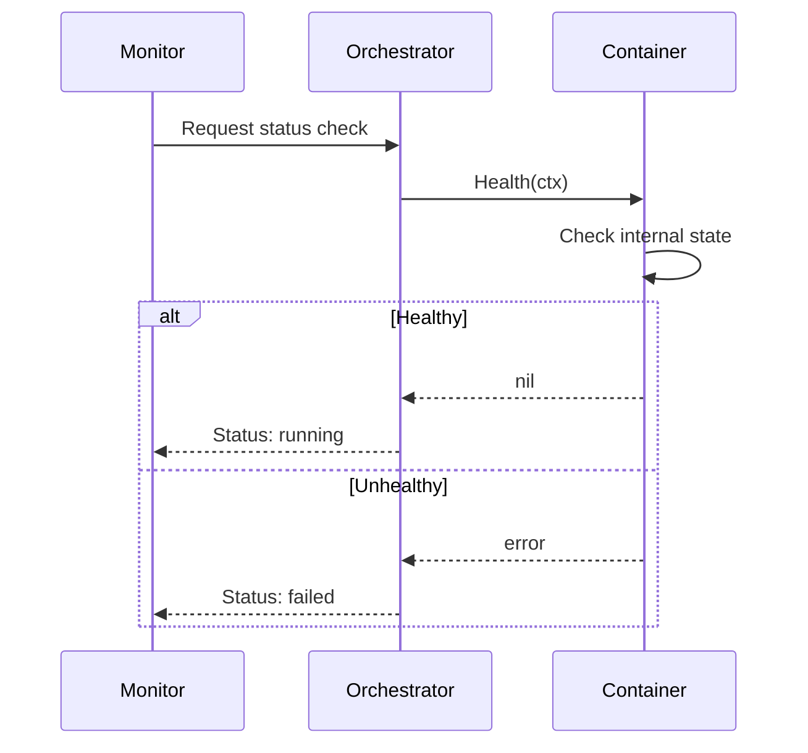

# Health Check System

## Metadata
- **Name**: Health Check System
- **Type**: Enabler
- **ID**: ENB-147825
- **Capability ID**: CAP-471395
- **Owner**: Product Team
- **Status**: Implemented
- **Approval**: Approved
- **Priority**: Medium
- **Analysis Review**: Not Required
- **Code Review**: Not Required

## Technical Overview
### Purpose
Provide container health monitoring capability through standardized Health() interface method.

## Functional Requirements
| ID | Name | Requirement | Status | Priority | Approval |
|----|------|-------------|--------|----------|----------|
| FR-529174 | Health Interface | Containers must implement Health(ctx) method | Implemented | High | Approved |
| FR-638291 | Context Timeout | Health checks must respect context timeout/cancellation | Implemented | High | Approved |
| FR-741562 | Error Return | Health check must return error on unhealthy state | Implemented | Medium | Approved |

## Non-Functional Requirements
| ID | Name | Requirement | Type | Status | Priority | Approval |
|----|------|-------------|------|--------|----------|----------|
| NFR-416823 | Check Speed | Health checks should complete quickly (< 1 second) | Performance | Implemented | Medium | Approved |
| NFR-527914 | No Side Effects | Health checks must not modify container state | Reliability | Implemented | High | Approved |

## Technical Specifications

### API Technical Specifications

| API Type | Operation | Channel / Endpoint | Description | Request / Publish Payload | Response / Subscribe Data |
|----------|-----------|---------------------|-------------|----------------------------|----------------------------|
| Interface Method | Health | Container.Health(ctx) | Check container health | context.Context | error (nil = healthy) |

### Sequence Diagrams

## External Dependencies
- **Go context**: Timeout and cancellation
- **ENB-283746**: Container interface definition

## Testing Strategy
- Mock container health scenarios
- Test timeout handling
- Test error propagation
- Verify no state mutations
