# React Application Bootstrap

## Metadata
- **Name**: React Application Bootstrap
- **Type**: Enabler
- **ID**: ENB-214759
- **Capability ID**: CAP-944623
- **Owner**: Product Team
- **Status**: Ready for Analysis
- **Approval**: Approved
- **Priority**: High
- **Analysis Review**: Not Required
- **Code Review**: Not Required

## Technical Overview
### Purpose
Initialize and configure the React application foundation with build tooling, project structure, and development environment.

## Functional Requirements
| ID | Name | Requirement | Status | Priority | Approval |
|----|------|-------------|--------|----------|----------|
| FR-PENDING | App Initialization | Create React app with Vite build tool | Ready for Design | High | Approved |
| FR-PENDING | TypeScript Setup | Configure TypeScript for type safety | Ready for Design | High | Approved |
| FR-PENDING | Project Structure | Establish folder structure following best practices | Ready for Design | High | Approved |
| FR-PENDING | Development Server | Configure hot-reload development server | Ready for Design | Medium | Approved |

## Non-Functional Requirements
| ID | Name | Requirement | Type | Status | Priority | Approval |
|----|------|-------------|------|--------|----------|----------|
| NFR-PENDING | Build Performance | Build time should be under 30 seconds | Performance | Ready for Design | Medium | Approved |
| NFR-PENDING | Bundle Size | Initial bundle should be under 500KB gzipped | Performance | Ready for Design | High | Approved |

## Technical Specifications (Template)

### Enabler Dependency Flow Diagram

```mermaid
flowchart TD
    ENB_214759["ENB-214759<br/>React Application Bootstrap<br/>⚙️"]

    ENB_385926["ENB-385926<br/>Ford Design System Integration<br/>🎨"]
    ENB_547813["ENB-547813<br/>Routing and Navigation<br/>🗺️"]

    ENB_214759 --> ENB_385926
    ENB_214759 --> ENB_547813

    classDef enabler fill:#e3f2fd,stroke:#1976d2,stroke-width:2px
    classDef dependent fill:#e8f5e8,stroke:#388e3c,stroke-width:2px

    class ENB_214759 enabler
    class ENB_385926,ENB_547813 dependent
```

## External Dependencies
- React 18+
- Vite (build tool)
- TypeScript
- Node.js 18+

## Testing Strategy
- Verify app builds successfully
- Test development server hot-reload
- Validate TypeScript compilation
- Check bundle size optimization
