# Ford Design System Integration

## Metadata

- **Name**: Ford Design System Integration
- **Type**: Enabler
- **ID**: ENB-385926
- **Approval**: Approved
- **Capability ID**: CAP-944623
- **Owner**: Product Team
- **Status**: Ready for Analysis
- **Priority**: High
- **Analysis Review**: Not Required
- **Code Review**: Not Required

## Technical Overview
### Purpose
Integrate the Ford Design System (balut-design-system.html) into the React application, providing branded UI components and styling.

## Functional Requirements

| ID | Name | Requirement | Priority | Status | Approval |
|----|------|-------------|----------|--------|----------|
| FR-PENDING | CSS Integration | Import Ford Design System CSS into React app | High | Ready for Design | Approved |
| FR-PENDING | Color Variables | Create CSS custom properties for Ford color palette | High | Ready for Design | Approved |
| FR-PENDING | Typography Setup | Configure Roboto font family and type scale | High | Ready for Design | Approved |
| FR-PENDING | Component Theming | Apply Ford blue color scheme to all components | High | Ready for Design | Approved |

## Non-Functional Requirements

| ID | Name | Type | Requirement | Priority | Status | Approval |
|----|------|------|-------------|----------|--------|----------|
| NFR-PENDING | Brand Consistency | Usability | All UI must use official Ford colors | High | Ready for Design | Approved |
| NFR-PENDING | Responsive Design | Usability | Support mobile, tablet, and desktop viewports | High | Ready for Design | Approved |

## Dependencies

### Internal Upstream Dependency

| Enabler ID | Description |
|------------|-------------|
| | |

### Internal Downstream Impact

| Enabler ID | Description |
|------------|-------------|
| | |

### External Dependencies

**External Upstream Dependencies**: None identified.

**External Downstream Impact**: None identified.

## Technical Specifications (Template)

### Enabler Dependency Flow Diagram

```mermaid
flowchart TD
    ENB_385926["ENB-385926<br/>Ford Design System Integration<br/>🎨"]

    ENB_214759["ENB-214759<br/>React Application Bootstrap<br/>⚙️"]
    ENB_691482["ENB-691482<br/>UI Component Library<br/>📦"]

    ENB_214759 --> ENB_385926
    ENB_385926 --> ENB_691482

    classDef enabler fill:#e3f2fd,stroke:#1976d2,stroke-width:2px
    classDef supporting fill:#e8f5e8,stroke:#388e3c,stroke-width:2px

    class ENB_385926 enabler
    class ENB_214759,ENB_691482 supporting
```

