# Container Orchestration

## Metadata
- **Name**: Container Orchestration
- **Type**: Capability
- **System**: Balut
- **Component**: Balut Orchestrator
- **ID**: CAP-471395
- **Owner**: Product Team
- **Status**: Implemented
- **Approval**: Approved
- **Priority**: Medium
- **Analysis Review**: Not Required

## Technical Overview
### Purpose
Manage lifecycle of application containers and services, providing unified container management with graceful startup, shutdown, health monitoring, and status reporting for all system components.

## Enablers
| ID | Description |
|----|-------------|
| ENB-283746 | Container Interface Definition - Standard interface for managed containers |
| ENB-592183 | Orchestrator Service - Central container lifecycle management |
| ENB-147825 | Health Check System - Container health monitoring |
| ENB-836419 | Graceful Shutdown Management - Coordinated service shutdown |

## Dependencies

### Internal Upstream Dependency
| Capability ID | Description |
|---------------|-------------|
| None | Foundational infrastructure capability with no upstream dependencies |

### Internal Downstream Impact
| Capability ID | Description |
|---------------|-------------|
| CAP-582341 | Figma Integration Management - Can be orchestrated as a container |
| CAP-694827 | Design Artifact Management - Can be orchestrated as a container |
| CAP-318652 | Capability Tracking - Can be orchestrated as a container |

## Technical Specifications

### Capability Dependency Flow Diagram
> **Note**: This diagram shows capability-to-capability relationships.

```mermaid
flowchart TD
    %% Current Capability
    CURRENT["CAP-471395<br/>Container Orchestration<br/>🎯"]

    %% Internal Capabilities (Same Organization)
    INT1["CAP-582341<br/>Figma Integration Management<br/>⚙️"]
    INT2["CAP-694827<br/>Design Artifact Management<br/>📊"]
    INT3["CAP-318652<br/>Capability Tracking<br/>🔧"]

    %% Dependencies Flow - Orchestrator manages all services
    CURRENT --> INT1
    CURRENT --> INT2
    CURRENT --> INT3

    %% Styling
    classDef current fill:#e3f2fd,stroke:#1976d2,stroke-width:3px
    classDef internal fill:#e8f5e8,stroke:#388e3c,stroke-width:2px

    class CURRENT current
    class INT1,INT2,INT3 internal

    %% Capability Grouping
    subgraph ORG1 ["Balut System"]
        subgraph DOMAIN1 ["Infrastructure Domain"]
            CURRENT
        end
        subgraph DOMAIN2 ["Application Services Domain"]
            INT1
            INT2
            INT3
        end
    end
```

## Success Criteria
- Containers can be registered dynamically
- Start operation initializes all containers successfully
- Stop operation performs graceful shutdown
- Health checks detect container failures
- Status reporting provides real-time container states
- Signal handling enables clean shutdown (SIGINT, SIGTERM)

## Risks and Assumptions
**Risks**:
- Current implementation has no registered containers (TODO placeholder)
- Concurrent container operations may have edge cases
- Health check failures don't trigger automatic recovery

**Assumptions**:
- Future services will implement Container interface
- Context-based cancellation provides sufficient shutdown control
- Container dependencies will be managed externally
