# Design Service Endpoint

## Metadata
- **Name**: Design Service Endpoint
- **Type**: Enabler
- **ID**: ENB-512834
- **Capability ID**: CAP-694827
- **Owner**: Product Team
- **Status**: Implemented
- **Approval**: Approved
- **Priority**: High
- **Analysis Review**: Not Required
- **Code Review**: Not Required

## Technical Overview
### Purpose
Provide REST API endpoint for design artifact operations, serving as the entry point for design management functionality.

## Functional Requirements
| ID | Name | Requirement | Status | Priority | Approval |
|----|------|-------------|--------|----------|----------|
| FR-219485 | Service Initialization | Service must start on configurable port (default 8081) | Implemented | High | Approved |
| FR-327196 | Designs Endpoint | Must provide GET /designs endpoint (placeholder) | Implemented | Medium | Approved |
| FR-481753 | Route Configuration | Service must configure HTTP routes using ServeMux | Implemented | High | Approved |
| FR-594827 | Graceful Shutdown | Service must shutdown gracefully on SIGINT/SIGTERM signals | Implemented | High | Approved |

## Non-Functional Requirements
| ID | Name | Requirement | Type | Status | Priority | Approval |
|----|------|-------------|------|--------|----------|----------|
| NFR-316482 | Service Timeout | HTTP server must enforce 15s read/write and 60s idle timeouts | Performance | Implemented | High | Approved |
| NFR-528739 | Shutdown Timeout | Graceful shutdown must complete within 30 seconds | Reliability | Implemented | High | Approved |
| NFR-647291 | Port Flexibility | Service port must be configurable via PORT environment variable | Usability | Implemented | Medium | Approved |

## Technical Specifications

### Enabler Dependency Flow Diagram

```mermaid
flowchart TD
    ENB_512834["ENB-512834<br/>Design Service Endpoint<br/>🌐"]

    ENB_639271["ENB-639271<br/>Health Monitoring<br/>❤️"]

    CLIENT["External HTTP Clients<br/>API Consumers<br/>👥"]

    FUTURE["Future Design Storage<br/>Placeholder<br/>⏳"]

    CLIENT --> ENB_512834
    ENB_512834 --> ENB_639271
    ENB_512834 -.Future.-> FUTURE

    classDef enabler fill:#e3f2fd,stroke:#1976d2,stroke-width:2px
    classDef supporting fill:#e8f5e8,stroke:#388e3c,stroke-width:2px
    classDef external fill:#f3e5f5,stroke:#7b1fa2,stroke-width:2px
    classDef placeholder fill:#f5f5f5,stroke:#999999,stroke-width:1px,stroke-dasharray: 5 5

    class ENB_512834 enabler
    class ENB_639271 supporting
    class CLIENT external
    class FUTURE placeholder
```

### API Technical Specifications

| API Type | Operation | Channel / Endpoint | Description | Request / Publish Payload | Response / Subscribe Data |
|----------|-----------|---------------------|-------------|----------------------------|----------------------------|
| HTTP GET | List Designs | GET /designs | List design artifacts (placeholder) | None | {"designs": []} |

### Sequence Diagrams

### State Diagrams

## External Dependencies
- **Go net/http**: HTTP server implementation
- **Go os/signal**: Signal handling for graceful shutdown
- **Go context**: Shutdown timeout management

## Testing Strategy
- Manual testing with curl/Postman
- Test service startup on custom port
- Test graceful shutdown behavior
- Verify timeout configurations
- Test health endpoint integration
