# AI Chat Interface

## Metadata

- **Name**: AI Chat Interface
- **Type**: Enabler
- **ID**: ENB-517389
- **Approval**: Approved
- **Capability ID**: CAP-944623
- **Owner**: Product Team
- **Status**: Implemented
- **Priority**: High
- **Analysis Review**: Required
- **Code Review**: Not Required

## Technical Overview
### Purpose
Implement an AI-powered chat interface that generates code enablers based on capability descriptions, supporting the design-driven development workflow.

## Functional Requirements

| ID | Name | Requirement | Priority | Status | Approval |
|----|------|-------------|----------|--------|----------|
| FR-517389-001 | Chat Interface | Provide chat UI with message thread display | High | Approved | Approved |
| FR-517389-002 | Message Input | Allow users to type and send capability descriptions | High | Approved | Approved |
| FR-517389-003 | AI Response Display | Display AI-generated enabler code with syntax highlighting | High | Approved | Approved |
| FR-517389-004 | Code Export | Allow users to copy or download generated code | High | Approved | Approved |
| FR-517389-005 | Chat History | Maintain conversation history within session | Medium | Approved | Approved |

## Non-Functional Requirements

| ID | Name | Type | Requirement | Priority | Status | Approval |
|----|------|------|-------------|----------|--------|----------|
| NFR-517389-001 | Response Time | Performance | AI responses should display within 5 seconds | High | Approved | Approved |
| NFR-517389-002 | Code Readability | Usability | Generated code should have proper syntax highlighting | High | Approved | Approved |
| NFR-517389-003 | Error Handling | Reliability | Gracefully handle API errors with user-friendly messages | Medium | Approved | Approved |
| NFR-517389-004 | Accessibility | Usability | Chat interface should be keyboard navigable | Medium | Approved | Approved |

## Dependencies

### Internal Upstream Dependency

| Enabler ID | Description |
|------------|-------------|
| ENB-648135 | Backend API Integration Layer |
| ENB-597324 | State Management System |

### Internal Downstream Impact

| Enabler ID | Description |
|------------|-------------|
| | |

### External Dependencies

**External Upstream Dependencies**: None identified.

**External Downstream Impact**: None identified.

## Technical Specifications (Template)

### Enabler Dependency Flow Diagram

```mermaid
flowchart TD
    ENB_517389["ENB-517389<br/>AI Chat Interface<br/>📡"]

    classDef enabler fill:#e3f2fd,stroke:#1976d2,stroke-width:2px
    class ENB_517389 enabler
```

### API Technical Specifications

| API Type | Operation | Channel / Endpoint | Description | Request / Publish Payload | Response / Subscribe Data |
|----------|-----------|---------------------|-------------|----------------------------|----------------------------|
| REST | POST | /api/ai/chat | Send capability description to AI | `{ message: string, conversationId?: string }` | `{ response: string, code?: string, conversationId: string }` |
| REST | GET | /api/ai/history | Get chat conversation history | Query: `?conversationId=<id>` | `{ messages: Message[] }` |

### Data Models

### Class Diagrams

### Sequence Diagrams

### Dataflow Diagrams

### State Diagrams

