# Routing and Navigation

## Metadata
- **Name**: Routing and Navigation
- **Type**: Enabler
- **ID**: ENB-547813
- **Capability ID**: CAP-944623
- **Owner**: Product Team
- **Status**: Ready for Analysis
- **Approval**: Approved
- **Priority**: High
- **Analysis Review**: Not Required
- **Code Review**: Not Required

## Technical Overview
### Purpose
Implement client-side routing and navigation system for multi-page application experience using React Router.

## Functional Requirements
| ID | Name | Requirement | Status | Priority | Approval |
|----|------|-------------|--------|----------|----------|
| FR-PENDING | Route Configuration | Define routes for all application pages | Ready for Design | High | Approved |
| FR-PENDING | Navigation Component | Create top navigation bar with Ford branding | Ready for Design | High | Approved |
| FR-PENDING | URL Management | Handle browser history and deep linking | Ready for Design | High | Approved |
| FR-PENDING | Active Route Indication | Highlight active navigation item | Ready for Design | Medium | Approved |

## Non-Functional Requirements
| ID | Name | Requirement | Type | Status | Priority | Approval |
|----|------|-------------|------|--------|----------|----------|
| NFR-PENDING | Navigation Speed | Route transitions should be instant (<100ms) | Performance | Ready for Design | High | Approved |
| NFR-PENDING | Browser Support | Support back/forward browser navigation | Usability | Ready for Design | High | Approved |

## Technical Specifications (Template)

### Enabler Dependency Flow Diagram

```mermaid
flowchart TD
    ENB_547813["ENB-547813<br/>Routing and Navigation<br/>🗺️"]

    ENB_214759["ENB-214759<br/>React Application Bootstrap<br/>⚙️"]
    ENB_739241["ENB-739241<br/>Page Components<br/>📄"]

    ENB_214759 --> ENB_547813
    ENB_547813 --> ENB_739241

    classDef enabler fill:#e3f2fd,stroke:#1976d2,stroke-width:2px
    classDef supporting fill:#e8f5e8,stroke:#388e3c,stroke-width:2px

    class ENB_547813 enabler
    class ENB_214759,ENB_739241 supporting
```

## External Dependencies
- React Router v6
- React 18+

## Testing Strategy
- Test all route navigations
- Verify deep linking works correctly
- Test browser back/forward buttons
- Validate active route highlighting
