# Figma Integration Management

## Metadata
- **Name**: Figma Integration Management
- **Type**: Capability
- **System**: Balut
- **Component**: Integration Service
- **ID**: CAP-582341
- **Owner**: Product Team
- **Status**: Implemented
- **Approval**: Approved
- **Priority**: High
- **Analysis Review**: Not Required

## Technical Overview
### Purpose
Enable external design tool connectivity and synchronization with Figma API, providing seamless access to design files, comments, and metadata to support design-driven development workflows.

## Enablers
| ID | Description |
|----|-------------|
| ENB-748192 | Figma API Client - HTTP client wrapper for Figma REST API communication |
| ENB-837461 | File Retrieval Service - Retrieves Figma file metadata and content |
| ENB-926583 | Comment Retrieval Service - Fetches comments from Figma design files |
| ENB-451729 | Integration HTTP Handlers - REST API endpoints for external Figma integration |

## Dependencies

### Internal Upstream Dependency
| Capability ID | Description |
|---------------|-------------|
| None | This is a foundational capability with no internal upstream dependencies |

### Internal Downstream Impact
| Capability ID | Description |
|---------------|-------------|
| CAP-694827 | Design Artifact Management - Consumes Figma data for design storage |
| CAP-318652 | Capability Tracking - May use design artifacts for capability documentation |

## Technical Specifications

### Capability Dependency Flow Diagram
> **Note**: This diagram shows capability-to-capability relationships. Grey capabilities are placeholders for future implementation.

```mermaid
flowchart TD
    %% Current Capability
    CURRENT["CAP-582341<br/>Figma Integration Management<br/>🎯"]

    %% Internal Capabilities (Same Organization)
    INT1["CAP-694827<br/>Design Artifact Management<br/>📊"]
    INT2["CAP-318652<br/>Capability Tracking<br/>🔧"]

    %% External Capabilities (Different Organization)
    EXT1["Figma API<br/>Third-party Design Platform<br/>🌐"]

    %% Dependencies Flow
    EXT1 --> CURRENT
    CURRENT --> INT1
    CURRENT --> INT2

    %% Styling
    classDef current fill:#e3f2fd,stroke:#1976d2,stroke-width:3px
    classDef internal fill:#e8f5e8,stroke:#388e3c,stroke-width:2px
    classDef external fill:#f3e5f5,stroke:#7b1fa2,stroke-width:2px

    class CURRENT current
    class INT1,INT2 internal
    class EXT1 external

    %% Capability Grouping
    subgraph ORG1 ["Balut System"]
        subgraph DOMAIN1 ["Integration Domain"]
            CURRENT
        end
        subgraph DOMAIN2 ["Core Services Domain"]
            INT1
            INT2
        end
    end

    subgraph ORG2 ["External Services"]
        EXT1
    end
```

## Success Criteria
- Figma API authentication successful with valid token
- File retrieval returns complete file metadata
- Comment retrieval returns all file comments
- API requests complete within 30 second timeout
- Graceful error handling for API failures
- HTTP 200 responses for successful requests

## Risks and Assumptions
**Risks**:
- Figma API rate limiting may impact high-volume usage
- API token expiration requires manual renewal
- Breaking changes in Figma API could require client updates

**Assumptions**:
- Figma personal access token is available and valid
- Network connectivity to api.figma.com is reliable
- Figma API v1 remains stable and supported
