# Design Artifact Management

## Metadata
- **Name**: Design Artifact Management
- **Type**: Capability
- **System**: Balut
- **Component**: Design Service
- **ID**: CAP-694827
- **Owner**: Product Team
- **Status**: Implemented
- **Approval**: Approved
- **Priority**: High
- **Analysis Review**: Not Required

## Technical Overview
### Purpose
Manage design artifacts, versions, and metadata from external design tools, providing centralized storage, versioning control, and access to design assets that support capability-driven development.

## Enablers
| ID | Description |
|----|-------------|
| ENB-512834 | Design Service Endpoint - REST API for design artifact operations |
| ENB-639271 | Health Monitoring - Service health check endpoint |

## Dependencies

### Internal Upstream Dependency
| Capability ID | Description |
|---------------|-------------|
| CAP-582341 | Figma Integration Management - Provides design data from Figma API |

### Internal Downstream Impact
| Capability ID | Description |
|---------------|-------------|
| CAP-318652 | Capability Tracking - Uses design artifacts for capability documentation |

## Technical Specifications

### Capability Dependency Flow Diagram
> **Note**: This diagram shows capability-to-capability relationships.

```mermaid
flowchart TD
    %% Current Capability
    CURRENT["CAP-694827<br/>Design Artifact Management<br/>🎯"]

    %% Internal Capabilities (Same Organization)
    INT1["CAP-582341<br/>Figma Integration Management<br/>⚙️"]
    INT2["CAP-318652<br/>Capability Tracking<br/>🔧"]

    %% Dependencies Flow
    INT1 --> CURRENT
    CURRENT --> INT2

    %% Styling
    classDef current fill:#e3f2fd,stroke:#1976d2,stroke-width:3px
    classDef internal fill:#e8f5e8,stroke:#388e3c,stroke-width:2px

    class CURRENT current
    class INT1,INT2 internal

    %% Capability Grouping
    subgraph ORG1 ["Balut System"]
        subgraph DOMAIN1 ["Design Domain"]
            CURRENT
        end
        subgraph DOMAIN2 ["Supporting Domains"]
            INT1
            INT2
        end
    end
```

## Success Criteria
- Design service responds to health checks successfully
- Service starts and stops gracefully
- Service runs independently on port 8081
- Placeholder endpoints return valid responses
- Ready for future design storage implementation

## Risks and Assumptions
**Risks**:
- Current implementation is placeholder-only with limited functionality
- No persistent storage layer implemented yet
- Design versioning logic not yet implemented

**Assumptions**:
- Future implementation will add database persistence
- Design artifacts will be stored with version history
- Integration with CAP-582341 will populate design data
