# Figma API Client

## Metadata
- **Name**: Figma API Client
- **Type**: Enabler
- **ID**: ENB-748192
- **Capability ID**: CAP-582341
- **Owner**: Product Team
- **Status**: Implemented
- **Approval**: Approved
- **Priority**: High
- **Analysis Review**: Not Required
- **Code Review**: Not Required

## Technical Overview
### Purpose
Provide HTTP client wrapper for Figma REST API communication with authentication, request handling, and response parsing.

## Functional Requirements
| ID | Name | Requirement | Status | Priority | Approval |
|----|------|-------------|--------|----------|----------|
| FR-381927 | HTTP Client Configuration | Client must initialize with 30-second timeout and base URL https://api.figma.com/v1 | Implemented | High | Approved |
| FR-592746 | Token Authentication | Client must support X-Figma-Token header authentication | Implemented | High | Approved |
| FR-746153 | Context Support | All API calls must accept context for cancellation and timeout control | Implemented | High | Approved |
| FR-821394 | Error Handling | Client must parse and return meaningful errors for non-200 responses | Implemented | High | Approved |

## Non-Functional Requirements
| ID | Name | Requirement | Type | Status | Priority | Approval |
|----|------|-------------|------|--------|----------|----------|
| NFR-157382 | Request Timeout | HTTP requests must timeout after 30 seconds | Performance | Implemented | High | Approved |
| NFR-294761 | Error Transparency | API errors must include status code and response body | Usability | Implemented | Medium | Approved |
| NFR-683419 | Memory Efficiency | Client should reuse HTTP connections | Performance | Implemented | Medium | Approved |

## Technical Specifications

### Enabler Dependency Flow Diagram

```mermaid
flowchart TD
    ENB_748192["ENB-748192<br/>Figma API Client<br/>📡"]

    EXT_FIGMA["Figma API v1<br/>External Service<br/>🌐"]

    INT_FILE["ENB-837461<br/>File Retrieval Service<br/>⚙️"]
    INT_COMMENT["ENB-926583<br/>Comment Retrieval Service<br/>⚙️"]

    ENB_748192 --> EXT_FIGMA
    INT_FILE --> ENB_748192
    INT_COMMENT --> ENB_748192

    classDef enabler fill:#e3f2fd,stroke:#1976d2,stroke-width:2px
    classDef external fill:#f3e5f5,stroke:#7b1fa2,stroke-width:2px
    classDef internal fill:#e8f5e8,stroke:#388e3c,stroke-width:2px

    class ENB_748192 enabler
    class EXT_FIGMA external
    class INT_FILE,INT_COMMENT internal
```

### API Technical Specifications

| API Type | Operation | Channel / Endpoint | Description | Request / Publish Payload | Response / Subscribe Data |
|----------|-----------|---------------------|-------------|----------------------------|----------------------------|
| HTTP Client | Initialize | NewFigmaClient(token string) | Create new Figma client instance | token: Personal access token | *FigmaClient instance |
| HTTP GET | GetFile | /files/{fileKey} | Retrieve Figma file metadata | ctx, fileKey | *models.File, error |
| HTTP GET | GetComments | /files/{fileKey}/comments | Retrieve file comments | ctx, fileKey | []models.Comment, error |

### Data Models

### Class Diagrams

### Sequence Diagrams

## External Dependencies
- **Figma API v1**: https://api.figma.com/v1
- **Go net/http**: Standard library HTTP client
- **Go encoding/json**: JSON parsing
- **Context package**: Request cancellation

## Testing Strategy
- Unit tests with mock HTTP responses
- Test success and error scenarios
- Validate JSON decoding
- Test context cancellation
- Test timeout handling
