# Graceful Shutdown Management

## Metadata
- **Name**: Graceful Shutdown Management
- **Type**: Enabler
- **ID**: ENB-836419
- **Capability ID**: CAP-471395
- **Owner**: Product Team
- **Status**: Implemented
- **Approval**: Approved
- **Priority**: High
- **Analysis Review**: Not Required
- **Code Review**: Not Required

## Technical Overview
### Purpose
Coordinate graceful service shutdown through signal handling and reverse-order container stopping.

## Functional Requirements
| ID | Name | Requirement | Status | Priority | Approval |
|----|------|-------------|--------|----------|----------|
| FR-394718 | Signal Handling | Must handle SIGINT and SIGTERM signals | Implemented | High | Approved |
| FR-481926 | Reverse Order Stop | Must stop containers in reverse registration order | Implemented | High | Approved |
| FR-573841 | Context Cancellation | Must use context for timeout control during shutdown | Implemented | High | Approved |
| FR-682193 | Error Collection | Must collect and report errors from all container stops | Implemented | Medium | Approved |

## Non-Functional Requirements
| ID | Name | Requirement | Type | Status | Priority | Approval |
|----|------|-------------|------|--------|----------|----------|
| NFR-528173 | Shutdown Timeout | Shutdown must complete or timeout within configured period | Reliability | Implemented | High | Approved |
| NFR-639284 | Best Effort | Must attempt to stop all containers even if some fail | Reliability | Implemented | High | Approved |
| NFR-741956 | No Data Loss | Containers must complete active operations before stopping | Reliability | Implemented | High | Approved |

## Technical Specifications

### Enabler Dependency Flow Diagram

```mermaid
flowchart TD
    ENB_836419["ENB-836419<br/>Graceful Shutdown<br/>🛑"]

    ENB_592183["ENB-592183<br/>Orchestrator Service<br/>⚙️"]
    ENB_283746["ENB-283746<br/>Container Interface<br/>📋"]

    SIGNAL["OS Signals<br/>SIGINT/SIGTERM<br/>⚡"]

    SIGNAL --> ENB_836419
    ENB_836419 --> ENB_592183
    ENB_592183 --> ENB_283746

    classDef enabler fill:#e3f2fd,stroke:#1976d2,stroke-width:2px
    classDef supporting fill:#e8f5e8,stroke:#388e3c,stroke-width:2px
    classDef external fill:#f3e5f5,stroke:#7b1fa2,stroke-width:2px

    class ENB_836419 enabler
    class ENB_592183,ENB_283746 supporting
    class SIGNAL external
```

### Sequence Diagrams

### State Diagrams

## External Dependencies
- **Go os/signal**: Signal notification
- **Go syscall**: SIGINT/SIGTERM constants
- **Go context**: Shutdown timeout
- **ENB-592183**: Orchestrator Stop() method

## Testing Strategy
- Test signal handling with mock signals
- Test reverse-order container stopping
- Test timeout behavior
- Test partial failure scenarios
- Verify context cancellation propagation
