# File Retrieval Service

## Metadata
- **Name**: File Retrieval Service
- **Type**: Enabler
- **ID**: ENB-837461
- **Capability ID**: CAP-582341
- **Owner**: Product Team
- **Status**: Implemented
- **Approval**: Approved
- **Priority**: High
- **Analysis Review**: Not Required
- **Code Review**: Not Required

## Technical Overview
### Purpose
Retrieve Figma file metadata and content through the Figma API client, providing file information to downstream services.

## Functional Requirements
| ID | Name | Requirement | Status | Priority | Approval |
|----|------|-------------|--------|----------|----------|
| FR-281746 | File Retrieval | Service must retrieve complete Figma file metadata by file key | Implemented | High | Approved |
| FR-394825 | Response Formatting | Service must return file data as structured JSON | Implemented | High | Approved |
| FR-517639 | Error Propagation | Service must propagate Figma client errors with context | Implemented | Medium | Approved |

## Non-Functional Requirements
| ID | Name | Requirement | Type | Status | Priority | Approval |
|----|------|-------------|------|--------|----------|----------|
| NFR-728461 | Response Time | File retrieval should complete within Figma client timeout (30s) | Performance | Implemented | High | Approved |
| NFR-849172 | Reliability | Service must handle Figma API failures gracefully | Reliability | Implemented | High | Approved |

## Technical Specifications

### Enabler Dependency Flow Diagram

```mermaid
flowchart TD
    ENB_837461["ENB-837461<br/>File Retrieval Service<br/>⚙️"]

    ENB_748192["ENB-748192<br/>Figma API Client<br/>📡"]
    ENB_451729["ENB-451729<br/>Integration HTTP Handlers<br/>🌐"]

    ENB_451729 --> ENB_837461
    ENB_837461 --> ENB_748192

    classDef enabler fill:#e3f2fd,stroke:#1976d2,stroke-width:2px
    classDef supporting fill:#e8f5e8,stroke:#388e3c,stroke-width:2px

    class ENB_837461 enabler
    class ENB_748192,ENB_451729 supporting
```

### API Technical Specifications

| API Type | Operation | Channel / Endpoint | Description | Request / Publish Payload | Response / Subscribe Data |
|----------|-----------|---------------------|-------------|----------------------------|----------------------------|
| Internal Method | GetFile | Service.GetFile(ctx, fileKey) | Retrieve file via Figma client | ctx Context, fileKey string | *models.File, error |

### Sequence Diagrams

## External Dependencies
- **ENB-748192**: Figma API Client for API communication
- **models.File**: File data model structure

## Testing Strategy
- Integration tests with mock Figma client
- Test successful file retrieval
- Test error handling scenarios
- Validate file data structure
