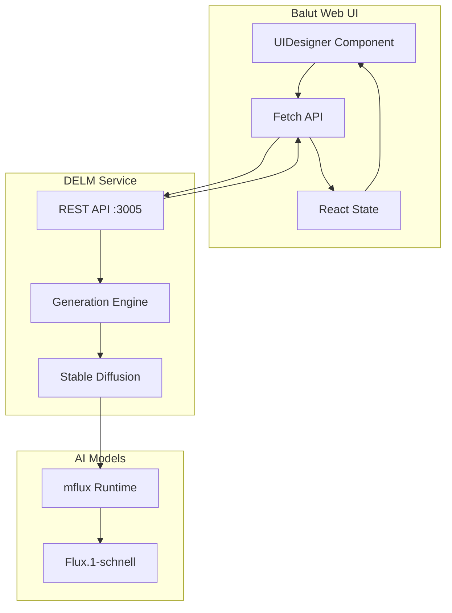
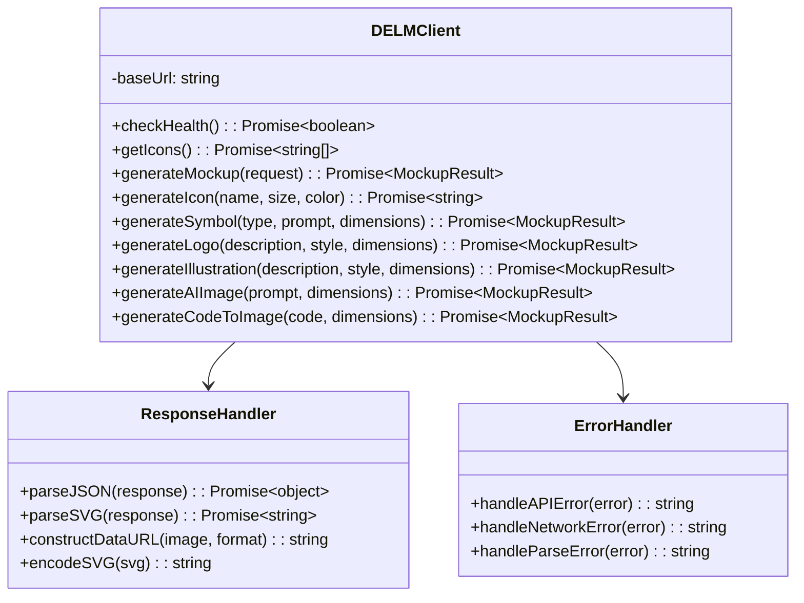
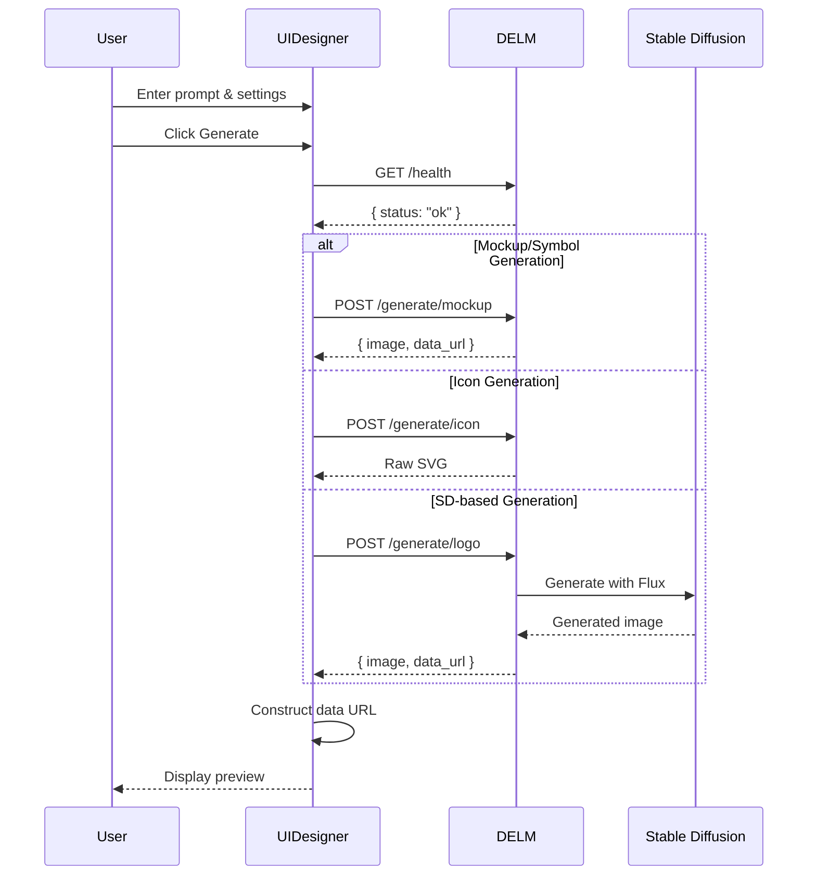

# DELM Service Integration Enabler

## Metadata

| Field | Value |
|-------|-------|
| **Name** | DELM Service Integration |
| **Type** | Enabler |
| **ID** | ENB-958471 |
| **Capability ID** | CAP-847293 |
| **Owner** | Development Team |
| **Status** | Implemented |
| **Approval** | Approved |
| **Priority** | High |

---

## Technical Overview

### Purpose

This enabler provides integration between the Balut web application and the DELM (Design Element Language Model) service for AI-powered image generation. It enables the UI Designer capability to generate UI mockups, icons, logos, illustrations, and AI images through a REST API interface.

---

## Functional Requirements

| FR-ID | Name | Requirement | Status | Priority | Approval |
|-------|------|-------------|--------|----------|----------|
| FR-958001 | API Communication | System communicates with DELM API via HTTP | Implemented | High | Approved |
| FR-958002 | Health Check | System checks DELM service availability | Implemented | High | Approved |
| FR-958003 | Mockup Generation | System sends mockup requests with component props | Implemented | High | Approved |
| FR-958004 | Icon Generation | System retrieves SVG icons by name | Implemented | High | Approved |
| FR-958005 | Icon List Retrieval | System fetches available icon names | Implemented | Medium | Approved |
| FR-958006 | Symbol Generation | System generates symbols with type selection | Implemented | Medium | Approved |
| FR-958007 | Logo Generation | System generates logos with style options | Implemented | High | Approved |
| FR-958008 | Illustration Generation | System generates illustrations with style | Implemented | High | Approved |
| FR-958009 | AI Image Generation | System generates images from prompts | Implemented | High | Approved |
| FR-958010 | Code-to-Image | System renders HTML code as images | Implemented | Medium | Approved |
| FR-958011 | Response Parsing | System parses JSON and raw SVG responses | Implemented | High | Approved |
| FR-958012 | Base64 Handling | System handles base64 encoded images | Implemented | High | Approved |
| FR-958013 | Data URL Construction | System constructs data URLs for display | Implemented | High | Approved |
| FR-958014 | Error Handling | System handles API errors gracefully | Implemented | High | Approved |

---

## Non-Functional Requirements

| NFR-ID | Name | Requirement | Type | Status | Priority |
|--------|------|-------------|------|--------|----------|
| NFR-958001 | Latency | API calls complete within timeout | Performance | Implemented | High |
| NFR-958002 | Reliability | Graceful degradation when offline | Reliability | Implemented | High |
| NFR-958003 | Compatibility | Works with DELM v1.2.0+ API | Compatibility | Implemented | High |
| NFR-958004 | Security | No sensitive data in requests | Security | Implemented | Medium |

---

## Technical Specifications

### Enabler Dependency Flow



### API Technical Specifications

| Type | Operation | Channel | Description | Payload | Response |
|------|-----------|---------|-------------|---------|----------|
| GET | Health | HTTP | Check service status | None | `{ status: "ok" }` |
| GET | Icons | HTTP | List available icons | None | `string[]` |
| POST | Mockup | HTTP | Generate component | See below | `MockupResult` |
| POST | Icon | HTTP | Generate icon | `{ name, size, color, format }` | Raw SVG |
| POST | Symbol | HTTP | Generate symbol | `{ symbol_type, prompt, width, height, format }` | `MockupResult` |
| POST | Logo | HTTP | Generate logo | `{ description, style, width, height, format }` | `MockupResult` |
| POST | Illustration | HTTP | Generate illustration | `{ description, style, width, height, format }` | `MockupResult` |
| POST | AI Image | HTTP | Generate image | `{ prompt, width, height, format }` | `MockupResult` |
| POST | Code-to-Image | HTTP | Render HTML | `{ code, width, height, format }` | `MockupResult` |

### Request Payloads

#### Mockup Request
```typescript
{
  component_type: 'button' | 'card' | 'input' | 'alert' | 'navbar' | 'avatar' | 'progress' | 'toggle',
  props: {
    // Component-specific properties
    text?: string,
    title?: string,
    content?: string,
    label?: string,
    message?: string,
    value?: number,
    checked?: boolean,
    // ... more props
  },
  width: number,
  height: number,
  format: 'base64'
}
```

#### Style Options

**Logo Styles**: `'minimal' | 'modern' | 'vintage' | 'playful' | 'corporate'`

**Illustration Styles**: `'flat' | 'isometric' | 'hand-drawn' | 'geometric' | '3d'`

**Symbol Types**: `'arrow' | 'divider' | 'pattern' | 'shape' | 'decoration'`

### Data Models

```mermaid
erDiagram
    UIDesigner ||--o{ GenerationRequest : sends
    GenerationRequest ||--|| DELM_API : to
    DELM_API ||--|| GenerationResponse : returns
    GenerationResponse ||--o{ MockupResult : contains

    GenerationRequest {
        string endpoint
        string method
        object body
    }

    GenerationResponse {
        string contentType
        int status
        object body
    }

    MockupResult {
        string image
        string data_url
        int width
        int height
        string component_type
    }
```

### Class Diagram



### Sequence Diagram



---

## External Dependencies

| Dependency | Version | Purpose | Required |
|------------|---------|---------|----------|
| DELM Service | 1.2.0+ | Image generation API | Yes |
| Python | 3.9+ | DELM runtime | Yes |
| mflux | Latest | Stable Diffusion runtime | For SD features |
| huggingface_hub | Latest | Model downloads | For SD features |
| Flux.1-schnell | Latest | Image generation model | For SD features |

---

## Configuration

### Environment Setup

```bash
# DELM Service
DELM_HOST=127.0.0.1
DELM_PORT=3005

# Hugging Face (for model downloads)
HF_TOKEN=<your_token>
```

### DELM Installation

```bash
# Clone repository
git clone https://github.com/jareynolds/delm.git
cd delm

# Install dependencies
pip3 install -r requirements.txt

# Start service
python3 main.py
```

### Stable Diffusion Setup

```bash
# Install mflux (Apple Silicon only)
pip3 install mflux

# Install Hugging Face CLI
pip3 install huggingface_hub

# Login to Hugging Face
huggingface-cli login

# Download model
huggingface-cli download black-forest-labs/FLUX.1-schnell --resume-download
```

---

## Testing Strategy

### Unit Tests

- Request payload construction
- Response parsing (JSON and SVG)
- Data URL construction
- Error message formatting

### Integration Tests

- Health check endpoint
- Icon list retrieval
- Mockup generation
- Icon generation with SVG response
- Logo generation with SD

### Manual Tests

- All generation modes
- Error scenarios (DELM offline)
- Invalid icon names
- Large image dimensions
- Download functionality

---

## Error Handling

| Error | Cause | User Message |
|-------|-------|--------------|
| API Offline | DELM not running | "DELM API is not available. Please ensure the DELM server is running on port 3005." |
| Network Error | Connection failed | "Failed to connect to DELM service" |
| Parse Error | Invalid response | "Invalid response format from endpoint" |
| Validation Error | Invalid input | Specific validation message |
| SD Unavailable | mflux not installed | "SD Model not available" (from DELM) |

---

## Implementation Details

### Response Type Detection

```typescript
const contentType = response.headers.get('content-type') || '';

if (contentType.includes('image/svg') || generationMode === 'icon') {
  // Handle raw SVG response
  const svgText = await response.text();
  // Process SVG...
} else {
  // Handle JSON response
  const data = await response.json();
  // Process JSON...
}
```

### SVG Encoding

```typescript
// Properly encode UTF-8 SVG to base64
const base64 = btoa(unescape(encodeURIComponent(svgText)));
const dataUrl = `data:image/svg+xml;base64,${base64}`;
```

### Data URL Construction

```typescript
// Construct data URL from base64 image
if (!data.data_url && data.image) {
  data.data_url = `data:image/png;base64,${data.image}`;
}
```

---

## Related Documents

- [UI Designer Capability](847293-capability.md)
- [Technical Changes 2025-11-23](TECHNICAL_CHANGES_2025-11-23.md)
- [DELM README](DELM-README.md)

---

**Document Version**: 1.0
**Created**: 2025-11-23
**Last Updated**: 2025-11-23
**Author**: Development Team
