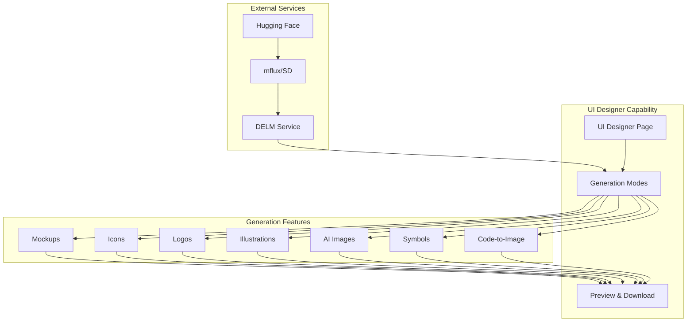
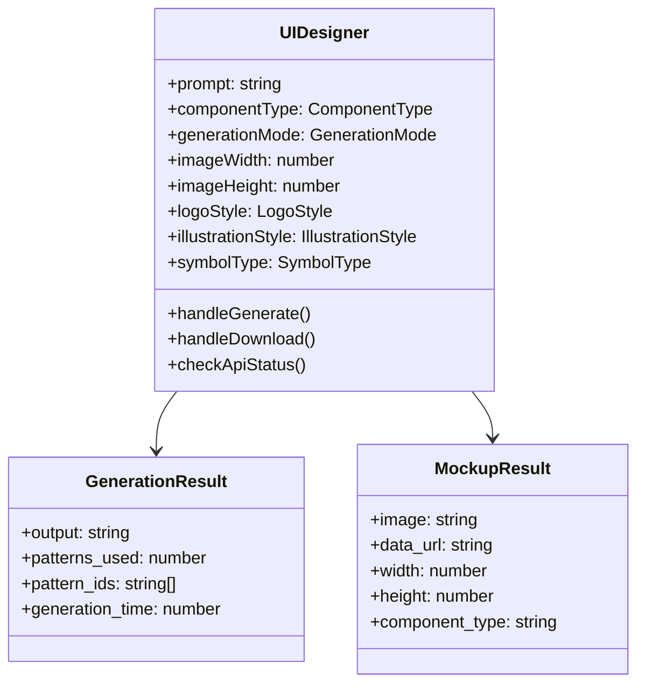
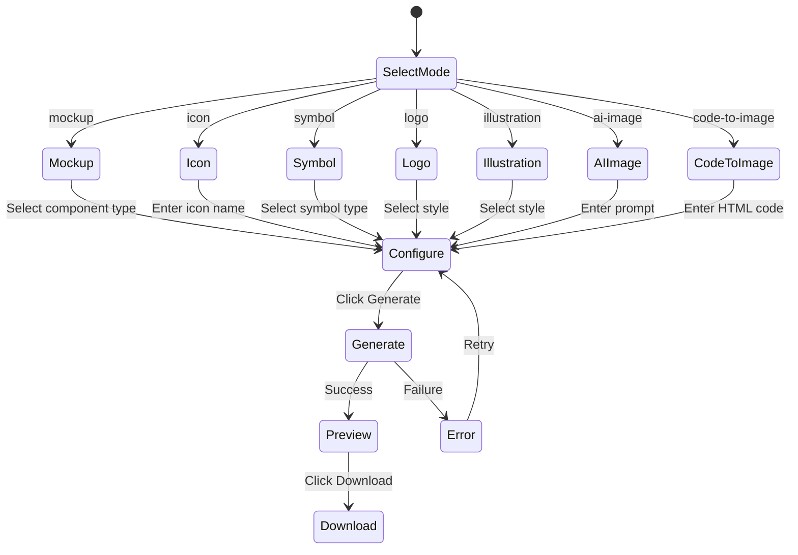

# UI Designer Capability

## Metadata

| Field | Value |
|-------|-------|
| **Name** | UI Designer |
| **Type** | Capability |
| **System** | Balut |
| **Component** | Web UI |
| **ID** | CAP-847293 |
| **Owner** | Development Team |
| **Status** | Implemented |
| **Approval** | Approved |
| **Priority** | High |

---

## Technical Overview

### Purpose

The UI Designer capability provides a comprehensive interface for generating UI components, icons, logos, illustrations, and AI-generated images through integration with the DELM (Design Element Language Model) service. This enables users to rapidly prototype and generate visual assets for their applications without manual design work.

---

## Enablers

This capability is supported by the following enablers:

| Enabler ID | Name | Status |
|------------|------|--------|
| ENB-958471 | DELM Service Integration | Implemented |
| ENB-958472 | Icon Generation | Implemented |
| ENB-958473 | Component Mockup Generation | Implemented |
| ENB-958474 | Stable Diffusion Integration | Implemented |
| ENB-958475 | Image Preview and Download | Implemented |

---

## Dependencies

### Upstream Dependencies

| Dependency | Type | Description |
|------------|------|-------------|
| DELM Service | External Service | Image generation API on port 3005 |
| mflux | Python Package | Stable Diffusion for Apple Silicon |
| Hugging Face | External Service | Model repository for Flux models |
| React Framework | Library | Frontend component framework |
| TypeScript | Language | Type-safe JavaScript |

### Downstream Dependencies

| Dependency | Type | Description |
|------------|------|-------------|
| Workspace Assets | Feature | Generated images saved to assets |
| Code Generation | Feature | UI components used in code generation |
| Storyboard | Feature | Visual mockups for storyboard |

---

## Dependency Flow

---

## Functional Requirements

| FR-ID | Name | Requirement | Status | Priority | Approval |
|-------|------|-------------|--------|----------|----------|
| FR-847001 | Generation Mode Selection | User can select from multiple generation modes | Implemented | High | Approved |
| FR-847002 | Component Type Selection | User can select UI component types for mockups | Implemented | High | Approved |
| FR-847003 | Dimension Configuration | User can set width and height for generated images | Implemented | Medium | Approved |
| FR-847004 | Style Selection | User can select styles for logos and illustrations | Implemented | Medium | Approved |
| FR-847005 | Icon Validation | System validates icon names against available icons | Implemented | Medium | Approved |
| FR-847006 | API Status Check | System shows DELM API status | Implemented | High | Approved |
| FR-847007 | Image Preview | Generated images displayed in preview panel | Implemented | High | Approved |
| FR-847008 | Image Download | User can download generated images | Implemented | High | Approved |
| FR-847009 | Error Handling | System displays meaningful error messages | Implemented | High | Approved |
| FR-847010 | Icon Help | Help button shows available icon names | Implemented | Medium | Approved |

---

## Non-Functional Requirements

| NFR-ID | Name | Requirement | Type | Status | Priority |
|--------|------|-------------|------|--------|----------|
| NFR-847001 | Response Time | Image generation completes within 30 seconds | Performance | Implemented | High |
| NFR-847002 | API Availability | Graceful handling when DELM offline | Reliability | Implemented | High |
| NFR-847003 | Image Quality | Generated images at specified resolution | Quality | Implemented | Medium |
| NFR-847004 | Format Support | Support PNG, JPEG, and SVG formats | Compatibility | Implemented | Medium |
| NFR-847005 | Browser Support | Works in Chrome, Safari, Firefox | Compatibility | Implemented | High |

---

## Technical Specifications

### Component Architecture

### API Integration

| Type | Operation | Endpoint | Description | Payload | Response |
|------|-----------|----------|-------------|---------|----------|
| POST | Generate Mockup | /generate/mockup | Generate UI component | { component_type, props, width, height, format } | { image, data_url, width, height } |
| POST | Generate Icon | /generate/icon | Generate SVG icon | { name, size, color, format } | SVG text |
| POST | Generate Symbol | /generate/symbol | Generate symbol | { symbol_type, prompt, width, height, format } | { image, data_url } |
| POST | Generate Logo | /generate/logo | Generate logo | { description, style, width, height, format } | { image, data_url } |
| POST | Generate Illustration | /generate/illustration | Generate illustration | { description, style, width, height, format } | { image, data_url } |
| POST | Generate AI Image | /generate/ai-image | Generate AI image | { prompt, width, height, format } | { image, data_url } |
| POST | Code to Image | /generate/code-to-image | Render HTML | { code, width, height, format } | { image, data_url } |
| GET | List Icons | /icons | Get available icons | None | string[] |
| GET | Health Check | /health | Check API status | None | { status } |

### Generation Modes

---

## Success Criteria

1. **Functional Completeness**
   - All seven generation modes operational
   - Icon validation working correctly
   - Image preview displays generated content
   - Download functionality works for all formats

2. **Performance**
   - API status check completes in < 1 second
   - Mockup generation completes in < 5 seconds
   - SD-based generation completes in < 30 seconds

3. **User Experience**
   - Clear error messages when DELM offline
   - Visual feedback during generation
   - Intuitive mode and style selection

4. **Integration**
   - Successful communication with DELM API
   - Proper handling of different response formats
   - Correct encoding of SVG and base64 images

---

## Risks and Assumptions

### Risks

| Risk | Probability | Impact | Mitigation |
|------|-------------|--------|------------|
| DELM service unavailable | Medium | High | Clear error messaging, health checks |
| mflux not installed | Medium | Medium | Graceful degradation, clear setup docs |
| Model download fails | Medium | High | Resume support, network instructions |
| Slow generation times | Low | Medium | Loading indicators, timeout handling |

### Assumptions

1. Users have network access to run DELM service
2. Apple Silicon Mac available for SD features
3. Hugging Face account can be created
4. DELM API maintains stable interface

---

## Implementation Notes

### File Locations

- **Component**: `web-ui/src/pages/UIDesigner.tsx`
- **Route**: `/ui-designer`
- **Navigation**: Listed in sidebar under Workspaces

### State Management

Uses React useState hooks for:
- Form inputs (prompt, dimensions, styles)
- Generation results
- API status
- Loading states
- Error messages
- Icon validation

### Response Handling

Different handling for:
- JSON responses (mockup, symbol, logo, illustration, ai-image)
- Raw SVG responses (icon)
- Base64 encoded images
- Data URL construction

---

## Related Documents

- [DELM Integration Enabler](958471-enabler.md)
- [Technical Changes 2025-11-23](TECHNICAL_CHANGES_2025-11-23.md)
- [QUICKSTART.md](../QUICKSTART.md)
- [DEVELOPMENT_GUIDE.md](../DEVELOPMENT_GUIDE.md)

---

**Document Version**: 1.0
**Created**: 2025-11-23
**Last Updated**: 2025-11-23
**Author**: Development Team
