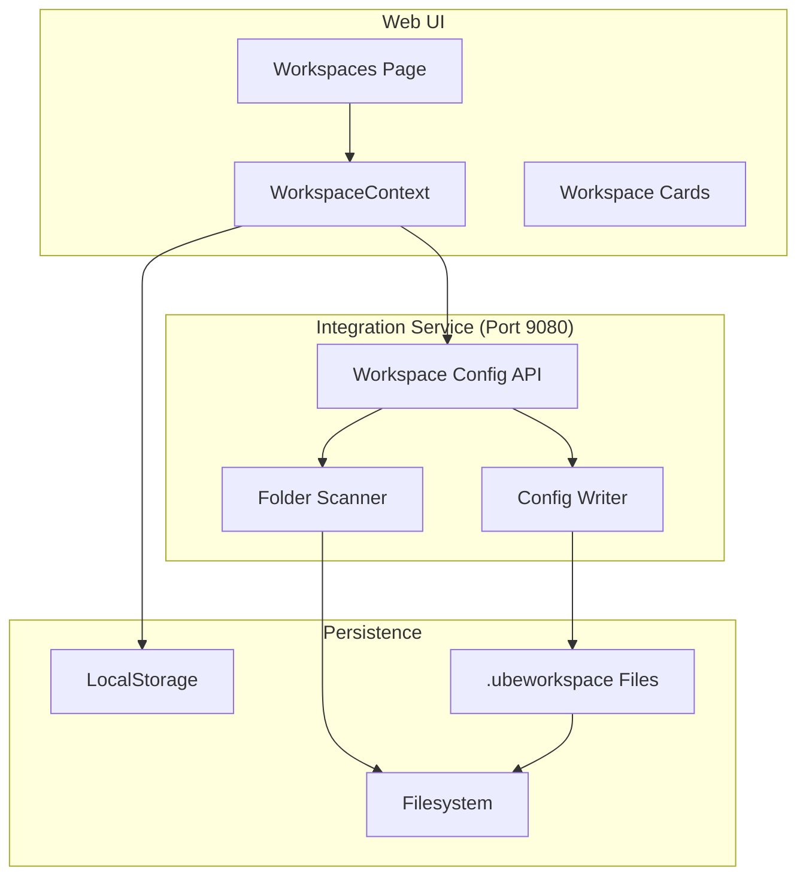
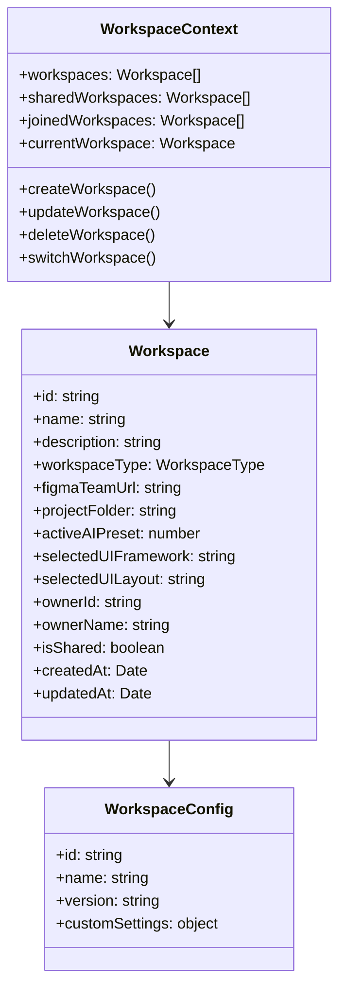
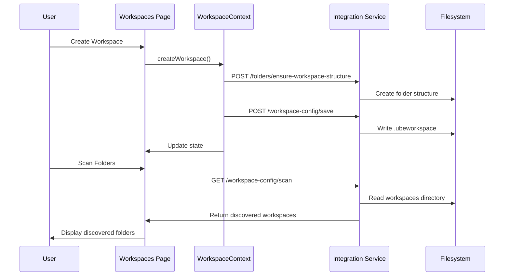

# Workspace Management Capability

## Metadata

| Field | Value |
|-------|-------|
| **Name** | Workspace Management |
| **Type** | Capability |
| **System** | UbeCode |
| **Component** | Web UI / Integration Service |
| **ID** | CAP-931847 |
| **Owner** | Development Team |
| **Status** | Implemented |
| **Approval** | Approved |
| **Priority** | High |

---

## Technical Overview

### Purpose

The Workspace Management capability provides comprehensive workspace lifecycle management including creation, configuration, sharing, and persistence of workspace settings. Workspaces are the fundamental organizing unit in UbeCode, containing all project-related configurations, design artifacts, and development settings.

A key feature is the `.ubeworkspace` configuration file which persists workspace settings to the filesystem, enabling:
- Portability of workspace configurations across machines
- Discovery of existing workspaces from the filesystem
- Version-controlled workspace settings
- Easy backup and restore of workspace configurations

---

## Enablers

This capability is supported by the following enablers:

| Enabler ID | Name | Status |
|------------|------|--------|
| ENB-931848 | Workspace Configuration File (.ubeworkspace) | Implemented |
| ENB-931849 | Workspace Folder Discovery | Implemented |
| ENB-931850 | Workspace Sharing | Implemented |
| ENB-931851 | Workspace Context Management | Implemented |

---

## Dependencies

### Upstream Dependencies

| Dependency | Type | Description |
|------------|------|-------------|
| Integration Service | Internal Service | Backend API on port 9080 |
| React Framework | Library | Frontend component framework |
| TypeScript | Language | Type-safe JavaScript |
| LocalStorage | Browser API | Client-side workspace storage |

### Downstream Dependencies

| Dependency | Type | Description |
|------------|------|-------------|
| Capabilities Management | Feature | Uses workspace folder for specifications |
| Storyboard | Feature | Stores storyboard data per workspace |
| Ideation Canvas | Feature | Stores ideation data per workspace |
| Code Generation | Feature | Uses workspace folder for generated code |
| AI Principles | Feature | Stores AI governance settings per workspace |

---

## Dependency Flow



---

## Functional Requirements

| FR-ID | Name | Requirement | Status | Priority | Approval |
|-------|------|-------------|--------|----------|----------|
| FR-931001 | Create Workspace | User can create new workspaces with name, description, and type | Implemented | High | Approved |
| FR-931002 | Edit Workspace | User can edit workspace settings | Implemented | High | Approved |
| FR-931003 | Delete Workspace | User can delete workspaces (except last one) | Implemented | High | Approved |
| FR-931004 | Switch Workspace | User can switch between workspaces | Implemented | High | Approved |
| FR-931005 | Share Workspace | User can share/unshare workspaces for collaboration | Implemented | Medium | Approved |
| FR-931006 | Join Workspace | User can join shared workspaces | Implemented | Medium | Approved |
| FR-931007 | Save Config File | System saves .ubeworkspace file on create/update | Implemented | High | Approved |
| FR-931008 | Scan Folders | System scans workspaces folder for .ubeworkspace files | Implemented | High | Approved |
| FR-931009 | Import Workspace | User can import discovered workspaces | Implemented | High | Approved |
| FR-931010 | Workspace Types | Support for new/refactor/enhance/reverse-engineer types | Implemented | Medium | Approved |

---

## Non-Functional Requirements

| NFR-ID | Name | Requirement | Type | Status | Priority |
|--------|------|-------------|------|--------|----------|
| NFR-931001 | Response Time | Workspace operations complete within 1 second | Performance | Implemented | High |
| NFR-931002 | Config Format | .ubeworkspace files use JSON format | Compatibility | Implemented | High |
| NFR-931003 | Path Security | Workspace paths restricted to workspaces directory | Security | Implemented | High |
| NFR-931004 | Data Isolation | User workspaces isolated by user email | Security | Implemented | High |

---

## Technical Specifications

### Workspace Configuration File Format

The `.ubeworkspace` file is a JSON file stored in the root of each workspace folder:

```json
{
  "id": "workspace-1701619200000",
  "name": "My Project",
  "description": "Project description",
  "workspaceType": "new",
  "figmaTeamUrl": "https://www.figma.com/files/team/123456/Team",
  "projectFolder": "workspaces/My-Project",
  "activeAIPreset": 1,
  "selectedUIFramework": "",
  "selectedUILayout": "",
  "ownerId": "user@example.com",
  "ownerName": "User Name",
  "isShared": false,
  "createdAt": "2025-12-03T12:00:00.000Z",
  "updatedAt": "2025-12-03T12:00:00.000Z",
  "version": "1.0"
}
```

### API Endpoints

| Type | Operation | Endpoint | Description | Payload | Response |
|------|-----------|----------|-------------|---------|----------|
| POST | Save Config | /workspace-config/save | Save .ubeworkspace file | { config: WorkspaceConfig } | { success, path, message } |
| GET | Scan Workspaces | /workspace-config/scan | Scan folders for configs | None | { workspaces[], basePath } |
| GET | Get Config | /workspace-config | Get config from folder | ?path=workspaces/name | WorkspaceConfig |

### Component Architecture



### Workflow



---

## Success Criteria

1. **Functional Completeness**
   - All workspace CRUD operations functional
   - .ubeworkspace file created on workspace creation
   - .ubeworkspace file updated on workspace changes
   - Folder scanning discovers existing workspaces

2. **Data Integrity**
   - Workspace configurations persist across sessions
   - Config files match localStorage data
   - Imported workspaces have correct settings

3. **User Experience**
   - Clear indication of configured vs unconfigured folders
   - Easy import of discovered workspaces
   - Visual feedback during scan operations

---

## Implementation Notes

### File Locations

- **Frontend Component**: `web-ui/src/pages/Workspaces.tsx`
- **Context Provider**: `web-ui/src/context/WorkspaceContext.tsx`
- **Backend Handler**: `internal/integration/handler.go` (HandleSaveWorkspaceConfig, HandleScanWorkspaces)
- **Routes**: `cmd/integration-service/main.go`
- **Config Files**: `workspaces/{name}/.ubeworkspace`

### State Management

Uses React Context (WorkspaceContext) for:
- Current workspace selection
- Workspace list management
- Shared workspace tracking
- Real-time collaboration sync

---

## Related Documents

- [ENB-931848 Workspace Configuration File](ENB-931848.md)
- [DEVELOPMENT_GUIDE.md](../DEVELOPMENT_GUIDE.md)
- [QUICKSTART.md](../QUICKSTART.md)

---

**Document Version**: 1.0
**Created**: 2025-12-03
**Last Updated**: 2025-12-03
**Author**: Development Team
