# Complete Dependency Flow Diagram

**Generated**: 2025-11-24
**Version**: 1.0
**Type**: Dependency Documentation

## Overview

This document provides a comprehensive view of all dependencies within the Balut application, showing how capabilities, enablers, and external services interact.

## Capability-Level Dependencies

### Dependency Flow Diagram

```mermaid
flowchart TD
    %% External Dependencies
    FIGMA["Figma API<br/>External Design Platform<br/>🌐"]
    DELM["DELM Service<br/>AI Image Generation<br/>🤖"]

    %% Infrastructure Capability
    CAP_471395["CAP-471395<br/>Container Orchestration<br/>📦"]

    %% Core Capabilities
    CAP_582341["CAP-582341<br/>Figma Integration Management<br/>🔗"]
    CAP_694827["CAP-694827<br/>Design Artifact Management<br/>📁"]
    CAP_318652["CAP-318652<br/>Capability Tracking<br/>📊"]
    CAP_847293["CAP-847293<br/>UI Designer<br/>🎨"]
    CAP_944623["CAP-944623<br/>Display UI<br/>🖥️"]

    %% External to Internal Dependencies
    FIGMA --> CAP_582341
    DELM --> CAP_847293

    %% Infrastructure Dependencies
    CAP_471395 --> CAP_582341
    CAP_471395 --> CAP_694827
    CAP_471395 --> CAP_318652

    %% Core Capability Dependencies
    CAP_582341 --> CAP_694827
    CAP_582341 --> CAP_944623
    CAP_694827 --> CAP_318652
    CAP_694827 --> CAP_944623
    CAP_847293 --> CAP_944623

    %% Styling
    classDef external fill:#f3e5f5,stroke:#7b1fa2,stroke-width:2px
    classDef infrastructure fill:#e3f2fd,stroke:#1976d2,stroke-width:3px
    classDef core fill:#e8f5e8,stroke:#388e3c,stroke-width:2px
    classDef ui fill:#fff3e0,stroke:#f57c00,stroke-width:2px

    class FIGMA,DELM external
    class CAP_471395 infrastructure
    class CAP_582341,CAP_694827,CAP_318652,CAP_847293 core
    class CAP_944623 ui
```



## Capability Dependency Matrix

| Capability | Depends On (Upstream) | Required By (Downstream) |
|------------|----------------------|--------------------------|
| CAP-471395<br/>Container Orchestration | None (Infrastructure) | CAP-582341, CAP-694827, CAP-318652 |
| CAP-582341<br/>Figma Integration | Figma API (External)<br/>CAP-471395 | CAP-694827, CAP-944623 |
| CAP-694827<br/>Design Artifact Mgmt | CAP-582341<br/>CAP-471395 | CAP-318652, CAP-944623 |
| CAP-318652<br/>Capability Tracking | CAP-694827<br/>CAP-471395 | None (End Consumer) |
| CAP-847293<br/>UI Designer | DELM Service (External) | CAP-944623 |
| CAP-944623<br/>Display UI | CAP-582341, CAP-694827, CAP-847293 | None (End User Interface) |

## Enabler-Level Dependencies

### Figma Integration Management (CAP-582341) Enablers


### Design Artifact Management (CAP-694827) Enablers


### Capability Tracking (CAP-318652) Enablers


### Container Orchestration (CAP-471395) Enablers


### UI Designer (CAP-847293) Enabler


### Display UI (CAP-944623) Enablers


## External Dependencies

### External Services

| External Service | Used By Capability | Purpose | Critical |
|-----------------|-------------------|---------|----------|
| Figma API | CAP-582341 | Design file retrieval, comments | Yes |
| DELM Service | CAP-847293 | AI-powered image generation | Yes |
| Docker | CAP-471395 | Container orchestration | Yes |

### External Libraries and Technologies

| Technology | Used By | Purpose | Version |
|------------|---------|---------|---------|
| Go | Multiple | Backend services | 1.22+ |
| React | CAP-944623 | Web UI framework | 18.x |
| TypeScript | CAP-944623 | Type-safe JavaScript | 5.x |
| Python | CAP-847293 | DELM service runtime | 3.9+ |
| mflux | CAP-847293 | Stable Diffusion runtime | Latest |
| Docker Compose | CAP-471395 | Service orchestration | Latest |

## Port Allocation

| Service | Port | Capability | Status |
|---------|------|------------|--------|
| Integration Service | 8080 | CAP-582341 | Active |
| Design Service | 8081 | CAP-694827 | Active |
| Capability Service | 8082 | CAP-318652 | Active |
| Web UI | 3000 | CAP-944623 | Active |
| API Server | 3001 | CAP-944623 | Active |
| DELM Service | 3005 | CAP-847293 | Active |

## Network Dependencies


## Data Flow Dependencies

### Design Workflow Data Flow


### AI Generation Workflow Data Flow


## Critical Paths

### Critical Path 1: Figma to Capability Tracking
```
Figma API → CAP-582341 (Figma Integration) → CAP-694827 (Design Artifacts) → CAP-318652 (Capability Tracking)
```

**Impact**: Design-driven development workflow
**Risk**: High - Any failure breaks design import pipeline

### Critical Path 2: AI Generation to UI Display
```
DELM Service → CAP-847293 (UI Designer) → CAP-944623 (Display UI)
```

**Impact**: AI-powered design generation
**Risk**: Medium - Fallback to manual design possible

### Critical Path 3: Container Orchestration
```
CAP-471395 (Container Orchestration) → All Services
```

**Impact**: System startup and lifecycle management
**Risk**: High - System-wide failure if orchestration fails

## Dependency Health Checks

### Health Check Matrix

| Dependency | Check Method | Frequency | Timeout | Critical |
|------------|-------------|-----------|---------|----------|
| Figma API | HTTP GET /v1/me | On-demand | 30s | Yes |
| DELM Service | HTTP GET /health | Before generation | 5s | Yes |
| Integration Service | HTTP GET /health | 30s interval | 5s | Yes |
| Design Service | HTTP GET /health | 30s interval | 5s | Yes |
| Capability Service | HTTP GET /health | 30s interval | 5s | Yes |

## Failure Modes and Mitigation

| Failure | Impact | Mitigation | Recovery Time |
|---------|--------|------------|---------------|
| Figma API Down | No design imports | Cached data, manual upload | API recovery time |
| DELM Service Down | No AI generation | Manual design creation | Service restart (~30s) |
| Integration Service Down | No Figma connectivity | Restart via orchestrator | ~10s |
| Design Service Down | No artifact storage | Restart via orchestrator | ~10s |
| Capability Service Down | No tracking updates | Restart via orchestrator | ~10s |
| Container Orchestrator Down | System-wide failure | Manual service restart | ~60s |

---

**Document Status**: Complete
**Last Updated**: 2025-11-24
**Maintainer**: Development Team
