# Container Interface Definition

## Metadata
- **Name**: Container Interface Definition
- **Type**: Enabler
- **ID**: ENB-283746
- **Capability ID**: CAP-471395
- **Owner**: Product Team
- **Status**: Implemented
- **Approval**: Approved
- **Priority**: Medium
- **Analysis Review**: Not Required
- **Code Review**: Not Required

## Technical Overview
### Purpose
Define standard interface contract for managed containers, enabling consistent lifecycle management across all application components.

## Functional Requirements
| ID | Name | Requirement | Status | Priority | Approval |
|----|------|-------------|--------|----------|----------|
| FR-417293 | Interface Methods | Must define Name(), Start(), Stop(), and Health() methods | Implemented | High | Approved |
| FR-528461 | Context Support | Start, Stop, and Health must accept context for cancellation | Implemented | High | Approved |
| FR-639174 | Status Types | Must define status constants: stopped, starting, running, stopping, failed | Implemented | Medium | Approved |
| FR-741852 | Container Info | Must provide ContainerInfo struct with Name, Status, Error fields | Implemented | Medium | Approved |

## Non-Functional Requirements
| ID | Name | Requirement | Type | Status | Priority | Approval |
|----|------|-------------|------|--------|----------|----------|
| NFR-384726 | Type Safety | Interface must use Go interface for compile-time type checking | Usability | Implemented | High | Approved |
| NFR-591483 | Extensibility | Interface must support any container implementation | Scalability | Implemented | High | Approved |

## Technical Specifications

### Enabler Dependency Flow Diagram

```mermaid
flowchart TD
    ENB_283746["ENB-283746<br/>Container Interface Definition<br/>📋"]

    ENB_592183["ENB-592183<br/>Orchestrator Service<br/>⚙️"]

    IMPL1["Future Container<br/>Implementation 1<br/>⏳"]
    IMPL2["Future Container<br/>Implementation 2<br/>⏳"]

    ENB_592183 --> ENB_283746
    IMPL1 -.Implements.-> ENB_283746
    IMPL2 -.Implements.-> ENB_283746

    classDef enabler fill:#e3f2fd,stroke:#1976d2,stroke-width:2px
    classDef supporting fill:#e8f5e8,stroke:#388e3c,stroke-width:2px
    classDef placeholder fill:#f5f5f5,stroke:#999999,stroke-width:1px,stroke-dasharray: 5 5

    class ENB_283746 enabler
    class ENB_592183 supporting
    class IMPL1,IMPL2 placeholder
```

### API Technical Specifications

| API Type | Operation | Channel / Endpoint | Description | Request / Publish Payload | Response / Subscribe Data |
|----------|-----------|---------------------|-------------|----------------------------|----------------------------|
| Interface | Name | Container.Name() | Get container identifier | None | string |
| Interface | Start | Container.Start(ctx) | Initialize and start container | context.Context | error |
| Interface | Stop | Container.Stop(ctx) | Gracefully shutdown container | context.Context | error |
| Interface | Health | Container.Health(ctx) | Check container health | context.Context | error |

### Data Models

### Class Diagrams

## External Dependencies
- **Go context**: Context for lifecycle control
- **Go error**: Error handling

## Testing Strategy
- Unit tests for ContainerInfo String() method
- Test status constant values
- Verify interface contract can be implemented
- Test future container implementations
