# Integration HTTP Handlers

## Metadata
- **Name**: Integration HTTP Handlers
- **Type**: Enabler
- **ID**: ENB-451729
- **Capability ID**: CAP-582341
- **Owner**: Product Team
- **Status**: Implemented
- **Approval**: Approved
- **Priority**: High
- **Analysis Review**: Not Required
- **Code Review**: Not Required

## Technical Overview
### Purpose
Provide REST API endpoints for external Figma integration, exposing file and comment retrieval functionality via HTTP.

## Functional Requirements
| ID | Name | Requirement | Status | Priority | Approval |
|----|------|-------------|--------|----------|----------|
| FR-182947 | Health Endpoint | Must provide GET /health endpoint returning service status | Implemented | High | Approved |
| FR-274168 | File Endpoint | Must provide GET /figma/files/{fileKey} endpoint for file retrieval | Implemented | High | Approved |
| FR-391752 | Comment Endpoint | Must provide GET /figma/files/{fileKey}/comments endpoint for comments | Implemented | High | Approved |
| FR-458139 | Path Parameter Extraction | Handlers must extract fileKey from URL path | Implemented | High | Approved |
| FR-526481 | Response Formatting | Handlers must return JSON responses with appropriate status codes | Implemented | High | Approved |

## Non-Functional Requirements
| ID | Name | Requirement | Type | Status | Priority | Approval |
|----|------|-------------|------|--------|----------|----------|
| NFR-617294 | Response Time | Health check must respond within 100ms | Performance | Implemented | High | Approved |
| NFR-738561 | Error Handling | Handlers must return appropriate HTTP status codes (200, 400, 500) | Usability | Implemented | High | Approved |
| NFR-849327 | Request Timeout | Handlers must respect 15-second read/write timeouts | Performance | Implemented | Medium | Approved |

## Technical Specifications

### Enabler Dependency Flow Diagram

```mermaid
flowchart TD
    ENB_451729["ENB-451729<br/>Integration HTTP Handlers<br/>🌐"]

    ENB_837461["ENB-837461<br/>File Retrieval Service<br/>⚙️"]
    ENB_926583["ENB-926583<br/>Comment Retrieval Service<br/>⚙️"]

    CLIENT["External HTTP Clients<br/>API Consumers<br/>👥"]

    CLIENT --> ENB_451729
    ENB_451729 --> ENB_837461
    ENB_451729 --> ENB_926583

    classDef enabler fill:#e3f2fd,stroke:#1976d2,stroke-width:2px
    classDef supporting fill:#e8f5e8,stroke:#388e3c,stroke-width:2px
    classDef external fill:#f3e5f5,stroke:#7b1fa2,stroke-width:2px

    class ENB_451729 enabler
    class ENB_837461,ENB_926583 supporting
    class CLIENT external
```

### API Technical Specifications

| API Type | Operation | Channel / Endpoint | Description | Request / Publish Payload | Response / Subscribe Data |
|----------|-----------|---------------------|-------------|----------------------------|----------------------------|
| HTTP GET | Health Check | GET /health | Service health status | None | {"status": "healthy"} |
| HTTP GET | Get File | GET /figma/files/{fileKey} | Retrieve Figma file | Path: fileKey | File JSON object |
| HTTP GET | Get Comments | GET /figma/files/{fileKey}/comments | Retrieve file comments | Path: fileKey | Comments JSON array |

### Class Diagrams

### Sequence Diagrams

### Dataflow Diagrams

## External Dependencies
- **Go net/http**: HTTP server and routing
- **Go encoding/json**: JSON encoding/decoding
- **ENB-837461**: File Retrieval Service
- **ENB-926583**: Comment Retrieval Service

## Testing Strategy
- HTTP handler unit tests with httptest.ResponseRecorder
- Test all endpoint routes
- Test path parameter extraction
- Test JSON response formatting
- Test error responses (400, 500)
- Test health check endpoint
