# Orchestrator Service

## Metadata
- **Name**: Orchestrator Service
- **Type**: Enabler
- **ID**: ENB-592183
- **Capability ID**: CAP-471395
- **Owner**: Product Team
- **Status**: Implemented
- **Approval**: Approved
- **Priority**: High
- **Analysis Review**: Not Required
- **Code Review**: Not Required

## Technical Overview
### Purpose
Provide central container lifecycle management, coordinating startup, shutdown, health monitoring, and status reporting for all registered containers.

## Functional Requirements
| ID | Name | Requirement | Status | Priority | Approval |
|----|------|-------------|--------|----------|----------|
| FR-318496 | Container Registration | Must allow registration of containers via Register() method | Implemented | High | Approved |
| FR-427581 | Batch Start | Must start all registered containers in single operation | Implemented | High | Approved |
| FR-536742 | Batch Stop | Must stop all registered containers in reverse order | Implemented | High | Approved |
| FR-648193 | Status Reporting | Must provide Status() method returning all container states | Implemented | Medium | Approved |
| FR-759284 | Thread Safety | Must use mutex for concurrent access to container map | Implemented | High | Approved |

## Non-Functional Requirements
| ID | Name | Requirement | Type | Status | Priority | Approval |
|----|------|-------------|------|--------|----------|----------|
| NFR-427816 | Startup Performance | All containers should start within configured timeout | Performance | Implemented | Medium | Approved |
| NFR-538942 | Shutdown Reliability | Stop should complete even if individual containers fail | Reliability | Implemented | High | Approved |
| NFR-649273 | Error Isolation | Container failures should not prevent other containers from starting | Reliability | Implemented | High | Approved |

## Technical Specifications

### Enabler Dependency Flow Diagram

```mermaid
flowchart TD
    ENB_592183["ENB-592183<br/>Orchestrator Service<br/>⚙️"]

    ENB_283746["ENB-283746<br/>Container Interface<br/>📋"]
    ENB_147825["ENB-147825<br/>Health Check System<br/>❤️"]
    ENB_836419["ENB-836419<br/>Graceful Shutdown<br/>🛑"]

    MAIN["Main Application<br/>Entry Point<br/>🚀"]

    MAIN --> ENB_592183
    ENB_592183 --> ENB_283746
    ENB_592183 --> ENB_147825
    ENB_592183 --> ENB_836419

    classDef enabler fill:#e3f2fd,stroke:#1976d2,stroke-width:2px
    classDef supporting fill:#e8f5e8,stroke:#388e3c,stroke-width:2px
    classDef external fill:#f3e5f5,stroke:#7b1fa2,stroke-width:2px

    class ENB_592183 enabler
    class ENB_283746,ENB_147825,ENB_836419 supporting
    class MAIN external
```

### API Technical Specifications

| API Type | Operation | Channel / Endpoint | Description | Request / Publish Payload | Response / Subscribe Data |
|----------|-----------|---------------------|-------------|----------------------------|----------------------------|
| Public Method | Register | Register(c Container) | Register a container | Container instance | error |
| Public Method | Start | Start(ctx) | Start all containers | context.Context | error |
| Public Method | Stop | Stop(ctx) | Stop all containers | context.Context | error |
| Public Method | Status | Status() | Get all container statuses | None | []ContainerInfo |

### Data Models

### Class Diagrams

### Sequence Diagrams

### State Diagrams

## External Dependencies
- **sync.RWMutex**: Thread-safe container map access
- **ENB-283746**: Container interface definition
- **Go context**: Lifecycle control

## Testing Strategy
- Unit tests with mock containers
- Test concurrent container operations
- Test partial failure scenarios
- Test registration of duplicate names
- Verify reverse-order shutdown
- Test mutex locking behavior
