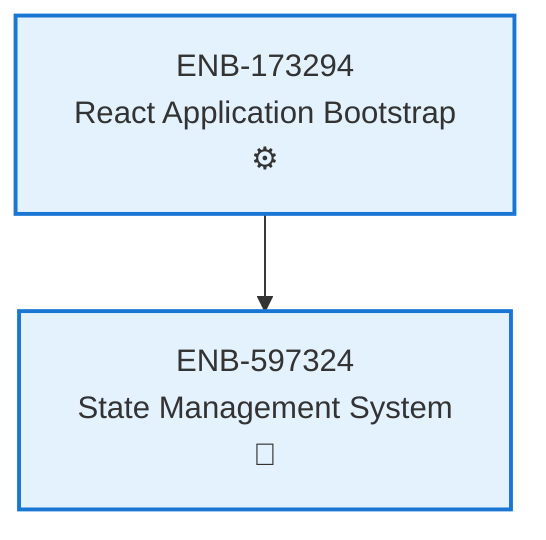
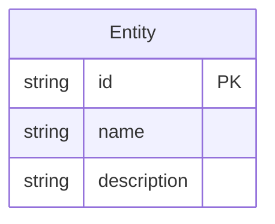
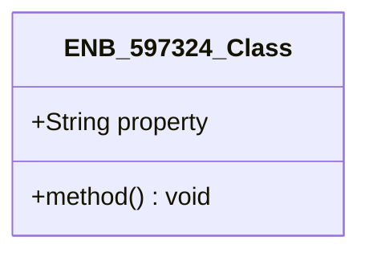
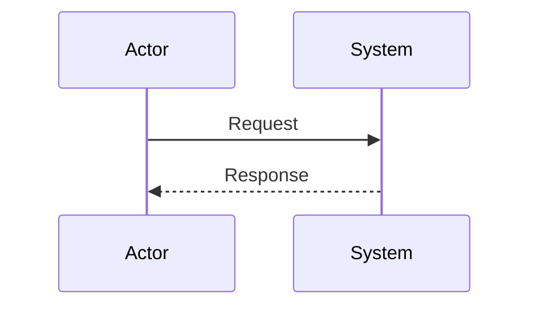
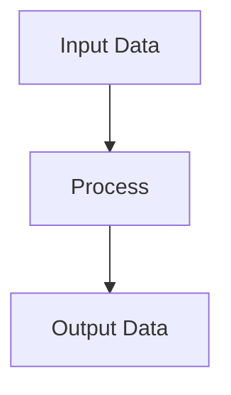
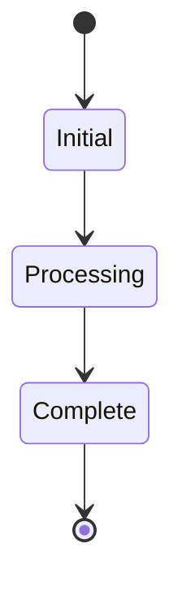

# State Management System

## Metadata

- **Name**: State Management System
- **Type**: Enabler
- **ID**: ENB-597324
- **Approval**: Approved
- **Capability ID**: CAP-944623
- **Owner**: Product Team
- **Status**: Ready for Implementation
- **Priority**: Medium
- **Analysis Review**: Required
- **Code Review**: Not Required

## Technical Overview
### Purpose
Implement centralized state management using React Context API or Redux Toolkit to manage application state, user sessions, and data flow between components.

## Functional Requirements

| ID | Name | Requirement | Priority | Status | Approval |
|----|------|-------------|----------|--------|----------|
| | | | | | |

## Non-Functional Requirements

| ID | Name | Type | Requirement | Priority | Status | Approval |
|----|------|------|-------------|----------|--------|----------|
| | | | | | | |

## Dependencies

### Internal Upstream Dependency

| Enabler ID | Description |
|------------|-------------|
| | |

### Internal Downstream Impact

| Enabler ID | Description |
|------------|-------------|
| | |

### External Dependencies

**External Upstream Dependencies**: None identified.

**External Downstream Impact**: None identified.

## Technical Specifications (Template)

### Enabler Dependency Flow Diagram

### API Technical Specifications (if applicable)

| API Type | Operation | Channel / Endpoint | Description | Request / Publish Payload | Response / Subscribe Data |
|----------|-----------|---------------------|-------------|----------------------------|----------------------------|
| | | | | | |

### Data Models

### Class Diagrams

### Sequence Diagrams

### Dataflow Diagrams

### State Diagrams

