# UI Component Library

## Metadata
- **Name**: UI Component Library
- **Type**: Enabler
- **ID**: ENB-691482
- **Capability ID**: CAP-944623
- **Owner**: Product Team
- **Status**: Ready for Analysis
- **Approval**: Approved
- **Priority**: High
- **Analysis Review**: Not Required
- **Code Review**: Not Required

## Technical Overview
### Purpose
Create reusable React components implementing the Ford Design System (buttons, cards, forms, alerts, etc.).

## Functional Requirements
| ID | Name | Requirement | Status | Priority | Approval |
|----|------|-------------|--------|----------|----------|
| FR-PENDING | Button Components | Implement primary, secondary, accent, outlined, and text buttons | Ready for Design | High | Approved |
| FR-PENDING | Card Components | Create card components with Ford blue gradient styling | Ready for Design | High | Approved |
| FR-PENDING | Form Components | Build input, select, textarea with Ford styling | Ready for Design | High | Approved |
| FR-PENDING | Alert Components | Implement info, success, warning, error alerts | Ready for Design | Medium | Approved |
| FR-PENDING | Navigation Components | Create Ford-branded nav bar and sidebar | Ready for Design | High | Approved |

## Non-Functional Requirements
| ID | Name | Requirement | Type | Status | Priority | Approval |
|----|------|-------------|------|--------|----------|----------|
| NFR-PENDING | Reusability | All components must be framework-agnostic and reusable | Maintainability | Ready for Design | High | Approved |
| NFR-PENDING | Accessibility | Components must meet WCAG AA standards | Accessibility | Ready for Design | High | Approved |
| NFR-PENDING | Performance | Components should render in <16ms | Performance | Ready for Design | Medium | Approved |

## Technical Specifications (Template)

### Enabler Dependency Flow Diagram

```mermaid
flowchart TD
    ENB_691482["ENB-691482<br/>UI Component Library<br/>📦"]

    ENB_385926["ENB-385926<br/>Ford Design System Integration<br/>🎨"]
    ENB_739241["ENB-739241<br/>Page Components<br/>📄"]

    ENB_385926 --> ENB_691482
    ENB_691482 --> ENB_739241

    classDef enabler fill:#e3f2fd,stroke:#1976d2,stroke-width:2px
    classDef supporting fill:#e8f5e8,stroke:#388e3c,stroke-width:2px

    class ENB_691482 enabler
    class ENB_385926,ENB_739241 supporting
```

## External Dependencies
- React 18+
- Ford Design System CSS

## Testing Strategy
- Component unit tests with Jest/React Testing Library
- Visual regression testing with Storybook
- Accessibility testing with axe-core
- Cross-browser compatibility testing
