# Capability Service Endpoint

## Metadata
- **Name**: Capability Service Endpoint
- **Type**: Enabler
- **ID**: ENB-724938
- **Capability ID**: CAP-318652
- **Owner**: Product Team
- **Status**: Implemented
- **Approval**: Approved
- **Priority**: High
- **Analysis Review**: Not Required
- **Code Review**: Not Required

## Technical Overview
### Purpose
Provide REST API endpoint for SAFe capability operations, serving as the entry point for capability tracking functionality.

## Functional Requirements
| ID | Name | Requirement | Status | Priority | Approval |
|----|------|-------------|--------|----------|----------|
| FR-328174 | Service Initialization | Service must start on configurable port (default 8082) | Implemented | High | Approved |
| FR-491826 | Capabilities Endpoint | Must provide GET /capabilities endpoint (placeholder) | Implemented | Medium | Approved |
| FR-573941 | Route Configuration | Service must configure HTTP routes using ServeMux | Implemented | High | Approved |
| FR-684253 | Graceful Shutdown | Service must shutdown gracefully on SIGINT/SIGTERM signals | Implemented | High | Approved |

## Non-Functional Requirements
| ID | Name | Requirement | Type | Status | Priority | Approval |
|----|------|-------------|------|--------|----------|----------|
| NFR-417382 | Service Timeout | HTTP server must enforce 15s read/write and 60s idle timeouts | Performance | Implemented | High | Approved |
| NFR-529641 | Shutdown Timeout | Graceful shutdown must complete within 30 seconds | Reliability | Implemented | High | Approved |
| NFR-738194 | Port Flexibility | Service port must be configurable via PORT environment variable | Usability | Implemented | Medium | Approved |

## Technical Specifications

### Enabler Dependency Flow Diagram

```mermaid
flowchart TD
    ENB_724938["ENB-724938<br/>Capability Service Endpoint<br/>🌐"]

    ENB_861452["ENB-861452<br/>Health Monitoring<br/>❤️"]

    CLIENT["External HTTP Clients<br/>API Consumers<br/>👥"]

    FUTURE["Future Capability Storage<br/>Placeholder<br/>⏳"]

    CLIENT --> ENB_724938
    ENB_724938 --> ENB_861452
    ENB_724938 -.Future.-> FUTURE

    classDef enabler fill:#e3f2fd,stroke:#1976d2,stroke-width:2px
    classDef supporting fill:#e8f5e8,stroke:#388e3c,stroke-width:2px
    classDef external fill:#f3e5f5,stroke:#7b1fa2,stroke-width:2px
    classDef placeholder fill:#f5f5f5,stroke:#999999,stroke-width:1px,stroke-dasharray: 5 5

    class ENB_724938 enabler
    class ENB_861452 supporting
    class CLIENT external
    class FUTURE placeholder
```

### API Technical Specifications

| API Type | Operation | Channel / Endpoint | Description | Request / Publish Payload | Response / Subscribe Data |
|----------|-----------|---------------------|-------------|----------------------------|----------------------------|
| HTTP GET | List Capabilities | GET /capabilities | List SAFe capabilities (placeholder) | None | {"capabilities": []} |

### Sequence Diagrams

### State Diagrams

## External Dependencies
- **Go net/http**: HTTP server implementation
- **Go os/signal**: Signal handling for graceful shutdown
- **Go context**: Shutdown timeout management

## Testing Strategy
- Manual testing with curl/Postman
- Test service startup on custom port
- Test graceful shutdown behavior
- Verify timeout configurations
- Test health endpoint integration
