# Authentication System

## Metadata

- **Name**: Authentication System
- **Type**: Enabler
- **ID**: ENB-729481
- **Approval**: Approved
- **Capability ID**: CAP-944623
- **Owner**: Product Team
- **Status**: Implemented
- **Priority**: High
- **Analysis Review**: Required
- **Code Review**: Not Required

## Technical Overview
### Purpose
Implement user authentication with login page, session management, and protected routes for the Balut application.

## Functional Requirements

| ID | Name | Requirement | Priority | Status | Approval |
|----|------|-------------|----------|--------|----------|
| FR-729481-001 | Login Form | Provide email/password login form with validation | High | Approved | Approved |
| FR-729481-002 | Session Management | Store and manage user session with token/cookie | High | Approved | Approved |
| FR-729481-003 | Protected Routes | Redirect unauthenticated users to login page | High | Approved | Approved |
| FR-729481-004 | Logout Functionality | Allow users to log out and clear session | High | Approved | Approved |
| FR-729481-005 | Auth State Persistence | Persist authentication state across page refreshes | Medium | Approved | Approved |

## Non-Functional Requirements

| ID | Name | Type | Requirement | Priority | Status | Approval |
|----|------|------|-------------|----------|--------|----------|
| NFR-729481-001 | Security | Security | Use secure token storage (localStorage/sessionStorage with appropriate security) | High | Approved | Approved |
| NFR-729481-002 | User Experience | Usability | Login form should be responsive and accessible | Medium | Approved | Approved |
| NFR-729481-003 | Performance | Performance | Authentication check should complete within 100ms | Medium | Approved | Approved |
| NFR-729481-004 | Browser Compatibility | Compatibility | Support modern browsers (Chrome, Firefox, Safari, Edge) | Medium | Approved | Approved |

## Dependencies

### Internal Upstream Dependency

| Enabler ID | Description |
|------------|-------------|
| ENB-173294 | React Application Bootstrap |
| ENB-597324 | State Management System |

### Internal Downstream Impact

| Enabler ID | Description |
|------------|-------------|
| | |

### External Dependencies

**External Upstream Dependencies**: None identified.

**External Downstream Impact**: None identified.

## Technical Specifications (Template)

### Enabler Dependency Flow Diagram

```mermaid
flowchart TD
    ENB_729481["ENB-729481<br/>Authentication System<br/>📡"]

    classDef enabler fill:#e3f2fd,stroke:#1976d2,stroke-width:2px
    class ENB_729481 enabler
```

### API Technical Specifications (if applicable)

| API Type | Operation | Channel / Endpoint | Description | Request / Publish Payload | Response / Subscribe Data |
|----------|-----------|---------------------|-------------|----------------------------|----------------------------|
| REST | POST | /api/auth/login | Authenticate user credentials | `{ email: string, password: string }` | `{ token: string, user: { id: string, email: string, name: string, role: string } }` |
| REST | POST | /api/auth/logout | Invalidate user session | `{ token: string }` | `{ success: boolean }` |
| REST | GET | /api/auth/verify | Verify current session token | Header: `Authorization: Bearer <token>` | `{ valid: boolean, user: User }` |

### Data Models

### Class Diagrams

### Sequence Diagrams

### Dataflow Diagrams

### State Diagrams

