# Workspace Management

## Metadata

- **Name**: Workspace Management
- **Type**: Enabler
- **ID**: ENB-836247
- **Approval**: Approved
- **Capability ID**: CAP-944623
- **Owner**: Product Team
- **Status**: Implemented
- **Priority**: High
- **Analysis Review**: Required
- **Code Review**: Not Required

## Technical Overview
### Purpose
Enable users to create, manage, and switch between workspaces with Figma API integration for design-driven development workflows.

## Functional Requirements

| ID | Name | Requirement | Priority | Status | Approval |
|----|------|-------------|----------|--------|----------|
| FR-836247-001 | Workspace List | Display list of available workspaces | High | Approved | Approved |
| FR-836247-002 | Workspace Creation | Allow users to create new workspaces | High | Approved | Approved |
| FR-836247-003 | Workspace Switching | Enable switching between workspaces | High | Approved | Approved |
| FR-836247-004 | Workspace Editing | Allow renaming and editing workspace details | Medium | Approved | Approved |
| FR-836247-005 | Workspace Deletion | Allow deletion of workspaces with confirmation | Medium | Approved | Approved |
| FR-836247-006 | Figma Integration | Placeholder for Figma API integration | Low | Approved | Approved |

## Non-Functional Requirements

| ID | Name | Type | Requirement | Priority | Status | Approval |
|----|------|------|-------------|----------|--------|----------|
| NFR-836247-001 | Performance | Performance | Workspace switching should complete within 200ms | High | Approved | Approved |
| NFR-836247-002 | Usability | Usability | Interface should be intuitive with clear workspace indicators | High | Approved | Approved |
| NFR-836247-003 | Persistence | Reliability | Active workspace should persist across sessions | High | Approved | Approved |

## Dependencies

### Internal Upstream Dependency

| Enabler ID | Description |
|------------|-------------|
| ENB-729481 | Authentication System |
| ENB-597324 | State Management System |

### Internal Downstream Impact

| Enabler ID | Description |
|------------|-------------|
| | |

### External Dependencies

**External Upstream Dependencies**: None identified.

**External Downstream Impact**: None identified.

## Technical Specifications (Template)

### Enabler Dependency Flow Diagram

```mermaid
flowchart TD
    ENB_836247["ENB-836247<br/>Workspace Management<br/>📡"]

    classDef enabler fill:#e3f2fd,stroke:#1976d2,stroke-width:2px
    class ENB_836247 enabler
```

