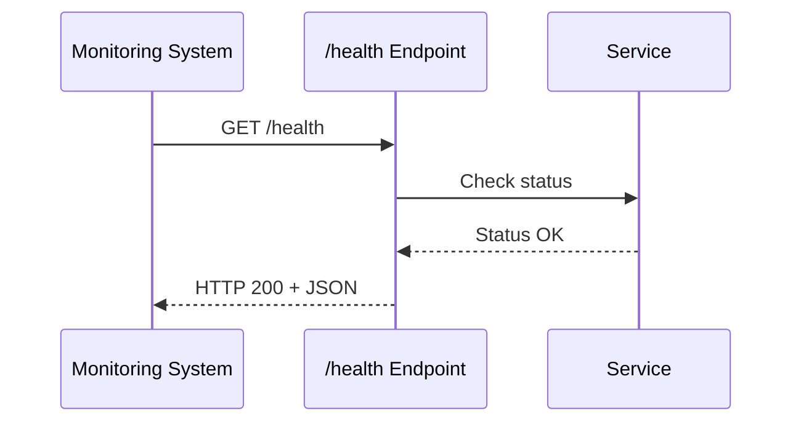

# Health Monitoring

## Metadata
- **Name**: Health Monitoring
- **Type**: Enabler
- **ID**: ENB-861452
- **Capability ID**: CAP-318652
- **Owner**: Product Team
- **Status**: Implemented
- **Approval**: Approved
- **Priority**: High
- **Analysis Review**: Not Required
- **Code Review**: Not Required

## Technical Overview
### Purpose
Provide service health check endpoint for monitoring and orchestration systems (Capability Service instance).

## Functional Requirements
| ID | Name | Requirement | Status | Priority | Approval |
|----|------|-------------|--------|----------|----------|
| FR-295173 | Health Endpoint | Must provide GET /health endpoint | Implemented | High | Approved |
| FR-386842 | Status Response | Must return JSON with service status and name | Implemented | High | Approved |
| FR-471956 | Always Available | Health endpoint must respond even under partial service degradation | Implemented | High | Approved |

## Non-Functional Requirements
| ID | Name | Requirement | Type | Status | Priority | Approval |
|----|------|-------------|------|--------|----------|----------|
| NFR-594827 | Response Time | Health check must respond within 100ms | Performance | Implemented | High | Approved |
| NFR-683149 | HTTP Status | Must return HTTP 200 for healthy status | Usability | Implemented | High | Approved |

## Technical Specifications

### API Technical Specifications

| API Type | Operation | Channel / Endpoint | Description | Request / Publish Payload | Response / Subscribe Data |
|----------|-----------|---------------------|-------------|----------------------------|----------------------------|
| HTTP GET | Health Check | GET /health | Service health status | None | {"status":"healthy","service":"capability-service"} |

### Sequence Diagrams

## External Dependencies
- **Go encoding/json**: JSON response formatting
- **Go net/http**: HTTP handler

## Testing Strategy
- Automated health check testing
- Docker Compose health check integration
- Test response format and status code
- Test under load conditions
