# Comment Retrieval Service

## Metadata
- **Name**: Comment Retrieval Service
- **Type**: Enabler
- **ID**: ENB-926583
- **Capability ID**: CAP-582341
- **Owner**: Product Team
- **Status**: Implemented
- **Approval**: Approved
- **Priority**: High
- **Analysis Review**: Not Required
- **Code Review**: Not Required

## Technical Overview
### Purpose
Fetch comments from Figma design files through the Figma API client, enabling collaboration and feedback tracking.

## Functional Requirements
| ID | Name | Requirement | Status | Priority | Approval |
|----|------|-------------|--------|----------|----------|
| FR-395714 | Comment Retrieval | Service must retrieve all comments for a Figma file by file key | Implemented | High | Approved |
| FR-482936 | Comment List Response | Service must return comments as array of Comment objects | Implemented | High | Approved |
| FR-571849 | Error Handling | Service must handle missing or invalid file keys gracefully | Implemented | Medium | Approved |

## Non-Functional Requirements
| ID | Name | Requirement | Type | Status | Priority | Approval |
|----|------|-------------|------|--------|----------|----------|
| NFR-614827 | Response Time | Comment retrieval should complete within Figma client timeout | Performance | Implemented | High | Approved |
| NFR-738152 | Scalability | Service should handle files with large comment counts | Scalability | Implemented | Medium | Approved |

## Technical Specifications

### Enabler Dependency Flow Diagram

```mermaid
flowchart TD
    ENB_926583["ENB-926583<br/>Comment Retrieval Service<br/>⚙️"]

    ENB_748192["ENB-748192<br/>Figma API Client<br/>📡"]
    ENB_451729["ENB-451729<br/>Integration HTTP Handlers<br/>🌐"]

    ENB_451729 --> ENB_926583
    ENB_926583 --> ENB_748192

    classDef enabler fill:#e3f2fd,stroke:#1976d2,stroke-width:2px
    classDef supporting fill:#e8f5e8,stroke:#388e3c,stroke-width:2px

    class ENB_926583 enabler
    class ENB_748192,ENB_451729 supporting
```

### API Technical Specifications

| API Type | Operation | Channel / Endpoint | Description | Request / Publish Payload | Response / Subscribe Data |
|----------|-----------|---------------------|-------------|----------------------------|----------------------------|
| Internal Method | GetComments | Service.GetComments(ctx, fileKey) | Retrieve comments via Figma client | ctx Context, fileKey string | []models.Comment, error |

### Data Models

### Sequence Diagrams

## External Dependencies
- **ENB-748192**: Figma API Client for API communication
- **models.Comment**: Comment data model structure
- **models.User**: User data model for comment authors

## Testing Strategy
- Integration tests with mock Figma client
- Test comment array retrieval
- Test empty comment list scenario
- Test error handling for invalid file keys
- Validate comment data structure
