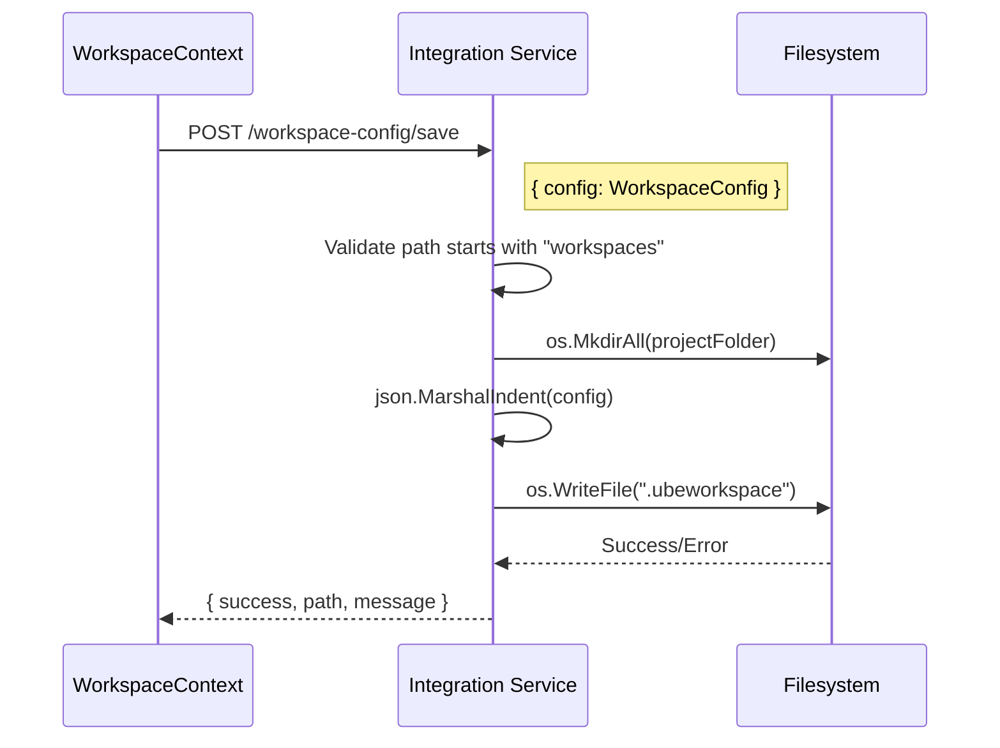
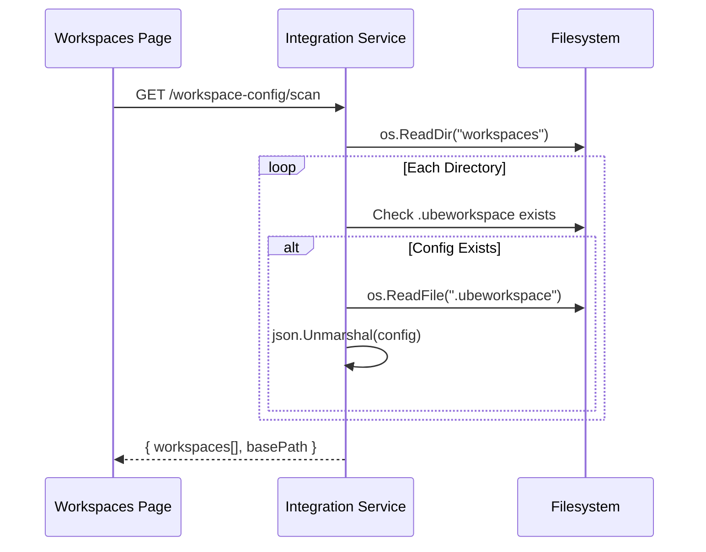
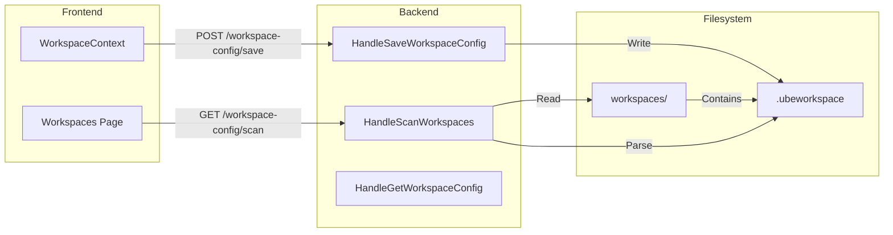

# Workspace Configuration File Enabler (.ubeworkspace)

## Metadata

| Field | Value |
|-------|-------|
| **Name** | Workspace Configuration File |
| **Type** | Enabler |
| **ID** | ENB-931848 |
| **Capability ID** | CAP-931847 |
| **Owner** | Development Team |
| **Status** | Implemented |
| **Approval** | Approved |
| **Priority** | High |
| **Analysis Review** | Not Required |
| **Code Review** | Not Required |

---

## Technical Context

### Purpose

The Workspace Configuration File enabler provides persistent storage of workspace settings in a `.ubeworkspace` JSON file within each workspace folder. This enables workspace configurations to be:

1. **Portable**: Move workspace folders between machines and retain all settings
2. **Discoverable**: Scan the filesystem to find existing workspaces not in localStorage
3. **Version Controlled**: Include workspace config in git repositories
4. **Recoverable**: Restore workspace settings after browser data loss

### Architecture Fit

This enabler integrates with the existing workspace management system by:
- Extending the `createWorkspace` function to write config files
- Extending the `updateWorkspace` function to update config files
- Adding new API endpoints for config file operations
- Adding UI for folder scanning and workspace import

### Existing Patterns to Follow

- Pattern from `HandleEnsureWorkspaceStructure` in `/internal/integration/handler.go`
- REST API patterns from existing integration service endpoints
- React Context update patterns from `WorkspaceContext.tsx`

---

## Functional Requirements

| ID | Name | Requirement | Status | Priority | Approval |
|----|------|-------------|--------|----------|----------|
| FR-931101 | Config File Creation | System creates .ubeworkspace file when workspace is created | Implemented | High | Approved |
| FR-931102 | Config File Update | System updates .ubeworkspace file when workspace is modified | Implemented | High | Approved |
| FR-931103 | Folder Scanning | System scans workspaces folder for subfolders with/without config files | Implemented | High | Approved |
| FR-931104 | Config File Reading | System reads and parses .ubeworkspace files | Implemented | High | Approved |
| FR-931105 | Workspace Import | User can import discovered workspaces into their account | Implemented | High | Approved |
| FR-931106 | Security Validation | System validates paths are within workspaces directory | Implemented | High | Approved |

---

## Non-Functional Requirements

| ID | Name | Requirement | Type | Status | Priority | Approval |
|----|------|-------------|------|--------|----------|----------|
| NFR-931101 | File Format | Config files use pretty-printed JSON for readability | Compatibility | Implemented | Medium | Approved |
| NFR-931102 | Path Security | All operations restricted to workspaces directory | Security | Implemented | High | Approved |
| NFR-931103 | Error Handling | Graceful handling of missing/corrupt config files | Reliability | Implemented | High | Approved |

---

## Technical Specifications

### WorkspaceConfig Data Structure (Go)

```go
type WorkspaceConfig struct {
    ID               string                 `json:"id"`
    Name             string                 `json:"name"`
    Description      string                 `json:"description,omitempty"`
    WorkspaceType    string                 `json:"workspaceType,omitempty"`
    FigmaTeamURL     string                 `json:"figmaTeamUrl,omitempty"`
    ProjectFolder    string                 `json:"projectFolder,omitempty"`
    ActiveAIPreset   int                    `json:"activeAIPreset,omitempty"`
    SelectedUIFramework string             `json:"selectedUIFramework,omitempty"`
    SelectedUILayout string                 `json:"selectedUILayout,omitempty"`
    OwnerID          string                 `json:"ownerId,omitempty"`
    OwnerName        string                 `json:"ownerName,omitempty"`
    IsShared         bool                   `json:"isShared"`
    CreatedAt        string                 `json:"createdAt"`
    UpdatedAt        string                 `json:"updatedAt"`
    Version          string                 `json:"version"`
    CustomSettings   map[string]interface{} `json:"customSettings,omitempty"`
}
```

### API Technical Specifications

| API Type | Operation | Endpoint | Description | Request Payload | Response Data |
|----------|-----------|----------|-------------|-----------------|---------------|
| POST | Save Config | /workspace-config/save | Creates/updates .ubeworkspace file | `{ config: WorkspaceConfig }` | `{ success: bool, path: string, message: string }` |
| GET | Scan Workspaces | /workspace-config/scan | Scans workspaces folder | None | `{ workspaces: ScannedWorkspace[], basePath: string }` |
| GET | Get Config | /workspace-config | Reads config from specific folder | Query: `?path=workspaces/name` | `WorkspaceConfig` |

### ScannedWorkspace Response Structure

```typescript
interface ScannedWorkspace {
  folderName: string;    // Name of the folder (e.g., "My-Project")
  folderPath: string;    // Full path (e.g., "workspaces/My-Project")
  config?: WorkspaceConfig;  // Parsed config if .ubeworkspace exists
  hasConfig: boolean;    // Whether .ubeworkspace file exists
}
```

### Sequence Diagram: Save Configuration



### Sequence Diagram: Scan Workspaces



### Data Flow Diagram



---

## Edge Cases and Error Handling

| Scenario | Expected Behavior | Test Case |
|----------|-------------------|-----------|
| Path outside workspaces | Return 400 error | `test_invalid_path()` |
| Missing workspaces folder | Return empty list | `test_no_workspaces_folder()` |
| Corrupt config file | Skip file, mark hasConfig=false | `test_corrupt_config()` |
| Permission denied | Return 500 error | `test_permission_denied()` |
| Hidden directories | Skip in scan | `test_hidden_directories()` |

---

## External Dependencies

- Go standard library (os, filepath, encoding/json)
- Existing workspace folder structure

---

## Acceptance Scenarios (Gherkin)

### Test Suite: TST-931848 - Workspace Configuration File Tests

```gherkin
@TST-931848
Feature: Workspace Configuration File Management
  As a UbeCode user
  I want workspace settings saved to .ubeworkspace files
  So that I can discover and import workspaces from the filesystem

  Background:
    Given the integration service is running
    And the workspaces directory exists

  @TS-931101 @FR-931101 @critical
  Scenario: Create workspace saves config file
    Given I am on the Workspaces page
    When I create a new workspace named "Test Project"
    Then a .ubeworkspace file should be created in "workspaces/Test-Project"
    And the file should contain the workspace name "Test Project"
    And the file should contain version "1.0"

  @TS-931102 @FR-931102 @critical
  Scenario: Update workspace updates config file
    Given a workspace "Test Project" exists with a .ubeworkspace file
    When I update the workspace description to "Updated description"
    Then the .ubeworkspace file should be updated
    And the description field should be "Updated description"
    And the updatedAt field should be newer than before

  @TS-931103 @FR-931103 @critical
  Scenario: Scan discovers workspace folders
    Given multiple folders exist in the workspaces directory
    And some folders have .ubeworkspace files
    And some folders do not have .ubeworkspace files
    When I click "Scan Folders"
    Then I should see all unlinked workspace folders
    And folders with config files should show "Has .ubeworkspace"
    And folders without config files should show "No config file"

  @TS-931104 @FR-931105
  Scenario: Import workspace with config file
    Given a folder "ExistingProject" with a .ubeworkspace file exists
    And the workspace is not in my workspace list
    When I click "Import Workspace" for "ExistingProject"
    Then the workspace should be added to my workspace list
    And the workspace settings should match the config file

  @TS-931105 @FR-931105
  Scenario: Import workspace without config file
    Given a folder "LegacyProject" without a .ubeworkspace file exists
    When I click "Import Workspace" for "LegacyProject"
    Then a new workspace should be created with the folder name
    And a .ubeworkspace file should be created in the folder

  @TS-931106 @FR-931106 @critical
  Scenario: Path security validation
    Given an attacker tries to save config to "../etc/passwd"
    When the save request is made
    Then the request should be rejected with a 400 error
    And the error should say "path must be within workspaces directory"
```

### Test Scenario Summary

| Scenario ID | Name | Requirement | Priority | Status | Automation |
|-------------|------|-------------|----------|--------|------------|
| TS-931101 | Create workspace saves config file | FR-931101 | Critical | Implemented | Pending |
| TS-931102 | Update workspace updates config file | FR-931102 | Critical | Implemented | Pending |
| TS-931103 | Scan discovers workspace folders | FR-931103 | Critical | Implemented | Pending |
| TS-931104 | Import workspace with config file | FR-931105 | High | Implemented | Pending |
| TS-931105 | Import workspace without config file | FR-931105 | High | Implemented | Pending |
| TS-931106 | Path security validation | FR-931106 | Critical | Implemented | Pending |

---

## Test Architecture

- **Framework**: Go testing package, Jest (frontend)
- **Coverage Target**: 80%+
- **Test Types**: Unit, Integration, E2E
- **Step Definition Location**: TBD
- **Feature File Location**: TBD

---

## Testing Strategy

### Unit Testing
- Test WorkspaceConfig struct serialization/deserialization
- Test path validation functions
- Test config file parsing

### Integration Testing
- Test API endpoints with real filesystem
- Test WorkspaceContext integration with backend

### End-to-End Testing
- Test full workflow: create workspace -> verify config file
- Test scan and import workflow

---

## Implementation Hints

### Suggested Approach
1. Add Go handler functions for config operations
2. Add routes in main.go
3. Update WorkspaceContext to call new APIs
4. Add UI components for scanning and importing

### Known Gotchas
- Path validation must happen on server side for security
- JSON date serialization requires ISO format
- Scanning should skip hidden directories (starting with .)

### Reference Implementations
- `HandleEnsureWorkspaceStructure` in handler.go for similar pattern
- `createWorkspace` in WorkspaceContext.tsx for frontend integration

---

## Approval History

| Date | Stage | Decision | By | Feedback |
|------|-------|----------|-----|----------|
| 2025-12-03 | Implementation | Approved | Development Team | Auto-approved during development |

---

**Document Version**: 1.0
**Created**: 2025-12-03
**Last Updated**: 2025-12-03
**Author**: Development Team
