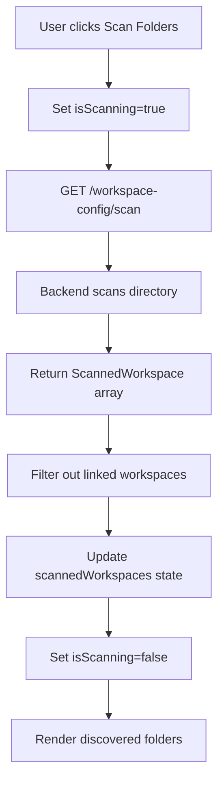

# Workspace Folder Discovery Enabler

## Metadata

| Field | Value |
|-------|-------|
| **Name** | Workspace Folder Discovery |
| **Type** | Enabler |
| **ID** | ENB-931849 |
| **Capability ID** | CAP-931847 |
| **Owner** | Development Team |
| **Status** | Implemented |
| **Approval** | Approved |
| **Priority** | High |
| **Analysis Review** | Not Required |
| **Code Review** | Not Required |

---

## Technical Context

### Purpose

The Workspace Folder Discovery enabler provides the ability to scan the `./workspaces` directory and discover workspace folders that exist on disk but are not currently linked to the user's account. This enables:

1. **Recovery**: Find workspaces after browser data/localStorage is cleared
2. **Migration**: Import workspaces from other machines or users
3. **Team Collaboration**: Discover workspaces shared via version control

### Architecture Fit

Integrates with the Workspaces page UI to provide a "Discovered Workspace Folders" section that shows unlinked workspace folders with options to import them.

### Existing Patterns to Follow

- Card grid layout pattern from "My Workspaces" section
- Button styling from existing workspace actions
- Loading state pattern from other scanning operations

---

## Functional Requirements

| ID | Name | Requirement | Status | Priority | Approval |
|----|------|-------------|--------|----------|----------|
| FR-931201 | Folder Scanning | System scans workspaces directory for subdirectories | Implemented | High | Approved |
| FR-931202 | Config Detection | System detects presence of .ubeworkspace in each folder | Implemented | High | Approved |
| FR-931203 | Filter Linked | System filters out already-linked workspace folders | Implemented | High | Approved |
| FR-931204 | Display Results | UI displays discovered folders with config status | Implemented | High | Approved |
| FR-931205 | Import Action | User can import discovered workspaces | Implemented | High | Approved |
| FR-931206 | Refresh Scan | User can manually trigger folder scan | Implemented | Medium | Approved |

---

## Non-Functional Requirements

| ID | Name | Requirement | Type | Status | Priority | Approval |
|----|------|-------------|------|--------|----------|----------|
| NFR-931201 | Scan Speed | Folder scan completes in < 2 seconds for 100 folders | Performance | Implemented | Medium | Approved |
| NFR-931202 | Skip Hidden | Scanner skips hidden directories (starting with .) | Compatibility | Implemented | Medium | Approved |
| NFR-931203 | Loading State | UI shows loading indicator during scan | UX | Implemented | Medium | Approved |

---

## Technical Specifications

### UI Component: Discovered Workspace Folders Section

Located in `web-ui/src/pages/Workspaces.tsx`, the section includes:

```typescript
// State management
const [scannedWorkspaces, setScannedWorkspaces] = useState<ScannedWorkspace[]>([]);
const [isScanning, setIsScanning] = useState(false);

// Scan function
const scanWorkspaceFolders = async () => {
  setIsScanning(true);
  try {
    const response = await fetch('http://localhost:9080/workspace-config/scan');
    if (response.ok) {
      const data = await response.json();
      // Filter out already-linked workspaces
      const existingFolders = new Set(workspaces.map(w => w.projectFolder));
      const discoveredWorkspaces = (data.workspaces || []).filter(
        (sw: ScannedWorkspace) => !existingFolders.has(sw.folderPath)
      );
      setScannedWorkspaces(discoveredWorkspaces);
    }
  } finally {
    setIsScanning(false);
  }
};
```

### UI Layout

```
+------------------------------------------+
| Discovered Workspace Folders    [Scan]   |
| Workspace folders found in ./workspaces  |
+------------------------------------------+

+----------------+ +----------------+ +----------------+
| [folder icon]  | | [folder icon]  | | [folder icon]  |
| Project Name   | | Legacy Project | | New Folder     |
| Description... | |                | |                |
|                | |                | |                |
| [Has config]   | | [No config]    | | [No config]    |
| [new] badge    | |                | |                |
|                | |                | |                |
| workspaces/... | | workspaces/... | | workspaces/... |
|                | |                | |                |
| [Import]       | | [Import]       | | [Import]       |
+----------------+ +----------------+ +----------------+
```

### Visual Indicators

| Indicator | Style | Meaning |
|-----------|-------|---------|
| "Has .ubeworkspace" | Green badge | Folder contains config file |
| "No config file" | Orange badge | Folder lacks config file |
| Workspace Type | Blue badge | Type from config (new/refactor/etc) |

### Data Flow



---

## Edge Cases and Error Handling

| Scenario | Expected Behavior | Test Case |
|----------|-------------------|-----------|
| No workspaces folder | Show empty state message | `test_no_folder()` |
| All folders linked | Show "all linked" message | `test_all_linked()` |
| API error | Log error, show empty state | `test_api_error()` |
| Slow scan | Show loading spinner | `test_loading_state()` |

---

## Acceptance Scenarios (Gherkin)

### Test Suite: TST-931849 - Workspace Folder Discovery Tests

```gherkin
@TST-931849
Feature: Workspace Folder Discovery
  As a UbeCode user
  I want to discover workspace folders on disk
  So that I can import workspaces not in my account

  @TS-931201 @FR-931201 @critical
  Scenario: Scan discovers folders
    Given the workspaces directory contains folders "ProjectA" and "ProjectB"
    And "ProjectA" is already linked to my account
    And "ProjectB" is not linked
    When I click "Scan Folders"
    Then I should see "ProjectB" in the discovered list
    And I should not see "ProjectA" in the discovered list

  @TS-931202 @FR-931202
  Scenario: Display config status
    Given folder "ConfiguredProject" has a .ubeworkspace file
    And folder "UnconfiguredProject" does not have a .ubeworkspace file
    When I scan workspace folders
    Then "ConfiguredProject" should show "Has .ubeworkspace" badge
    And "UnconfiguredProject" should show "No config file" badge

  @TS-931203 @FR-931205
  Scenario: Import with config
    Given discovered folder "ProjectX" has a .ubeworkspace with name "Project X"
    When I click "Import Workspace" for "ProjectX"
    Then a workspace named "Project X" should be added to my list
    And the workspace should use settings from the config file

  @TS-931204 @FR-931205
  Scenario: Import without config
    Given discovered folder "LegacyProject" has no .ubeworkspace file
    When I click "Import Workspace" for "LegacyProject"
    Then a workspace named "LegacyProject" should be added to my list
    And a new .ubeworkspace file should be created

  @TS-931205 @NFR-931203
  Scenario: Loading state during scan
    Given the scan operation takes time
    When I click "Scan Folders"
    Then the button should show "Scanning..."
    And the button should be disabled
    And when complete it should show "Scan Folders" again
```

---

## Implementation Notes

### File Locations

- **UI Component**: `web-ui/src/pages/Workspaces.tsx` (lines 533-647)
- **Backend Handler**: `internal/integration/handler.go` (HandleScanWorkspaces)
- **Route**: `cmd/integration-service/main.go` (GET /workspace-config/scan)

### Auto-scan Behavior

The scan runs automatically on page load via useEffect:

```typescript
useEffect(() => {
  refreshSharedWorkspaces();
  scanWorkspaceFolders(); // Auto-scan on mount
}, []);
```

---

**Document Version**: 1.0
**Created**: 2025-12-03
**Last Updated**: 2025-12-03
**Author**: Development Team
