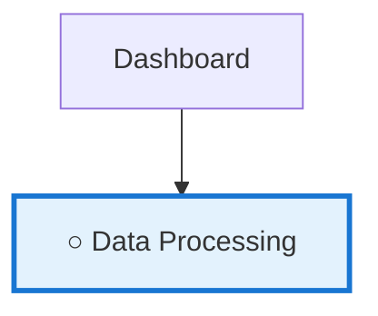

# Flow Visualization

**Status:** pending

**Description:** ```mermaid



```mermaid
flowchart TD
    card2["Dashboard"]
    card3["○ Data Processing"]:::current
    card2 --> card3
    classDef current fill:#e3f2fd,stroke:#1976d2,stroke-width:3px
```
