# AI AGENT SOFTWARE DEVELOPMENT PLAN
**Version**: 3.0.1
**Last Updated**: October 25, 2025
**Author**: Darcy Davidson

## Overview
This document provides comprehensive guidance for Claude Code to discover, analyze, design, implement, test, refactor, and retire software applications using the Anvil capability-driven framework. This is the single source of truth for all software development activities.

## Table of Contents
- [Command Examples](#command-examples)
- [Core Principles](#core-principles)
  - [Components-Capabilities-Enablers-Requirements Model](#components-capabilities-enablers-requirements-model)
  - [Quality and Governance](#quality-and-governance)
  - [Documentation-First Approach](#documentation-first-approach)
  - [FORBIDDEN ACTIONS](#forbidden-actions)
  - [DISCOVERY EXCEPTION](#discovery-exception)
  - [MANDATORY BEHAVIOR](#mandatory-behavior)
  - [VIOLATION CONSEQUENCES](#violation-consequences)
- [TASK: DISCOVERY](#task-discovery)
  - [🚨 CRITICAL WARNING - DISCOVERY LIMITATIONS 🚨](#-critical-warning---discovery-limitations-)
    - [⚠️ ABSOLUTE PROHIBITION - NEVER PROCEED TO IMPLEMENTATION FROM DISCOVERY](#-absolute-prohibition---never-proceed-to-implementation-from-discovery)
    - [🛡️ DISCOVERY SAFETY RULES](#-discovery-safety-rules)
    - [🚫 FORBIDDEN DURING DISCOVERY](#-forbidden-during-discovery)
    - [✅ ALLOWED DURING DISCOVERY](#-allowed-during-discovery)
  - [Purpose](#purpose)
  - [Discovery Process](#discovery-process)
    - [Phase 1: Project Analysis](#phase-1-project-analysis)
    - [Phase 2: Capability Identification](#phase-2-capability-identification)
    - [Phase 3: Enabler Identification](#phase-3-enabler-identification)
    - [Phase 4: Document Creation](#phase-4-document-creation)
  - [Critical Rules for Discovery](#critical-rules-for-discovery)
  - [Discovery Document Configuration Rules](#discovery-document-configuration-rules)
  - [🚨 FINAL CRITICAL REMINDER - DISCOVERY SAFETY 🚨](#-final-critical-reminder---discovery-safety-)
    - [DISCOVERY = DOCUMENTATION ONLY](#discovery--documentation-only)
    - [WHEN TO USE DISCOVERY](#when-to-use-discovery)
    - [WHEN NOT TO USE DISCOVERY](#when-not-to-use-discovery)
- [CAPABILITY DEVELOPMENT PLAN](#capability-development-plan)
  - [CRITICAL WORKFLOW RULES](#critical-workflow-rules)
    - [APPROVAL vs STATE - FUNDAMENTAL DIFFERENCE](#approval-vs-state---fundamental-difference)
    - [STATE MACHINE COMPLIANCE](#state-machine-compliance)
    - [FORBIDDEN SHORTCUTS](#forbidden-shortcuts)
  - [Task 1: Approval Verification (MANDATORY)](#task-1-approval-verification-mandatory)
    - [Pre-Conditions Verification](#pre-conditions-verification)
    - [Critical Rules](#critical-rules)
    - [Exit Criteria Checklist](#exit-criteria-checklist)
  - [Task 2: Analysis](#task-2-analysis)
    - [Pre-Conditions Verification](#pre-conditions-verification-1)
    - [Critical Rules](#critical-rules-1)
    - [Perform Analysis](#perform-analysis)
    - [🚨 CRITICAL ANALYSIS PHASE LIMITATIONS 🚨](#-critical-analysis-phase-limitations-)
    - [Minimal Enabler Template for Analysis Phase](#minimal-enabler-template-for-analysis-phase)
    - [🔴 METADATA FIELD VERIFICATION CHECKLIST 🔴](#-metadata-field-verification-checklist-)
    - [Enabler Configuration Rules](#enabler-configuration-rules)
    - [Post-Condition Transition](#post-condition-transition)
    - [🚨 SEQUENTIAL EXECUTION RULES 🚨](#-sequential-execution-rules-)
    - [Exit Criteria Checklist](#exit-criteria-checklist-1)
    - [Critical Rules](#critical-rules-2)
  - [Task 3: Design](#task-3-design)
    - [Pre-Conditions Verification (ABSOLUTELY MANDATORY)](#pre-conditions-verification-absolutely-mandatory)
    - [Critical Rules](#critical-rules-3)
    - [Perform Design](#perform-design)
    - [🚨 CRITICAL DESIGN PHASE RULES 🚨](#-critical-design-phase-rules-)
    - [Enabler State Processing](#enabler-state-processing)
    - [Documentation Requirements](#documentation-requirements)
    - [Post-Condition Transition](#post-condition-transition-1)
    - [Absolute Prohibitions (ZERO TOLERANCE)](#absolute-prohibitions-zero-tolerance)
  - [Task 4: Develop the Enablers](#task-4-develop-the-enablers)
    - [Pre-Conditions Verification (ABSOLUTELY MANDATORY)](#pre-conditions-verification-absolutely-mandatory-1)
    - [Critical Rules](#critical-rules-4)
    - [Develop Enabler](#develop-enabler)
    - [Post-Condition Transition](#post-condition-transition-2)
    - [Exit Criteria Checklist](#exit-criteria-checklist-2)
- [ENABLER DEVELOPMENT PLAN](#enabler-development-plan)
  - [CRITICAL WORKFLOW RULES](#critical-workflow-rules-1)
    - [APPROVAL vs STATE - FUNDAMENTAL DIFFERENCE](#approval-vs-state---fundamental-difference-1)
    - [STATE MACHINE COMPLIANCE](#state-machine-compliance-1)
    - [FORBIDDEN SHORTCUTS](#forbidden-shortcuts-1)
  - [Task 1: Approval Verification (MANDATORY)](#task-1-approval-verification-mandatory-1)
    - [Pre-Conditions Verification](#pre-conditions-verification-2)
    - [Critical Rules](#critical-rules-5)
    - [Exit Criteria Checklist](#exit-criteria-checklist-3)
  - [Task 2: Analysis](#task-2-analysis-1)
    - [Pre-Conditions Verification](#pre-conditions-verification-3)
    - [Critical Rules](#critical-rules-6)
    - [Perform Analysis](#perform-analysis-1)
    - [Requirement Configuration Rules](#requirement-configuration-rules)
    - [Post-Condition Transition](#post-condition-transition-3)
    - [Exit Criteria Checklist](#exit-criteria-checklist-4)
    - [Critical Rules](#critical-rules-7)
  - [Task 3: Design](#task-3-design-1)
    - [Pre-Conditions Verification](#pre-conditions-verification-4)
    - [Critical Rules](#critical-rules-8)
    - [Perform Design](#perform-design-1)
    - [Post-Condition Transition](#post-condition-transition-4)
    - [Exit Criteria Checklist](#exit-criteria-checklist-5)
  - [Task 4: Implementation](#task-4-implementation)
    - [Pre-Conditions Verification](#pre-conditions-verification-5)
    - [Critical Rules](#critical-rules-9)
    - [Perform Implementation](#perform-implementation)
    - [Post-Condition Transition](#post-condition-transition-5)
    - [Exit Criteria Checklist](#exit-criteria-checklist-6)
- [STANDARDS AND CONVENTIONS](#standards-and-conventions)
  - [File Naming and ID Generation Schema](#file-naming-and-id-generation-schema)
    - [Unique ID Format](#unique-id-format)
    - [ID Generation Algorithm (Standalone)](#id-generation-algorithm-standalone)
    - [File Naming Convention](#file-naming-convention)
    - [File Placement Strategy](#file-placement-strategy)
  - [Naming Conventions for Capabilities and Enablers](#naming-conventions-for-capabilities-and-enablers)
    - [Driving vs. Driven Naming Strategy](#driving-vs-driven-naming-strategy)
    - [Driven Elements (Nouns)](#driven-elements-nouns)
    - [Driving Elements (Verbs)](#driving-elements-verbs)
    - [Dependency Relationship Patterns](#dependency-relationship-patterns)
    - [Visual Relationship Diagram](#visual-relationship-diagram)
    - [Best Practices for Naming](#best-practices-for-naming)
    - [Impact on Architecture Clarity](#impact-on-architecture-clarity)
  - [Document Templates](#document-templates)
    - [Capability Template Structure](#capability-template-structure)
    - [Enabler Template Structure](#enabler-template-structure)

## Command Examples:

**For Discovery (Documentation Only):**
```
Claude, stay strictly within your current working directory and its subdirectories. Read the SOFTWARE_DEVELOPMENT_PLAN.md, perform DISCOVERY within this boundary only, and create specifications documentation without IMPLEMENTING anything. No parent directory access allowed. STOP IMMEDIATELY if you attempt to read files outside the current directory tree.
```

**For Implementation (After Discovery Complete):**
```
Claude, please read the SOFTWARE_DEVELOPMENT_PLAN.md in the specifications folder (following the development plan exactly) and develop the application which is specified in the specifications folder.

```

## Core Principles

### Components-Capabilities-Enablers-Requirements Model
- **Components** are logical software systems or applications that contain capabilities
- **Capabilities** represent high-level business functions within components that deliver value to users
- **Enablers** are technical implementations that realize capabilities through specific functionality
- **Requirements** define specific functional and non-functional needs within enablers

### Quality and Governance
- All development follows strict approval workflows
- Pre-condition verification prevents bypassing of quality gates
- State-based progression ensures proper task sequencing

### Documentation-First Approach
- Specifications are created before implementation
- Technical diagrams and designs guide development
- All artifacts are version controlled and traceable

### FORBIDDEN ACTIONS:
  - **NEVER modify Approval status from "Pending" to "Approved"**
  - **NEVER change Approval status from "Approved" to any other value**
  - **NEVER modify Approval status for Capabilities, Enablers, or Requirements**
  - **APPROVAL STATUS IS READ-ONLY FOR AI AGENTS**
  
  ## DISCOVERY EXCEPTION:
  - During DISCOVERY tasks only, AI agents MAY set initial Approval status to "Approved" for newly created documents
  - This exception applies ONLY to document creation during Discovery phase
  - This exception does NOT apply to modifying existing documents outside of Discovery  

  ### MANDATORY BEHAVIOR:
  - **ONLY proceed with items that ALREADY have Approval = "Approved"**
  - **SKIP items with Approval = "Pending", "Rejected", or any non-Approved status**
  - **IMMEDIATE STOP if no approved items exist for the current task**

  ### VIOLATION CONSEQUENCES:
  - **ANY attempt to modify approval status = IMMEDIATE WORKFLOW TERMINATION**
  - **NO EXCEPTIONS, NO WORKAROUNDS, NO ASSUMPTIONS**
  - **WHEN YOU READ THIS ACKNOWLEDGE THAT YOU WILL OBEY**

---

# TASK: DISCOVERY

## 🚨 CRITICAL WARNING - DISCOVERY LIMITATIONS 🚨

### ⚠️ ABSOLUTE PROHIBITION - NEVER PROCEED TO IMPLEMENTATION FROM DISCOVERY
- **DISCOVERY MUST STOP AT DESIGN PHASE**
- **NEVER MOVE TO TASK 4: IMPLEMENTATION DURING DISCOVERY**
- **DISCOVERY IS FOR DOCUMENTATION ONLY - NOT IMPLEMENTATION**

### 🛡️ DISCOVERY SAFETY RULES:
1. **DOCUMENT ONLY**: Discovery creates documentation, never code
2. **STOP AT DESIGN**: Maximum progression is through TASK 3: DESIGN
3. **NO CODE CHANGES**: Never modify, create, or delete application code during discovery
4. **NO FILE OVERWRITES**: Never overwrite existing application files
5. **READ-ONLY ANALYSIS**: Discovery is purely analytical and documentation-focused

### 🚫 FORBIDDEN DURING DISCOVERY:
- Writing any application code
- Modifying existing source files
- Creating new application components
- Deleting or moving application files
- Running build processes on discovered applications
- Installing dependencies in discovered applications
- Making any changes that could break the existing application

### ✅ ALLOWED DURING DISCOVERY:
- Reading and analyzing existing code
- Creating capability and enabler documentation in specifications/ folder
- Creating dependency diagrams
- Documenting current architecture
- Analyzing requirements and technical debt
- Creating design documents for future implementation

## Purpose
Analyze existing projects and create structured Capabilities and Enablers within the Anvil framework. Use this when examining codebases, applications, or systems to reverse-engineer their architecture **FOR DOCUMENTATION PURPOSES ONLY**.

## Discovery Process

### Phase 1: Project Analysis
1. **Examine Project Structure**
   - Review directory structure and file organization
   - Identify main application components, modules, and services
   - Look for configuration files, documentation, and build scripts
   - Note frameworks, libraries, and technologies used

2. **Identify Core Functionality**
   - Analyze entry points (main files, startup scripts)
   - Review API endpoints, routes, or service interfaces
   - Examine data models, schemas, and database structures
   - Identify user-facing features and business logic

3. **Map Dependencies**
   - Internal component relationships
   - External service integrations
   - Database dependencies
   - Third-party library usage

### Phase 2: Capability Identification

#### What is a Capability?
A Capability represents a high-level business function or feature within a Component that delivers value to users. Components have Capabilities, and each Capability is composed of multiple Enablers that work together to implement the capability.

#### Capability Discovery Rules:
- **Business Value Focus**: Each capability should represent a distinct business function
- **User-Centric**: Capabilities should be meaningful to end users or business stakeholders
- **Independence**: Capabilities should be largely self-contained with clear boundaries
- **Granularity**: Not too broad (entire application) or too narrow (single function)

#### Common Capability Patterns:
- **User Management**: Authentication, authorization, user profiles
- **Data Management**: CRUD operations for core business entities
- **Integration**: External service connections, API management
- **Reporting**: Analytics, dashboards, data visualization
- **Communication**: Notifications, messaging, alerts
- **Security**: Access control, encryption, audit logging
- **Configuration**: Settings, preferences, system configuration

### Phase 3: Enabler Identification

#### What is an Enabler?
An Enabler is a specific technical implementation that realizes a Capability. Enablers implement Capabilities by adhering to specific Requirements. Each Enabler represents concrete functionality, services, or technical solutions.

#### Enabler Discovery Rules:
- **Technical Focus**: Enablers represent actual code components, services, or implementations
- **Capability Alignment**: Each enabler must belong to exactly one capability
- **Implementation Specific**: Maps to actual files, classes, modules, or services
- **Testable**: Should have clear inputs, outputs, and testable behavior

#### Common Enabler Patterns:
- **API Endpoints**: REST endpoints, GraphQL resolvers
- **Database Operations**: Data access layers, repositories
- **User Interface Components**: Pages, forms, components
- **Business Logic**: Services, validators, processors
- **Infrastructure**: Configuration, deployment, monitoring
- **Security Components**: Authentication handlers, authorization middleware

### Phase 4: Document Creation

#### File Creation Process
1. Create `specifications/` directory relative to SOFTWARE_DEVELOPMENT_PLAN.md
2. Create capability files first: `{numeric-id}-capability.md`
3. Create enabler files in same directory: `{numeric-id}-enabler.md`
4. Ensure proper metadata relationships between capabilities and enablers

#### Capability Template Structure:
```markdown
# [Capability Name]

## Metadata
- **Name**: [Business Function Name]
- **Type**: Capability
- **System**: [System Name]
- **Component**: [Component Name]
- **ID**: CAP-123456
- **Owner**: [Team/Person]
- **Status**: Implemented
- **Approval**: Approved
- **Priority**: [High/Medium/Low]
- **Analysis Review**: [Required/Not Required]

## Purpose
[Clear business value statement explaining what business problem this solves]

## Enablers
| Enabler ID | Description |
|------------|-------------|
| ENB-644549 | [Enabler Description] |

## Dependencies
[List other capabilities this depends on]

## Success Criteria
[Measurable criteria for determining when this capability is successfully implemented]

## Risks and Assumptions
[Key risks and assumptions for this capability]
```

#### Enabler Template Structure:
```markdown
# [Enabler Name]

## Metadata
- **Name**: [Enabler Name]
- **Type**: Enabler
- **ID**: ENB-654321
- **Capability ID**: CAP-123456
- **Owner**: [Team/Person]
- **Status**: Implemented
- **Approval**: Approved
- **Priority**: [High/Medium/Low]
- **Analysis Review**: [Required/Not Required]
- **Code Review**: [Required/Not Required]

## Purpose
[Technical function description]

## Requirements
### Functional Requirements
| ID | Requirement | Status | Priority |
|----|------------|--------|----------|
| FR-789012 | [Requirement Description] | Implemented | Must Have |

### Non-Functional Requirements
| ID | Requirement | Status | Priority |
|----|------------|--------|----------|
| NFR-345678 | [NFR Description] | Implemented | Must Have |

## Technical Specifications (Template)
[Detailed technical implementation details]

## Dependencies
[External dependencies, APIs, services]

## Testing Strategy
[How this enabler will be tested]
```

### Critical Rules for Discovery:
1. **Scan for existing IDs** - Always check all markdown files for ID collisions before creating new ones
2. **Use numeric filename format** - Extract numeric part from full ID (remove CAP- or ENB- prefix)
3. **Create specifications/ directory** - Always relative to SOFTWARE_DEVELOPMENT_PLAN.md location
4. **Group enablers with capabilities** - Place enablers in same directory as parent capability
5. **Maintain relationships** - Always specify capabilityId in enabler metadata
6. **Follow collision detection** - Use provided algorithm to ensure unique IDs

 ### Discovery Document Configuration Rules
  **DISCOVERY EXCEPTION**: When creating documents during Discovery phase:
  - **Capability Status**: Set to "Implemented"
  - **Capability Approval**: Set to "Approved"
  - **Enabler Status**: Set to "Implemented"
  - **Enabler Approval**: Set to "Approved"
  - **Requirement Status**: Set to "Implemented"
  - **Requirement Approval**: Set to "Approved"

 **CRITICAL**: Discovery must update ALL discovered documents (both existing and newly created) to "Implemented" status to reflect that the functionality being
  documented already exists.
   **Rationale**: Discovery documents represent existing functionality being documented, not new features being planned.
---


## 🚨 FINAL CRITICAL REMINDER - DISCOVERY SAFETY 🚨

### DISCOVERY = DOCUMENTATION ONLY
- **Discovery creates specifications, never code**
- **Discovery analyzes existing systems without modification**
- **Discovery STOPS at design phase to prevent application overwrites**
- **Discovery is READ-ONLY analysis for documentation purposes**

### WHEN TO USE DISCOVERY:
- Analyzing existing codebases for documentation
- Reverse-engineering applications into Anvil specifications
- Creating architectural documentation
- Planning future enhancements (documentation only)

### WHEN NOT TO USE DISCOVERY:
- Building new applications (use full development plan)
- Modifying existing applications (use analysis → design → implementation)
- Fixing bugs in running systems (use targeted implementation tasks)

# CAPABILITY DEVELOPMENT PLAN

## CRITICAL WORKFLOW RULES

### APPROVAL vs STATE - FUNDAMENTAL DIFFERENCE:
- **Approval Definition**: Authorization/permission to proceed when workflow reaches appropriate state
- **State**: Current position in the development workflow that MUST be followed sequentially
- **Pre-condition Verification**: Never change value of a condition to make the condition true. This is not a set.
- **KEY RULE**: NEVER skip states even if approved - approval only grants permission, not workflow bypass
- **ZERO TOLERANCE**: Never modify pre-condition values.

### STATE MACHINE COMPLIANCE:
- Always respect the current **State** field value
- Follow tasks order in strict sequential order
- Each task moves the capability to the next appropriate state
- Approval status does NOT override state requirements

### FORBIDDEN SHORTCUTS:
- Do NOT jump out of task order
- Do NOT skip analysis, design, or review phases based on approval alone
- Do NOT assume any workflow steps are complete without verifying state progression

## Task 1: Approval Verification (MANDATORY)
**Purpose**: Ensure proper authorization before proceeding with any implementation tasks.

### Pre-Conditions Verification
| Condition | Required Value | Action if True | Action if False |
|-------|----------------|------------------|------------------|
| Capability Approval | "Approved" | Continue to next task | Stop all processing, Respond with "Capability not approved."  |

#### Critical Rules
- **ABSOLUTE PROHIBITION**: Never ask user to change Pre-Conditions values
- **IMMEDIATE TERMINATION**: Stop ALL processing if pre-conditions fail
- **NO EXCEPTIONS**: Pre-condition failures = MANDATORY STOP
- **WORKFLOW HALT**: Do not proceed past failed pre-condition verification
- **RESPONSE REQUIREMENT**: Must explicitly state "STOPPING due to failed pre-conditions" and explain which conditions failed

### Exit Criteria Checklist
- [ ] Both approval statuses verified
- [ ] Decision made (proceed/stop)
- [ ] Appropriate response provided

---

## Task 2: Analysis
**Purpose**: Analyze the current capability and determine what new enablers or modifications need to be made.

### Pre-Conditions Verification
| Condition | Required Value | Action if True | Action if False |
|-----------|----------------|----------------|-----------------|
| Task 1 Completion | Must be "Passed" | Continue to next condition check | STOP - explain why you are stopping |
| Capability Status | "Ready for Analysis" | Continue to Analysis Process Section | SKIP to Task 3: Design |

#### Critical Rules
- **ABSOLUTE PROHIBITION**: Never ask user to change Pre-Conditions values
- **IMMEDIATE TERMINATION**: Stop ALL processing if pre-conditions fail
- **NO EXCEPTIONS**: Pre-condition failures = MANDATORY STOP
- **WORKFLOW HALT**: Do not proceed past failed pre-condition verification
- **RESPONSE REQUIREMENT**: Must explicitly state "STOPPING due to failed pre-conditions" and explain which conditions failed

### Perform Analysis
| Step | Action | Result | CRITICAL RULE |
|------|--------|--------|---------------|
| 1 | Verify pre-conditions | ALL must be met | NEVER SKIP |
| 2 | **IMMEDIATELY Set Capability Status** | **"In Analysis" - DO THIS FIRST** | **MANDATORY BEFORE ANY OTHER WORK** |
| 3 | Generate new Enablers, add Enablers to Capability List and Create MINIMAL enabler files using the **COMPLETE Enabler Template Structure** from STANDARDS AND CONVENTIONS section with ALL METADATA FIELDS FILLED |
  Analyze the Capability and create new Enablers using the exact template format | ONLY AFTER STEP 2 COMPLETE || 4 | Configure Enablers | Apply Enabler Configuration Rules below | ONLY AFTER STEP 3 COMPLETE | **CRITICAL**: Look at the PARENT CAPABILITY'S "Analysis Review" setting (not the enabler's setting) to determine how to configure each new enabler
| 5 | Update Capability Enabler Table | Add meaningful descriptions to each new enabler in the parent capability's enabler table | AFTER enabler metadata creation | 

### 🚨 CRITICAL ANALYSIS PHASE LIMITATIONS 🚨

  **What to Create During Analysis:**
  - **COMPLETE enabler metadata section** - ALL fields from template must be present and filled
  - ALL metadata fields: Name, Type, System, Component, ID, Capability ID, Owner, Status, Approval, Priority, Analysis Review, Code Review
  - Basic Purpose statement (1-2 sentences maximum)
  - Empty template sections with headers only
  - Update capability enablers table with meaningful descriptions for each enabler

  **What NOT to Create During Analysis:**
  - ❌ Detailed technical specifications
  - ❌ Actual requirements (FR/NFR entries with content)
  - ❌ Implementation designs
  - ❌ Detailed mermaid diagrams
  - ❌ API specifications
  - ❌ Data models
  - ❌ Sequence diagrams
  - ❌ Class diagrams

  ### Minimal Enabler Template for Analysis Phase
  Use the existing **COMPLETE Enabler Template Structure** from the STANDARDS AND CONVENTIONS section. COPY ALL METADATA FIELDS EXACTLY from the template with these modifications:

  **Include these sections with content:**
  - Complete Metadata section (ALL fields from template)
  - Purpose section (ONE SENTENCE only - no implementation details)

  **Include these sections but LEAVE EMPTY:**
  - Technical Specifications (Template) - keep header, leave content empty
  - Requirements tables - include headers only, no actual requirement entries

### 🔴 METADATA FIELD VERIFICATION CHECKLIST 🔴
Before proceeding to next step, verify enabler contains ALL these metadata fields:
- [ ] Name
- [ ] Type
- [ ] ID
- [ ] Capability ID
- [ ] Owner
- [ ] Status
- [ ] Approval
- [ ] Priority
- [ ] Analysis Review
- [ ] Code Review

**FAILURE TO INCLUDE ALL FIELDS = ANALYSIS FAILURE**

### Enabler Configuration Rules
| Enabler Analysis Review Setting | Enabler Approval | Enabler Status | Enabler Priority |
|------------------------|---------------------|-------------------|-------------------|
| "Required" | "Pending" | "Ready for Analysis" | "High" or "Medium" or "Low" |
| "Not Required" | "Approved" | "Ready for Analysis" | "High" or "Medium" or "Low" |

### Post-Condition Transition
| Step | Action | CRITICAL RULE |
|------|--------|---------------|
| 1 | Set Capability Status "Ready for Design" | **ONLY AFTER ALL ANALYSIS STEPS COMPLETE** |

### 🚨 SEQUENTIAL EXECUTION RULES 🚨
- **STEP 2 MUST BE COMPLETED FIRST**: Set status to "In Analysis" before any enabler work
- **NO JUMPING AHEAD**: Never set status to "Ready for Design" during analysis phase
- **STATUS REFLECTS CURRENT PHASE**: Status must accurately represent what phase you're in
- **POST-CONDITIONS ONLY AT END**: Transition to next status only when ALL analysis work is complete

### Exit Criteria Checklist
- [ ] All new Enablers added to Capability
- [ ] Capability enablers table updated with new enablers
- [ ] Enabler descriptions added to parent capability's enabler table
- [ ] All Enablers have appropriate Approval and Status set following the Enabler Configuration Rules
- [ ] All Enablers have COMPLETE metadata with ALL template fields present
- [ ] Enabler metadata completed for all new enablers (ALL template fields)
- [ ] Basic purpose statements written (implementation-agnostic)
- [ ] Technical Overview Purpose completed for each enabler (2-3 sentences, not just basic purpose)
- [ ] Template sections created but LEFT EMPTY
- [ ] NO detailed requirements created
- [ ] NO technical specifications written
- [ ] NO diagrams created (except empty placeholders)

### Critical Rules
- Do NOT modify existing Enablers
- Create copies as new Enablers if improvements needed
- ONLY explicitly obtained user approval can change Approval to "Approved"

---

## Task 3: Design
**Purpose**: Create a design based only on approved and ready to implement Enablers by following the sections below.

### Capability Status: Ready for Refactor
**"Ready for Refactor"** is a new capability status that allows capabilities to re-enter the design phase for:
- **Architecture improvements**: Updating technical design based on new requirements
- **Performance optimizations**: Redesigning for better performance characteristics
- **Technology upgrades**: Incorporating new technologies or frameworks
- **Design debt reduction**: Improving existing design patterns and structures
- **Scalability enhancements**: Redesigning to handle increased load or usage

**Usage**: Set a capability to "Ready for Refactor" when implemented capabilities need design updates before further development. This status enables the same design workflow as "Ready for Design" but indicates refactoring intent rather than initial design.

### Pre-Conditions Verification (ABSOLUTELY MANDATORY)
| Condition | Required Value | Action if True | Action if False |
|-----------|----------------|---------|----------------------|
| Capability Approval | "Approved" | continue to next pre-condition check | IMMEDIATE STOP |
| Capability Status | "Ready for Design" or "Ready for Refactor" | continue to next section | SKIP to Task 4: Develop the Enablers |

#### Critical Rules
- **ABSOLUTE PROHIBITION**: Never ask user to change Pre-Conditions values
- **IMMEDIATE TERMINATION**: Stop ALL processing if pre-conditions fail
- **NO EXCEPTIONS**: Pre-condition failures = MANDATORY STOP
- **WORKFLOW HALT**: Do not proceed past failed pre-condition verification
- **RESPONSE REQUIREMENT**: Must explicitly state "STOPPING due to failed pre-conditions" and explain which conditions failed

### Perform Design
| Step | Action | Requirement |
|------|--------|-------------|
| 1 | Verify pre-conditions | ALL must be met |
| 2 | Set Capability Status | "In Design" |
| 3 | **MANDATORY APPROVAL CHECK**: Verify that enablers exist with Approval = "Approved" | If NO enablers have Approval = "Approved", IMMEDIATELY STOP and respond "STOPPING: No enablers are approved for design." |
| 4 | **FILTER APPROVED ENABLERS**: Create filtered list of enablers with Approval = "Approved" AND state allowing inclusion per table below | EXCLUDE ALL enablers with Approval ≠ "Approved" regardless of state |
| 5 | **DISPLAY DESIGN ENABLERS**: List the specific approved enablers that will be used in design | Must explicitly state which enablers are included and which are excluded |
| 6 | **CREATE DESIGN**: Update Technical Specifications using ONLY the approved enablers from filtered list | NEVER include non-approved enablers in design documentation |

 ### 🚨 CRITICAL DESIGN PHASE RULES 🚨

**RULE 1 - MANDATORY APPROVAL GATE**: Design phase requires at least one enabler with Approval = "Approved". If ALL enablers have Approval = "Pending" or other status, STOP immediately.

**RULE 2 - STRICT INCLUSION FILTER**: Design MUST ONLY include enablers with Approval = "Approved". Even if some enablers are approved, EXCLUDE all enablers with Approval = "Pending", "Rejected", or any other status.

**RULE 3 - NO PARTIAL APPROVAL MIXING**: Never mix approved and non-approved enablers in design. Only create design documentation for the approved subset.

**EXAMPLE SCENARIO**:
- 5 total enablers: 2 have Approval = "Approved", 3 have Approval = "Pending"
- **CORRECT**: Design only the 2 approved enablers
- **WRONG**: Design all 5 enablers or mention the pending ones

### Enabler State Processing
| Enabler State | Action |
|------------------|--------|
| "In Draft" | DO NOT include in design |
| "Ready for Analysis" | DO NOT Include in design |
| "Ready for Implementation" | Include in design |
| "Ready for Refactor" | Include in design |
| "Ready for Retirement" | Remove from design completely |

### Documentation Requirements
| Section | Content | If Not Applicable |
|---------|---------|-------------------|
| Technical Specifications | Main design | Required |
| Document any Dependency Flow Diagrams in the Capability Dependency Flow Diagrams Section | Flow diagrams | Mark "Not Applicable" if not applicable |

**CRITICAL**: When creating dependency diagrams, follow these rules for non-existent capabilities:
- **Grey Theme Rule**: Any capability that does not actually exist in the specifications directory must be styled with grey theme
- **Placeholder Naming**: Use generic placeholder names like "CAP-XXX01", "CAP-XXX02" for non-existent capabilities
- **Grey Styling**: Apply grey fill and stroke colors (e.g., `fill:#f5f5f5,stroke:#999999`) to non-existent capabilities
- **Clear Labeling**: Add "(Placeholder)" suffix to non-existent capability names
- **Documentation Note**: Include a note in the diagram explaining that grey capabilities are placeholders for future implementation

### Post-Condition Transition
| Step | Verification | Required State | Action if Failed |
|------|-------------|----------------|------------------|
| 0 | **Technical Specifications Completion Check** | All "(Template)" text must be replaced with actual design content | STOP - Complete design documentation first |
| 1 | **Design Documentation Verification** | Technical Specifications section must contain real architecture, APIs, data models, diagrams | STOP - Fill in actual design details |
| 2 | **Template Content Removal** | No placeholder text like "Add your dependency flows here" or "Add more entities here" | STOP - Replace all template placeholders |
| 3 | **ONLY AFTER ALL VERIFICATIONS PASS** | Set Capability Status "Ready for Implementation" | Proceed to implementation phase |

### Absolute Prohibitions (ZERO TOLERANCE)
- 🚫 Never bypass for any reason whatsoever
- 🚫 Never write implementation code during this task
- 🚫 Never used unapproved or not ready to implement requirements in design

---

## Task 4: Develop the Enablers
**Purpose**: Execute the complete Enabler Development Plan workflow for each approved enabler. 

**CRITICAL**: This task orchestrates enabler development but does NOT directly implement code - each enabler must individually complete Tasks 1-4 of the Enabler Development Plan.

### Pre-Conditions Verification (ABSOLUTELY MANDATORY)
| Condition | Required Value | Action if True | Action if False |
|-----------|----------------|---------|----------------------|
| Capability Approval | "Approved" | continue to next pre-condition check | IMMEDIATE STOP |
| Capability Status | "Ready for Implementation" | continue to next section | IMMEDIATE STOP |

#### Critical Rules
- **ABSOLUTE PROHIBITION**: Never ask user to change Pre-Conditions values
- **ABSOLUTE PROHIBITION**: Never modify enabler approval status, analysis review settings, or any other pre-condition values
- **IMMEDIATE TERMINATION**: Stop ALL processing if pre-conditions fail
- **NO EXCEPTIONS**: Pre-condition failures = MANDATORY STOP
- **WORKFLOW HALT**: Do not proceed past failed pre-condition verification
- **RESPONSE REQUIREMENT**: Must explicitly state "STOPPING due to failed pre-conditions" and explain which conditions failed

### Develop Enabler
|Step | Condition | Required Value | Action if True | Action if False |
|------|---------------------|----------------|---------|----------------------|
| 1 | Enabler Approval | "Approved" | Develop Enabler following the Enabler's Development Plan | IMMEDIATE STOP - explain that enabler is not approved and cannot be developed |

|Step | Condition | Required Value | Action if True | Action if False |
|------|---------------------|----------------|---------|----------------------|
| 1 | Enabler Approval | "Approved" | **MANDATORY**: Follow COMPLETE Enabler Development Plan (Task 1→2→3→4) for EACH enabler individually. **NO CODE IMPLEMENTATION** until enabler completes Task 3: Design | IMMEDIATE STOP - explain that enabler is not approved and cannot be developed |
| 2 | **WORKFLOW ENFORCEMENT** | **Each enabler MUST complete: Approval Verification → Analysis → Design → Implementation** | **Process enablers sequentially through full workflow** | **STOP - Cannot skip enabler development phases** |

### Post-Condition Transition
| Step | Action | CRITICAL RULE |
|------|--------|---------------|
| 1 | Set Enabler Status "Implemented" | **ONLY after enabler completes its individual Task 4: Implementation following full Enabler Development Plan** |

### Exit Criteria Checklist
- [ ] Implementation completed for all approved requirements
- [ ] Requirement Status updated appropriately
- [ ] Unapproved requirements skipped
- [ ] Enabler State set to "Implemented"

---

# ENABLER DEVELOPMENT PLAN

## CRITICAL WORKFLOW RULES

### APPROVAL vs STATE - FUNDAMENTAL DIFFERENCE:
- **Approval Definition**: Authorization/permission to proceed when workflow reaches appropriate state
- **State**: Current position in the development workflow that MUST be followed sequentially
- **Pre-condition Verification**: Never change value of a condition to make the condition true. This is not a set.
- **KEY RULE**: NEVER skip states even if approved - approval only grants permission, not workflow bypass
- **ZERO TOLERANCE**: Never modify pre-condition values.

### STATE MACHINE COMPLIANCE:
- Always respect the current **State** field value
- Follow tasks order in strict sequential order
- Each task moves the enabler to the next appropriate state
- Approval status does NOT override state requirements

### FORBIDDEN SHORTCUTS:
- Do NOT jump out of task order
- Do NOT skip analysis, design, or review phases based on approval alone
- Do NOT assume any workflow steps are complete without verifying state progression

## Task 1: Approval Verification (MANDATORY)
**Purpose**: Ensure proper authorization before proceeding with any implementation tasks.

### Pre-Conditions Verification
| Condition | Required Value | Action if True | Action if False |
|-------|----------------|------------------|------------------|
| Parent Capability Approval | "Approved" | Continue to next condition check |1. Stop all processing 2. Respond with "Parent Capability is not approved. Both Parent Capability and Enabler status must be 'Approved' to proceed."  |
| Enabler Approval | "Approved" | Continue to next task | Stop all processing, Respond with "Enabler is not approved. Both Parent Capability and Enabler status must be 'Approved' to proceed." |

#### Critical Rules
- **ABSOLUTE PROHIBITION**: Never ask user to change Pre-Conditions values
- **IMMEDIATE TERMINATION**: Stop ALL processing if pre-conditions fail
- **NO EXCEPTIONS**: Pre-condition failures = MANDATORY STOP
- **WORKFLOW HALT**: Do not proceed past failed pre-condition verification
- **RESPONSE REQUIREMENT**: Must explicitly state "STOPPING due to failed pre-conditions" and explain which conditions failed

### Exit Criteria Checklist
- [ ] Both approval statuses verified
- [ ] Decision made (proceed/stop)
- [ ] Appropriate response provided

---

## Task 2: Analysis
**Purpose**: Analyze the current enabler and determine what new requirements or modifications need to be made.

### Pre-Conditions Verification
| Condition | Required Value | Action if True | Action if False |
|-----------|----------------|----------------|-----------------|
| Task 1 Completion | Must be "Passed" | Continue to next condition check | STOP - explain why you are stopping |
| Enabler Status | "Ready for Analysis" | Continue to Analysis Process Section | SKIP to Task 3: Design |

#### Critical Rules
- **ABSOLUTE PROHIBITION**: Never ask user to change Pre-Conditions values
- **IMMEDIATE TERMINATION**: Stop ALL processing if pre-conditions fail
- **NO EXCEPTIONS**: Pre-condition failures = MANDATORY STOP
- **WORKFLOW HALT**: Do not proceed past failed pre-condition verification
- **RESPONSE REQUIREMENT**: Must explicitly state "STOPPING due to failed pre-conditions" and explain which conditions failed

### Perform Analysis
| Step | Action | Result |
|------|--------|--------|
| 1 | Verify pre-conditions | ALL must be met |
| 2 | Set Enabler Status | "In Analysis" |
| 3 | Generate new Requirements, add Requirements to Enabler | Analyze the Enabler and create new Requirements |
| 4 | Configure Requirements | Apply Requirement Configuration Rules below |

### Requirement Configuration Rules
| Enabler Analysis Review Setting | Requirement Approval | Requirement Status | Requirement Priority |
|--------------------------------|---------------------|-------------------|---------------------|
| "Required" | "Pending" | "Ready for Design" | "High" or "Medium" or "Low" |
| "Not Required" | "Approved" | "Ready for Design" | "High" or "Medium" or "Low" |

### Post-Condition Transition
| Step | Action |
|------|--------|
| 1 | Set Enabler Status "Ready for Design" - **UNDER NO CIRCUMSTANCES ARE YOU TO SET IT TO ANYTHING DIFFERENT** |

### Exit Criteria Checklist
- [ ] All new Requirements added to Enabler
- [ ] All Requirements have appropriate Approval and Status set following the Requirement Configuration Rules

### Critical Rules
- Do NOT modify existing Requirements
- Create copies as new Requirements if improvements needed
- ONLY explicitly obtained user approval can change Approval to "Approved"

---

## Task 3: Design  
**Purpose**: Create a design under the Technical Specifications Section  

**IMPORTANT**: Do NOT write any implementation code until this task is complete.  
**IMPORTANT**: Do NOT create separate files - update the enabler specification documents.  

### Pre-Conditions Verification  
| Condition | Required Value | Action if True | Action if False |  
|-----------|----------------|----------------|-----------------|  
| Task 2 Completion | Must be "Passed" | Continue to next condition check | STOP - explain why you are stopping |  
| Enabler Status | "Ready for Design" or "Ready for Refactor" | Continue to Design Process Section | SKIP to Task 4: Implementation |  
| Requirement Status | "Ready for Design" or "Ready for Implementation" | Continue to Design Process Section | SKIP requirement from design process |  

#### Critical Rules  
- **ABSOLUTE PROHIBITION**: Never ask user to change Pre-Conditions values  
- **IMMEDIATE TERMINATION**: Stop ALL processing if pre-conditions fail  
- **NO EXCEPTIONS**: Pre-condition failures = MANDATORY STOP  
- **WORKFLOW HALT**: Do not proceed past failed pre-condition verification  
- **RESPONSE REQUIREMENT**: Must explicitly state "STOPPING due to failed pre-conditions" and explain which conditions failed  

### Perform Design
| Step | Action |
|------|--------|
| 1 | Verify pre-conditions |
| 2 | Set Enabler Status to "In Design" |
| 3 | **Replace "Technical Specifications (Template)" header with "Technical Specifications"** - Remove the "(Template)" text from the section header and replace the template content with actual design |
| 4 | For each Requirement with Approval = "Approved" AND status "Ready for Design", add to Design and immediately update Requirement status to "Ready for Implementation" |
| 5 | **Create NEW Technical Specifications Section with actual design** - Replace template diagrams and placeholder content with real architecture, APIs, models, etc. |
| 6 | Document any APIs that would appropriate fit in API Technical Specifications |
| 7 | Document any Data Models in the Data Models Section |
| 8 | Document any Sequence Diagrams in the Sequence Diagrams Section |
| 9 | Document any Class Diagrams in the Class Diagrams Section |
| 10 | Document any Data Flow Diagrams in the Data Flow Diagrams Section |
| 11 | Document any State Diagrams in the State Diagrams Section |
| 12 | Document any Dependency Flow Diagrams in the Enabler Dependency Flow Diagrams Section |
| 13 | Document any other designs under Technical Specifications Section |  

### Post-Condition Transition  

**🚨 ENABLER DESIGN COMPLETION GATE 🚨**

| Step | Verification | Required State | Action if Failed |
|------|-------------|----------------|------------------|
| 0 | **Header Update Check** | "Technical Specifications (Template)" must be changed to "Technical Specifications" | STOP - Update section header first |
| 1 | **Template Content Removal** | All template diagrams and placeholder content must be replaced | STOP - Complete actual design content |
| 2 | **Approved Requirements Coverage** | Each approved requirement must have corresponding design documentation | STOP - Design all approved requirements |
| 3 | **Design Artifacts Present** | Relevant sections (APIs, Data Models, Sequence Diagrams, etc.) must contain actual design | STOP - Fill in design specifications |
| 4 | **ONLY AFTER ALL VERIFICATIONS PASS** | Set Enabler Status "Ready for Implementation" | Proceed to implementation |

### Exit Criteria Checklist  
- [ ] Design documented under Technical Specifications  
- [ ] All applicable diagram sections completed  
- [ ] All Requirements with Approval Status = "Approved" are processed from "Ready for Design" → "Ready for Implementation"  
- [ ] Status updated to "Ready for Implementation"  

---

## Task 4: Implementation
**Purpose**: Execute requirement implementation only if each requirement is approved and in the correct state.

### Pre-Conditions Verification
| Condition | Required Value | Action if True | Action if False |
|-----------|----------------|----------------|-----------------|
| Task 3 Completion | Must be "Passed" | Continue to next condition check | STOP - explain why you are stopping |
| Enabler Status | "Ready for Implementation" | Continue to Implementation Process Section | SKIP to Task 5: Testing |
| Requirement Status | "Ready for Implementation" | Continue to Implementation Process Section | SKIP requirement from implementation process |

#### Critical Rules
- **ABSOLUTE PROHIBITION**: Never ask user to change Pre-Conditions values  
- **IMMEDIATE TERMINATION**: Stop ALL processing if pre-conditions fail  
- **NO EXCEPTIONS**: Pre-condition failures = MANDATORY STOP  
- **WORKFLOW HALT**: Do not proceed past failed pre-condition verification  
- **RESPONSE REQUIREMENT**: Must explicitly state "STOPPING due to failed pre-conditions" and explain which conditions failed  

### Perform Implementation
| Step | Action |
|------|--------|
| 1 | Set Enabler Status to "In Implementation" |
| 2 | For each Requirement, check if Requirement Approval = "Approved" AND Requirement Status = "Ready for Implementation" |
| 2 | If approved and in correct state, continue to implementation steps; if not, skip and perform no other tasks |
| 3 | Implement the requirement ONLY IF Requirement Status = "Ready for Implementation" |
| 4 | Set Requirement Status to "Implemented" |

### Post-Condition Transition
| Step | Action |
|------|--------|
| 1 | Set Enabler Status "Implemented" |

### Exit Criteria Checklist
- [ ] Implementation completed for all approved requirements in "Ready for Implementation" state  
- [ ] Requirement Status updated from "Ready for Implementation" → "Implemented"  
- [ ] Unapproved or out-of-state requirements skipped  
- [ ] Enabler Status set to "Implemented"  

---

# STANDARDS AND CONVENTIONS

## File Naming and ID Generation Schema

### Unique ID Format:
- **Capabilities**: `CAP-XXXXXX` (e.g., `CAP-123456`)
- **Enablers**: `ENB-XXXXXX` (e.g., `ENB-654321`)
- **Functional Requirements**: `FR-XXXXXX` (e.g., `FR-789012`)
- **Non-Functional Requirements**: `NFR-XXXXXX` (e.g., `NFR-345678`)

### ID Generation Algorithm (Standalone):
**For projects without running Anvil server**, use this algorithm:

```javascript
function generateSemiUniqueNumber() {
  const now = Date.now();
  const timeComponent = parseInt(now.toString().slice(-4));
  const randomComponent = Math.floor(Math.random() * 100);
  const combined = timeComponent * 100 + randomComponent;
  return combined.toString().padStart(6, '0').slice(-6);
}

function findExistingIds(prefix) {
  // Search all markdown files for: **ID**: {prefix}-XXXXXX
  // Return array of found numeric IDs
}

function generateUniqueId(prefix) {
  const existingIds = findExistingIds(prefix);
  let attempts = 0;

  while (attempts < 100) {
    const newNumber = generateSemiUniqueNumber();
    const newId = `${prefix}-${newNumber}`;

    if (!existingIds.includes(newId)) {
      return newId;
    }
    attempts++;
    // Add small delay for different timestamp
  }

  // Fallback: sequential numbering from 100000
  let sequentialNum = 100000;
  while (existingIds.includes(`${prefix}-${sequentialNum}`)) {
    sequentialNum++;
  }
  return `${prefix}-${sequentialNum}`;
}
```

### File Naming Convention:
- **Capabilities**: `{numeric-id}-capability.md` (e.g., `123456-capability.md`)
- **Enablers**: `{numeric-id}-enabler.md` (e.g., `654321-enabler.md`)

**Important**: Do NOT use prefixes like `cap-` or `enb-` in filenames. Extract numeric part from full ID (remove `CAP-` or `ENB-` prefix).

### File Placement Strategy:

**Directory Structure:**
```
project-root/
├── SOFTWARE_DEVELOPMENT_PLAN.md (this file)
├── specifications/
│   ├── 123456-capability.md        # User Management Capability
│   ├── 654321-enabler.md          # Login System Enabler (child of 123456)
│   ├── 789012-enabler.md          # Password Reset Enabler (child of 123456)
│   ├── 345678-capability.md       # Data Processing Capability
│   └── 901234-enabler.md          # Data Validation Enabler (child of 345678)
```

## Naming Conventions for Capabilities and Enablers

### Driving vs. Driven Naming Strategy

Understanding whether a capability or enabler is **driving** or **being driven** is crucial for establishing clear dependency relationships and communication patterns within your system architecture.

#### **Driven Elements (Nouns)**
Elements that are **being driven** should be named as **nouns** because they represent:
- **Passive resources** that respond to external requests
- **Service providers** that offer functionality to other components
- **Downstream dependencies** that are consumed by other elements

**Characteristics of Driven Elements:**
- Provide services or resources to other components
- React to incoming requests or commands
- Typically represent foundational capabilities that multiple other components depend on
- Often appear as **downstream dependencies** in dependency diagrams

**Examples of Driven Elements (Nouns):**
- **Logging** - Provides logging services to other components
- **Authentication** - Provides authentication services when requested
- **Database Storage** - Provides data persistence services
- **Configuration Management** - Provides configuration data to other systems
- **User Notification** - Provides notification services when triggered

#### **Driving Elements (Verbs)**
Elements that are **driving** should be named as **verbs** or **action phrases** because they represent:
- **Active orchestrators** that initiate processes or workflows
- **Trigger mechanisms** that start chains of operations
- **Upstream dependencies** that coordinate and control other elements

**Characteristics of Driving Elements:**
- Initiate processes, workflows, or operations
- Coordinate multiple other components to achieve business outcomes
- Often represent business processes or user-initiated actions
- Typically appear as **upstream dependencies** in dependency diagrams

**Examples of Driving Elements (Verbs):**
- **Log Startup** - Actively initiates the startup logging process
- **Authenticate User** - Actively orchestrates the user authentication workflow
- **Process Payment** - Actively coordinates the payment processing workflow
- **Generate Report** - Actively triggers report generation processes
- **Send Welcome Email** - Actively initiates the welcome email workflow

#### **Dependency Relationship Patterns**

**Typical Flow Pattern:**
```
[Verb/Driver] ──drives──> [Noun/Driven]
[Upstream]    ──uses──>   [Downstream]
```

**Example Dependency Relationships:**
- **Log Startup** (verb) ──> **Logging** (noun)
- **Authenticate User** (verb) ──> **Authentication** (noun)
- **Process Payment** (verb) ──> **Payment Gateway** (noun)
- **Generate Report** (verb) ──> **Database Storage** (noun)

#### **Visual Relationship Diagram**



**Key Insights from the Diagram:**
- **Blue elements (Verbs)** initiate actions and coordinate other components
- **Purple elements (Nouns)** provide services and respond to requests
- **Arrows show dependency flow** from drivers to services
- **Multiple dependencies are common** - drivers often use multiple services
- **Clear separation** between orchestration logic and service logic

#### **Best Practices for Naming**

1. **Identify the Role First**: Before naming, determine if the element is primarily:
   - **Initiating actions** (use verbs)
   - **Providing services** (use nouns)

2. **Consider the Consumer Perspective**:
   - If other components "call upon" this element, it's likely driven (noun)
   - If this element "orchestrates" other components, it's likely driving (verb)

3. **Use Clear, Business-Meaningful Names**:
   - Avoid technical jargon when business terms are clearer
   - Use names that stakeholders can easily understand
   - Be specific enough to avoid ambiguity

4. **Maintain Consistency**:
   - Use consistent naming patterns across similar elements
   - Document your naming conventions for the project team

5. **Examples of Well-Named Pairs**:
   ```
   Driver (Verb)              Driven (Noun)
   ├─ Log Application Events  ──> Application Logging
   ├─ Validate User Input     ──> Input Validation
   ├─ Backup Database         ──> Database Backup Storage
   ├─ Monitor System Health   ──> System Health Monitoring
   └─ Route Network Traffic   ──> Network Routing
   ```

#### **Impact on Architecture Clarity**

This naming strategy provides several benefits:

- **Clearer Dependency Modeling**: Immediately understand data/control flow direction
- **Better Component Boundaries**: Natural separation between orchestrators and services
- **Improved Communication**: Stakeholders can easily distinguish between active processes and passive resources
- **Enhanced Maintainability**: Future developers can quickly understand component roles and relationships
- **Simplified Testing Strategy**: Clear separation between process logic (verbs) and service logic (nouns)

## Document Templates

### Capability Template Structure:
<!-- START CAPABILITY TEMPLATE -->
# [Capability Name]

## Metadata
- **Name**: [Business Function Name]
- **Type**: Capability
- **System**: [System Name]
- **Component**: [Component Name]
- **ID**: CAP-XXXXXX
- **Owner**: [Team/Person]
- **Status**: [Current State]
- **Approval**: Not Approved
- **Priority**: [High/Medium/Low]
- **Analysis Review**: [Required/Not Required]


## Technical Overview 
###  Purpose
[Clear business value statement]

## Enablers
| ID |
|----|
| ENB-XXXXXX |

## Dependencies

### Internal Upstream Dependency

| Capability ID | Description |
|---------------|-------------|
| | |

### Internal Downstream Impact

| Capability ID | Description |
|---------------|-------------|
| | |

## Technical Specifications (Template)

### Capability Dependency Flow Diagram
> **Note for AI**: When designing this section, show the direct relationships and dependencies between capabilities (NOT enablers). Focus on capability-to-capability interactions, business value flows, and how capabilities work together to deliver end-to-end business outcomes. Include:
> - **Current Capability**: The capability being defined and its role in the business value chain
> - **Internal Dependencies**: Dependencies on other capabilities within the same organizational boundary/domain
> - **External Dependencies**: Dependencies on capabilities across organizational boundaries.
> - **Business Flow**: How business value and data flows between capabilities
> - **Exclude**: Enabler-level details, technical implementation specifics, infrastructure components

```mermaid
flowchart TD
    %% Current Capability
    CURRENT["Current Capability<br/>Primary Business Function<br/>🎯"]

    %% Internal Capabilities (Same Organization)
    INT1["Supporting Capability A<br/>Core Service<br/>⚙️"]
    INT2["Supporting Capability B<br/>Data Management<br/>📊"]
    INT3["Supporting Capability C<br/>Business Logic<br/>🔧"]

    %% External Capabilities (Different Organization)
    EXT1["External Capability A<br/>Third-party Service<br/>🌐"]
    EXT2["External Capability B<br/>Integration Point<br/>🔗"]

    %% Internal Dependencies Flow
    INT1 --> CURRENT
    CURRENT --> INT2
    INT2 --> INT3

    %% External Dependencies Flow
    EXT1 --> CURRENT
    CURRENT --> EXT2

    %% Styling
    classDef current fill:#e3f2fd,stroke:#1976d2,stroke-width:3px
    classDef internal fill:#e8f5e8,stroke:#388e3c,stroke-width:2px
    classDef external fill:#f3e5f5,stroke:#7b1fa2,stroke-width:2px

    class CURRENT current
    class INT1,INT2,INT3 internal
    class EXT1,EXT2 external

    %% Capability Grouping
    subgraph ORG1 ["Internal Organization"]
        subgraph DOMAIN1 ["Current Domain"]
            CURRENT
        end
        subgraph DOMAIN2 ["Supporting Domain"]
            INT1
            INT2
            INT3
        end
    end

    subgraph ORG2 ["External Organization"]
        EXT1
        EXT2
    end
```


<!-- END CAPABILITY TEMPLATE -->

## Enabler Template Structure:
<!-- START ENABLER TEMPLATE -->
# [Enabler Name]

## Metadata
- **Name**: [Enabler Name]
- **Type**: Enabler
- **ID**: ENB-XXXXXX
- **Capability ID**: CAP-XXXXXX
- **Owner**: Product Team
- **Status**: In Draft
- **Approval**: Not Approved
- **Priority**: High
- **Analysis Review**: Required
- **Code Review**: Not Required

## Technical Overview
### Purpose
[What is the purpose?]

## Functional Requirements
| ID | Name | Requirement | Status | Priority | Approval |
|----|-------------|--------|----------|----------|----------|
| FR-XXXXXX | [Name] | [Requirement Description] | [Status] | [Priority] | [Approval] |

<!-- Requirement Field Definitions:
- **ID**: Unique identifier following format FR-XXXXXX (Functional) or NFR-XXXXXX (Non-Functional)
- **Name**: Descriptive name for this specific requirement (e.g., "User Login Validation", "Response Time Limit", "Data Encryption")
- **Requirement**: Detailed description of what must be achieved
- **Priority**: Business priority (High/Medium/Low)
- **Status**: Current workflow state (In Draft, Ready for Analysis, etc.)
- **Approval**: Authorization status (Pending, Approved, Rejected)
-->

## Non-Functional Requirements
| ID | Name | Requirement | Type | Status | Priority | Approval |
|----|-------------|--------|----------|----------|----------|----------|
| NFR-XXXXXX | [Name] | [Requirement Description] | [Type] | [Status] | [Priority] | [Approval] |

<!-- ### Requirement Field Definitions:
- **Type**: Category of requirement - only for NFRs (Performance, Security, Usability, Compatibility, Scalability, etc.)
-->

## Technical Specifications (Template)

### Enabler Dependency Flow Diagram

```mermaid
flowchart TD
    ENB_XXXXXX["ENB-XXXXXX<br/>[Enabler Name]<br/>📡"]

    %% Add your dependency flows here

    classDef enabler fill:#e3f2fd,stroke:#1976d2,stroke-width:2px
    class ENB_XXXXXX enabler
```

### API Technical Specifications (if applicable)

| API Type | Operation | Channel / Endpoint | Description | Request / Publish Payload | Response / Subscribe Data |
|----------|-----------|---------------------|-------------|----------------------------|----------------------------|
| | | | | | |

### Data Models

### Class Diagrams

### Sequence Diagrams

### Dataflow Diagrams

### State Diagrams

## External Dependencies
[External dependencies, APIs, services]

## Testing Strategy
[How this enabler will be tested]
<!-- END ENABLER TEMPLATE -->

---

This comprehensive plan ensures consistent, high-quality software development while maintaining proper governance and quality control throughout the entire software development lifecycle.