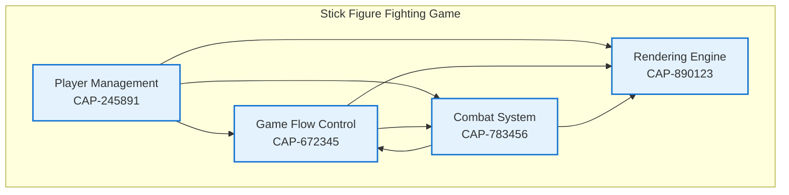

# Stick Figure Fighting Game

**Version**: 1.0.0
**Last Updated**: November 19, 2025
**Status**: Discovery Complete - Ready for Implementation

## Overview

A browser-based 2-player local multiplayer fighting game featuring customizable stick figure characters. The project uses the Anvil capability-driven development framework for structured software development.

## Project Status

| Phase | Status | Description |
|-------|--------|-------------|
| Discovery | Complete | All capabilities and enablers documented |
| Analysis | Complete | Requirements identified for all enablers |
| Design | Complete | Technical specifications created |
| Implementation | Not Started | No source code written |

## Architecture

### Capability-Enabler Model

This project follows the Anvil framework's Component-Capability-Enabler-Requirement model:

- **Capabilities**: High-level business functions (4 total)
- **Enablers**: Technical implementations (12 total)
- **Requirements**: Functional and non-functional specifications

### System Architecture



## Capabilities

### 1. Player Management (CAP-245891)
Manage player setup, character creation, player selection, and maintain player state throughout the game session.

| Enabler ID | Name | Purpose |
|------------|------|---------|
| ENB-347892 | Player Selection | Routes players to 1st/2nd player flow |
| ENB-458923 | Character Creator | Stick figure customization interface |
| ENB-561234 | Player State Manager | Maintains player data and state |

### 2. Game Flow Control (CAP-672345)
Orchestrate game states from initialization through gameplay to completion, managing transitions between game start, character creation, combat, and end conditions.

| Enabler ID | Name | Purpose |
|------------|------|---------|
| ENB-894567 | Game Initialization | Handles game start and setup |
| ENB-945678 | Game State Manager | Manages state transitions |
| ENB-156789 | Victory Detection | Determines win/loss conditions |

### 3. Combat System (CAP-783456)
Handle all fighting mechanics including attack/defend actions, damage calculation, health management, and combat interaction between two player characters.

| Enabler ID | Name | Purpose |
|------------|------|---------|
| ENB-267890 | Combat Engine | Processes attack/defend actions |
| ENB-378901 | Damage Calculation | Computes damage values |
| ENB-489012 | Health Management | Tracks player health |

### 4. Rendering Engine (CAP-890123)
Provide visual display of all game elements including stick figure characters, arena environment, combat animations, and UI components using HTML5 Canvas.

| Enabler ID | Name | Purpose |
|------------|------|---------|
| ENB-590234 | Stick Figure Renderer | Draws and animates characters |
| ENB-601345 | Arena Renderer | Displays game arena and background |
| ENB-712456 | Animation System | Manages animations and effects |

## Project Structure

```
stickfigures/
├── README.md                           # This file
├── SOFTWARE_DEVELOPMENT_PLAN.md        # Development governance and workflow
├── AI_GOVERNANCE_FRAMEWORK.md          # AI prompting levels and governance
├── specifications/
│   ├── DISCOVERY_SUMMARY.md            # Discovery phase summary
│   │
│   ├── # Player Management Capability
│   ├── 245891-capability.md            # CAP-245891: Player Management
│   ├── 347892-enabler.md               # ENB-347892: Player Selection
│   ├── 458923-enabler.md               # ENB-458923: Character Creator
│   ├── 561234-enabler.md               # ENB-561234: Player State Manager
│   │
│   ├── # Game Flow Control Capability
│   ├── 672345-capability.md            # CAP-672345: Game Flow Control
│   ├── 894567-enabler.md               # ENB-894567: Game Initialization
│   ├── 945678-enabler.md               # ENB-945678: Game State Manager
│   ├── 156789-enabler.md               # ENB-156789: Victory Detection
│   │
│   ├── # Combat System Capability
│   ├── 783456-capability.md            # CAP-783456: Combat System
│   ├── 267890-enabler.md               # ENB-267890: Combat Engine
│   ├── 378901-enabler.md               # ENB-378901: Damage Calculation
│   ├── 489012-enabler.md               # ENB-489012: Health Management
│   │
│   ├── # Rendering Engine Capability
│   ├── 890123-capability.md            # CAP-890123: Rendering Engine
│   ├── 590234-enabler.md               # ENB-590234: Stick Figure Renderer
│   ├── 601345-enabler.md               # ENB-601345: Arena Renderer
│   ├── 712456-enabler.md               # ENB-712456: Animation System
│   │
│   └── Story/                          # Original storyboard cards
│       ├── STORY-001.md through STORY-010.md
```

## Technical Stack (Recommended)

| Component | Technology | Notes |
|-----------|------------|-------|
| Frontend | Vanilla JavaScript | Lightweight, no framework dependency |
| Rendering | HTML5 Canvas API | Native browser support, performant |
| State Management | State Machine | Simple game state transitions |
| Animation | RequestAnimationFrame | Smooth 60 FPS rendering |
| Input | Keyboard Events | Player 1 & 2 keyboard controls |

## Development Governance

### Workflow Compliance
All development must follow the SOFTWARE_DEVELOPMENT_PLAN.md which defines:
- Sequential task execution (Analysis → Design → Implementation)
- Pre-condition verification at each phase
- Approval workflows and quality gates
- State machine compliance

### AI Governance Framework
The AI_GOVERNANCE_FRAMEWORK.md provides 5 levels of AI prompting for:
- Workflow governance
- Quality gates
- Documentation standards
- Security compliance
- Development lifecycle management

See the governance framework for detailed prompting templates.

## Implementation Sequence

When ready to implement, follow this recommended order:

### Phase 1: Foundation
1. **Player Management** (CAP-245891)
   - Player selection UI
   - Character creator interface
   - Player state manager

### Phase 2: Rendering
2. **Rendering Engine** (CAP-890123)
   - Canvas setup
   - Stick figure drawing
   - Arena display

### Phase 3: Game Logic
3. **Game Flow Control** (CAP-672345)
   - State machine
   - Initialization sequence
   - Victory detection

### Phase 4: Combat
4. **Combat System** (CAP-783456)
   - Combat engine
   - Damage calculation
   - Health management

### Phase 5: Polish
5. **Integration & Refinement**
   - Animation system
   - Visual effects
   - UI/UX improvements

## Key Files

| File | Purpose |
|------|---------|
| `SOFTWARE_DEVELOPMENT_PLAN.md` | Complete development workflow and governance rules |
| `AI_GOVERNANCE_FRAMEWORK.md` | AI prompting levels for different compliance needs |
| `specifications/DISCOVERY_SUMMARY.md` | Discovery phase results and implementation guidance |

## Compliance Notes

- All capabilities and enablers are marked "Implemented" (per discovery rules - represents documented storyboard)
- All approvals set to "Approved" per discovery exception
- Technical specifications in enablers are templates ready for design phase
- No code implementation has been performed - documentation only

## Getting Started

### For Development
1. Read `SOFTWARE_DEVELOPMENT_PLAN.md` for workflow understanding
2. Review `specifications/DISCOVERY_SUMMARY.md` for project overview
3. Study capability files to understand architecture
4. Begin implementation following the development plan phases

### For AI Agents
1. Read `SOFTWARE_DEVELOPMENT_PLAN.md` completely
2. Follow capability development plan strictly
3. Adhere to pre-condition verification requirements
4. Never skip workflow phases

## Documentation

| Document | Description |
|----------|-------------|
| [SOFTWARE_DEVELOPMENT_PLAN.md](SOFTWARE_DEVELOPMENT_PLAN.md) | Complete AI agent development guide |
| [AI_GOVERNANCE_FRAMEWORK.md](AI_GOVERNANCE_FRAMEWORK.md) | AI prompting levels and governance categories |
| [DISCOVERY_SUMMARY.md](specifications/DISCOVERY_SUMMARY.md) | Project discovery results |

## Metrics

| Metric | Value |
|--------|-------|
| Total Capabilities | 4 |
| Total Enablers | 12 |
| Functional Requirements | ~36 (estimated 3 per enabler) |
| Non-Functional Requirements | ~24 (estimated 2 per enabler) |
| Story Cards | 10 |

## Version History

| Version | Date | Description |
|---------|------|-------------|
| 1.0.0 | 2025-11-19 | Initial documentation complete |

---

**Framework**: Anvil Capability-Driven Development
**Discovery Date**: November 18, 2025
**Documentation Updated**: November 19, 2025
