# Technical Specifications (Template)

**Status:** Implemented

**Description:** this needs to be much better written

**Status:** Implemented

**Description:** this needs to be much better written

### Capability Dependency Flow Diagram

```mermaid
flowchart TD
    %% Current Capability
    CURRENT["Combat System<br/>Fighting Mechanics<br/>🎯"]

    %% Internal Capabilities (Same Organization)
    INT1["Player Management<br/>Character Data<br/>⚙️"]
    INT2["Game Flow Control<br/>State Management<br/>📊"]
    INT3["Rendering Engine<br/>Visual Feedback<br/>🔧"]

    %% Internal Dependencies Flow
    INT1 --> CURRENT
    INT2 --> CURRENT
    CURRENT --> INT3
    CURRENT --> INT2

    %% Styling
    classDef current fill:#e3f2fd,stroke:#1976d2,stroke-width:3px
    classDef internal fill:#e8f5e8,stroke:#388e3c,stroke-width:2px

    class CURRENT current
    class INT1,INT2,INT3 internal

    %% Capability Grouping
    subgraph ORG1 ["Stick Figure Game Application"]
        subgraph DOMAIN1 ["Combat Domain"]
            CURRENT
        end
        subgraph DOMAIN2 ["Supporting Domains"]
            INT1
            INT2
            INT3
        end
    end
```

