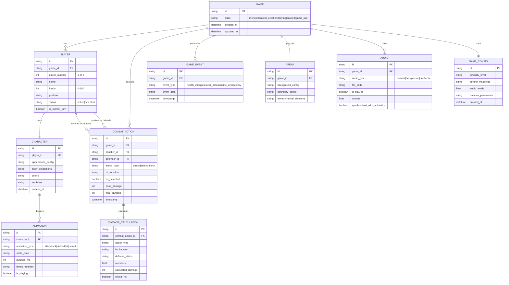

# Data Model

## Metadata
- **Type**: Data Model
- **Workspace**: stick figure fight
- **Generated**: 12/1/2025, 10:46:18 AM

## Diagram

```mermaid
erDiagram
    GAME {
        string id PK
        string state "menu|character_creation|playing|paused|game_over"
        datetime created_at
        datetime updated_at
    }
    
    PLAYER {
        string id PK
        string game_id FK
        int player_number "1 or 2"
        string name
        int health "0-100"
        string position
        string status "active|defeated"
        boolean is_current_turn
    }
    
    CHARACTER {
        string id PK
        string player_id FK
        string appearance_config
        string body_proportions
        string colors
        string attributes
        datetime created_at
    }
    
    COMBAT_ACTION {
        string id PK
        string game_id FK
        string attacker_id FK
        string defender_id FK
        string action_type "attack|defend|block"
        string hit_location
        boolean hit_detected
        int base_damage
        int final_damage
        datetime timestamp
    }
    
    DAMAGE_CALCULATION {
        string id PK
        string combat_action_id FK
        string attack_type
        string hit_location
        string defense_status
        float modifiers
        int calculated_damage
        boolean critical_hit
    }
    
    ANIMATION {
        string id PK
        string character_id FK
        string animation_type "idle|attack|defend|hit|defeat"
        string sprite_data
        int duration_ms
        string timing_function
        boolean is_playing
    }
    
    GAME_EVENT {
        string id PK
        string game_id FK
        string event_type "health_change|player_defeat|game_over|victory"
        string event_data
        datetime timestamp
    }
    
    ARENA {
        string id PK
        string game_id FK
        string background_config
        string boundary_config
        string environmental_elements
    }
    
    AUDIO {
        string id PK
        string game_id FK
        string audio_type "combat|background|ui|effects"
        string file_path
        boolean is_playing
        float volume
        boolean synchronized_with_animation
    }
    
    GAME_CONFIG {
        string id PK
        string difficulty_level
        string control_mappings
        float audio_levels
        string balance_parameters
        datetime created_at
    }
    
    GAME ||--o{ PLAYER : "has"
    PLAYER ||--|| CHARACTER : "owns"
    GAME ||--o{ COMBAT_ACTION : "contains"
    PLAYER ||--o{ COMBAT_ACTION : "performs as attacker"
    PLAYER ||--o{ COMBAT_ACTION : "receives as defender"
    COMBAT_ACTION ||--|| DAMAGE_CALCULATION : "calculates"
    CHARACTER ||--o{ ANIMATION : "displays"
    GAME ||--o{ GAME_EVENT : "generates"
    GAME ||--|| ARENA : "plays in"
    GAME ||--o{ AUDIO : "plays"
    GAME ||--|| GAME_CONFIG : "uses"
```
