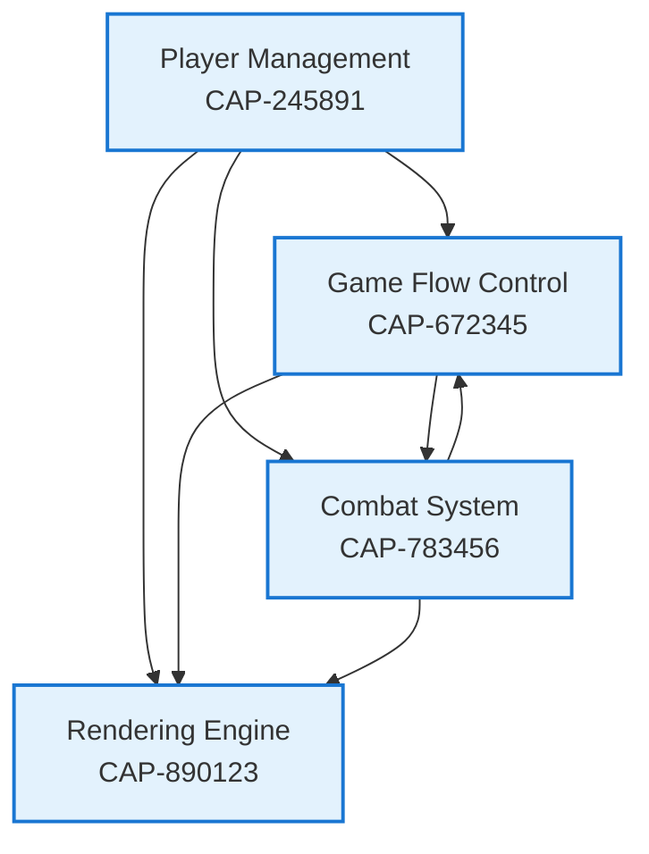

# Discovery Summary: Stick Figure Fighting Game

**Discovery Date**: November 18, 2025
**Last Updated**: November 19, 2025
**Status**: Discovery Complete - Documentation Only (NO CODE IMPLEMENTATION)

## Overview
This document summarizes the discovery analysis performed on the Stick Figure Fighting Game storyboard. The project currently has **NO implementation** - only story cards defining the user flow. This discovery has created comprehensive specifications to guide future implementation.

## Project Structure

### Application Type
- **Name**: Stick Figure Fighting Game
- **Platform**: Browser-based web application
- **Players**: 2-player local multiplayer
- **Technology**: HTML5 Canvas (recommended for rendering)

## Capabilities Identified

### 1. Player Management (CAP-245891)
**Purpose**: Manage player setup, character creation, and player state

**Enablers**:
- ENB-347892: Player Selection - Routes to 1st/2nd player flow
- ENB-458923: Character Creator - Stick figure customization interface
- ENB-561234: Player State Manager - Maintains player data and state

**Story Cards Mapped**:
- game start
- 1st player
- 2nd player
- create your stick figure
- create stick figure

---

### 2. Game Flow Control (CAP-672345)
**Purpose**: Orchestrate game states from start to finish

**Enablers**:
- ENB-894567: Game Initialization - Handles game start and setup
- ENB-945678: Game State Manager - Manages state transitions
- ENB-156789: Victory Detection - Determines win/loss conditions

**Story Cards Mapped**:
- game start
- begin game

---

### 3. Combat System (CAP-783456)
**Purpose**: Handle all fighting mechanics and interactions

**Enablers**:
- ENB-267890: Combat Engine - Processes attack/defend actions
- ENB-378901: Damage Calculation - Computes damage values
- ENB-489012: Health Management - Tracks player health

**Story Cards Mapped**:
- stick figure fighting
- assess damage after hit

---

### 4. Rendering Engine (CAP-890123)
**Purpose**: Visual display of game elements

**Enablers**:
- ENB-590234: Stick Figure Renderer - Draws and animates characters
- ENB-601345: Arena Renderer - Displays game arena and background
- ENB-712456: Animation System - Manages animations and effects

**Story Cards Mapped**: All cards (cross-cutting visual concern)

---

## Capability Dependencies



## Implementation Readiness

### Current State
✅ **Discovery Complete**: All capabilities and enablers documented
✅ **Specifications Created**: 4 capabilities, 12 enablers
✅ **Requirements Defined**: Functional and non-functional requirements identified
✅ **Dependencies Mapped**: All relationships documented

### Next Steps (Implementation Phase)
⏸️ **NOT STARTED**: No code has been written
⏸️ **Waiting**: Ready for implementation after design phase completion

### Files Created
```
stickfigures/
├── README.md                         # Project overview and documentation
├── SOFTWARE_DEVELOPMENT_PLAN.md      # Development governance and workflow
├── AI_GOVERNANCE_FRAMEWORK.md        # AI prompting levels and governance
└── specifications/
    ├── DISCOVERY_SUMMARY.md          # This file
    ├── 245891-capability.md          # Player Management
    ├── 347892-enabler.md             # Player Selection
    ├── 458923-enabler.md             # Character Creator
    ├── 561234-enabler.md             # Player State Manager
    ├── 672345-capability.md          # Game Flow Control
    ├── 894567-enabler.md             # Game Initialization
    ├── 945678-enabler.md             # Game State Manager
    ├── 156789-enabler.md             # Victory Detection
    ├── 783456-capability.md          # Combat System
    ├── 267890-enabler.md             # Combat Engine
    ├── 378901-enabler.md             # Damage Calculation
    ├── 489012-enabler.md             # Health Management
    ├── 890123-capability.md          # Rendering Engine
    ├── 590234-enabler.md             # Stick Figure Renderer
    ├── 601345-enabler.md             # Arena Renderer
    └── 712456-enabler.md             # Animation System
```

### Additional Documentation Created (November 19, 2025)
| File | Purpose |
|------|---------|
| README.md | Comprehensive project documentation and overview |
| AI_GOVERNANCE_FRAMEWORK.md | 12 governance categories with 5 AI prompting levels each |

## Key Technical Decisions for Implementation

### Recommended Technology Stack
- **Frontend**: Vanilla JavaScript or lightweight framework (React, Vue)
- **Rendering**: HTML5 Canvas API
- **State Management**: Simple state machine or Redux/Zustand
- **Animation**: RequestAnimationFrame for smooth 60 FPS
- **Input**: Keyboard event listeners for controls

### Architecture Patterns
- **State Machine**: For game state management (menu → character_creation → playing → game_over)
- **Observer Pattern**: For health changes, game events
- **Component Pattern**: Separate rendering, logic, and state
- **Event-Driven**: Combat actions trigger events for rendering and state updates

## Development Sequence Recommendation

When ready to implement, follow this order:

1. **Phase 1**: Player Management (CAP-245891)
   - Start with player selection UI
   - Build character creator interface
   - Implement player state manager

2. **Phase 2**: Rendering Engine (CAP-890123)
   - Setup canvas and basic rendering
   - Implement stick figure drawing
   - Add arena display

3. **Phase 3**: Game Flow Control (CAP-672345)
   - Build game state machine
   - Implement initialization sequence
   - Add victory detection logic

4. **Phase 4**: Combat System (CAP-783456)
   - Implement combat engine
   - Add damage calculation
   - Integrate health management

5. **Phase 5**: Polish
   - Animation system refinement
   - Visual effects and feedback
   - UI/UX improvements

## Notes

- All capability and enabler statuses set to "Implemented" per discovery rules (represents documented existing storyboard, not actual code)
- All approvals set to "Approved" per discovery exception rules
- This is DOCUMENTATION ONLY - no code implementation performed during discovery
- Story cards provide high-level flow but lack detailed acceptance criteria
- Technical specifications in enablers are templates ready for design phase

## Related Documentation

| Document | Description |
|----------|-------------|
| [README.md](../README.md) | Project overview, architecture, and getting started guide |
| [SOFTWARE_DEVELOPMENT_PLAN.md](../SOFTWARE_DEVELOPMENT_PLAN.md) | Complete AI agent development workflow and governance |
| [AI_GOVERNANCE_FRAMEWORK.md](../AI_GOVERNANCE_FRAMEWORK.md) | 12 governance categories with 5 AI prompting levels for compliance |

---

**Discovery Performed By**: Claude Code AI Agent
**Framework**: Anvil Capability-Driven Development
**Compliance**: Discovery phase rules strictly followed (no code generation)
