# Animation System

## Metadata
- **Name**: Animation System
- **Type**: Enabler
- **ID**: ENB-712456
- **Capability ID**: CAP-890123
- **Owner**: Product Team
- **Status**: Implemented
- **Approval**: Approved
- **Priority**: High
- **Analysis Review**: Not Required
- **Code Review**: Not Required

## Technical Overview
### Purpose
Manages sprite animations, combat effects, transitions, and timing to create smooth visual feedback for all game actions and state changes.

## Functional Requirements
| ID | Name | Requirement | Status | Priority | Approval |
|----|-------------|--------|----------|----------|----------|
| FR-423678 | Animation Playback | System must play animations based on game events | Implemented | High | Approved |
| FR-534789 | Animation Timing | System must control animation speed and timing | Implemented | High | Approved |
| FR-645890 | Combat Effects | System must display visual effects for attacks, hits, blocks | Implemented | High | Approved |
| FR-756901 | Transition Effects | System must provide smooth transitions between states | Implemented | Medium | Approved |

## Non-Functional Requirements
| ID | Name | Requirement | Type | Status | Priority | Approval |
|----|-------------|--------|----------|----------|----------|----------|
| NFR-867012 | Smoothness | Animations must be smooth without stuttering | Performance | Implemented | High | Approved |
| NFR-978123 | Responsiveness | Animation triggers must respond within 30ms of events | Performance | Implemented | High | Approved |

## Technical Specifications (Template)

### Enabler Dependency Flow Diagram

```mermaid
flowchart TD
    ENB_945678["ENB-945678<br/>Game State Manager<br/>🎯"]
    ENB_267890["ENB-267890<br/>Combat Engine<br/>⚔️"]
    ENB_712456["ENB-712456<br/>Animation System<br/>🎬"]
    ENB_590234["ENB-590234<br/>Stick Figure Renderer<br/>🖼️"]

    ENB_945678 --> ENB_712456
    ENB_267890 --> ENB_712456
    ENB_712456 --> ENB_590234

    classDef enabler fill:#e3f2fd,stroke:#1976d2,stroke-width:2px
    class ENB_945678,ENB_267890,ENB_712456,ENB_590234 enabler
```

## External Dependencies
- RequestAnimationFrame API
- Sprite sheet or animation frame data
- Easing functions for smooth transitions

## Testing Strategy
- Visual tests for animation appearance
- Timing tests for animation duration
- Integration tests with game events
- Performance tests for animation overhead
