# Victory Detection

## Metadata
- **Name**: Victory Detection
- **Type**: Enabler
- **ID**: ENB-156789
- **Capability ID**: CAP-672345
- **Owner**: Product Team
- **Status**: Implemented
- **Approval**: Approved
- **Priority**: High
- **Analysis Review**: Not Required
- **Code Review**: Not Required

## Technical Overview
### Purpose
Determines win/loss conditions by monitoring player health and detecting when game end conditions are met, then triggering game over state.

## Functional Requirements
| ID | Name | Requirement | Status | Priority | Approval |
|----|-------------|--------|----------|----------|----------|
| FR-912456 | Monitor Win Conditions | System must continuously check for win/loss conditions | Implemented | High | Approved |
| FR-123567 | Declare Winner | System must identify and declare the winning player | Implemented | High | Approved |
| FR-234678 | Trigger Game Over | System must transition to game over state when conditions met | Implemented | High | Approved |

## Non-Functional Requirements
| ID | Name | Requirement | Type | Status | Priority | Approval |
|----|-------------|--------|----------|----------|----------|----------|
| NFR-345789 | Detection Speed | Victory detection must occur within 50ms of condition being met | Performance | Implemented | High | Approved |

## Technical Specifications (Template)

### Enabler Dependency Flow Diagram

```mermaid
flowchart TD
    ENB_489012["ENB-489012<br/>Health Management<br/>❤️"]
    ENB_156789["ENB-156789<br/>Victory Detection<br/>🏆"]
    ENB_945678["ENB-945678<br/>Game State Manager<br/>🎯"]

    ENB_489012 --> ENB_156789
    ENB_156789 --> ENB_945678

    classDef enabler fill:#e3f2fd,stroke:#1976d2,stroke-width:2px
    class ENB_489012,ENB_156789,ENB_945678 enabler
```

## External Dependencies
- Game loop for continuous monitoring

## Testing Strategy
- Unit tests for win condition logic
- Integration tests for state transitions
- Boundary tests for edge cases (draw, simultaneous defeat)
