# Combat Engine

## Metadata
- **Name**: Combat Engine
- **Type**: Enabler
- **ID**: ENB-267890
- **Capability ID**: CAP-783456
- **Owner**: Product Team
- **Status**: Implemented
- **Approval**: Approved
- **Priority**: High
- **Analysis Review**: Not Required
- **Code Review**: Not Required

## Technical Overview
### Purpose
Processes attack and defend actions, manages combat interactions between players including hit detection, collision detection, and combat flow control.

## Functional Requirements
| ID | Name | Requirement | Status | Priority | Approval |
|----|-------------|--------|----------|----------|----------|
| FR-456890 | Process Attack Actions | System must handle player attack inputs and execute attacks | Implemented | High | Approved |
| FR-567901 | Process Defend Actions | System must handle player defend/block inputs | Implemented | High | Approved |
| FR-678012 | Hit Detection | System must detect when attacks connect with opponent | Implemented | High | Approved |
| FR-789123 | Combat Flow | System must manage turn-based or real-time combat flow | Implemented | High | Approved |

## Non-Functional Requirements
| ID | Name | Requirement | Type | Status | Priority | Approval |
|----|-------------|--------|----------|----------|----------|----------|
| NFR-890234 | Responsiveness | Combat actions must respond within 50ms | Performance | Implemented | High | Approved |
| NFR-901345 | Fairness | Combat mechanics must be balanced for both players | Usability | Implemented | High | Approved |

## Technical Specifications (Template)

### Enabler Dependency Flow Diagram

```mermaid
flowchart TD
    ENB_561234["ENB-561234<br/>Player State Manager<br/>💾"]
    ENB_945678["ENB-945678<br/>Game State Manager<br/>🎯"]
    ENB_267890["ENB-267890<br/>Combat Engine<br/>⚔️"]
    ENB_378901["ENB-378901<br/>Damage Calculation<br/>💥"]
    ENB_712456["ENB-712456<br/>Animation System<br/>🎬"]

    ENB_561234 --> ENB_267890
    ENB_945678 --> ENB_267890
    ENB_267890 --> ENB_378901
    ENB_267890 --> ENB_712456

    classDef enabler fill:#e3f2fd,stroke:#1976d2,stroke-width:2px
    class ENB_561234,ENB_945678,ENB_267890,ENB_378901,ENB_712456 enabler
```

## External Dependencies
- Keyboard/input event handling
- Collision detection algorithms

## Testing Strategy
- Unit tests for combat logic
- Integration tests for player interactions
- Gameplay tests for combat balance
