# Player Selection

## Metadata
- **Name**: Player Selection
- **Type**: Enabler
- **ID**: ENB-347892
- **Capability ID**: CAP-245891
- **Owner**: Product Team
- **Status**: Implemented
- **Approval**: Approved
- **Priority**: High
- **Analysis Review**: Not Required
- **Code Review**: Not Required

## Technical Overview
### Purpose
Routes players to 1st or 2nd player character creation flow based on user selection at game start.

## Functional Requirements
| ID | Name | Requirement | Status | Priority | Approval |
|----|-------------|--------|----------|----------|----------|
| FR-823567 | Player Role Selection | System must provide UI for selecting 1st or 2nd player role | Implemented | High | Approved |
| FR-934678 | Route to Creation | System must route selected player to appropriate character creation screen | Implemented | High | Approved |

## Non-Functional Requirements
| ID | Name | Requirement | Type | Status | Priority | Approval |
|----|-------------|--------|----------|----------|----------|----------|
| NFR-145789 | Response Time | Player selection must respond within 100ms | Performance | Implemented | Medium | Approved |

## Technical Specifications (Template)

### Enabler Dependency Flow Diagram

```mermaid
flowchart TD
    ENB_347892["ENB-347892<br/>Player Selection<br/>📡"]
    ENB_458923["ENB-458923<br/>Character Creator<br/>🎨"]
    ENB_561234["ENB-561234<br/>Player State Manager<br/>💾"]

    ENB_347892 --> ENB_458923
    ENB_347892 --> ENB_561234

    classDef enabler fill:#e3f2fd,stroke:#1976d2,stroke-width:2px
    class ENB_347892,ENB_458923,ENB_561234 enabler
```

## External Dependencies
- Browser DOM for UI rendering
- Event handling system for user input

## Testing Strategy
- Unit tests for player selection logic
- Integration tests for routing behavior
- UI tests for button interactions
