# Damage Calculation

## Metadata
- **Name**: Damage Calculation
- **Type**: Enabler
- **ID**: ENB-378901
- **Capability ID**: CAP-783456
- **Owner**: Product Team
- **Status**: Implemented
- **Approval**: Approved
- **Priority**: High
- **Analysis Review**: Not Required
- **Code Review**: Not Required

## Technical Overview
### Purpose
Computes damage values based on attack type, hit location, defense status, and other combat modifiers to determine health reduction.

## Functional Requirements
| ID | Name | Requirement | Status | Priority | Approval |
|----|-------------|--------|----------|----------|----------|
| FR-112567 | Calculate Base Damage | System must calculate base damage from attack type | Implemented | High | Approved |
| FR-223678 | Apply Modifiers | System must apply defense, critical hits, and other modifiers | Implemented | Medium | Approved |
| FR-334789 | Damage Output | System must output final damage value for health update | Implemented | High | Approved |

## Non-Functional Requirements
| ID | Name | Requirement | Type | Status | Priority | Approval |
|----|-------------|--------|----------|----------|----------|----------|
| NFR-445890 | Calculation Speed | Damage calculation must complete within 10ms | Performance | Implemented | High | Approved |
| NFR-556901 | Transparency | Damage calculations should be deterministic and testable | Maintainability | Implemented | Medium | Approved |

## Technical Specifications (Template)

### Enabler Dependency Flow Diagram

```mermaid
flowchart TD
    ENB_267890["ENB-267890<br/>Combat Engine<br/>⚔️"]
    ENB_378901["ENB-378901<br/>Damage Calculation<br/>💥"]
    ENB_489012["ENB-489012<br/>Health Management<br/>❤️"]

    ENB_267890 --> ENB_378901
    ENB_378901 --> ENB_489012

    classDef enabler fill:#e3f2fd,stroke:#1976d2,stroke-width:2px
    class ENB_267890,ENB_378901,ENB_489012 enabler
```

## External Dependencies
- Mathematical calculation libraries
- Game balance configuration values

## Testing Strategy
- Unit tests for damage formulas
- Parameterized tests for various scenarios
- Balance validation tests
