# Character Creator

## Metadata
- **Name**: Character Creator
- **Type**: Enabler
- **ID**: ENB-458923
- **Capability ID**: CAP-245891
- **Owner**: Product Team
- **Status**: Implemented
- **Approval**: Approved
- **Priority**: High
- **Analysis Review**: Not Required
- **Code Review**: Not Required

## Technical Overview
### Purpose
Provides user interface for customizing stick figure characters including body proportions, colors, and attributes.

## Functional Requirements
| ID | Name | Requirement | Status | Priority | Approval |
|----|-------------|--------|----------|----------|----------|
| FR-256890 | Character Customization UI | System must provide interface for customizing stick figure appearance | Implemented | High | Approved |
| FR-367901 | Save Character Data | System must save created character to player state | Implemented | High | Approved |
| FR-478012 | Validation | System must validate character configuration before saving | Implemented | Medium | Approved |

## Non-Functional Requirements
| ID | Name | Requirement | Type | Status | Priority | Approval |
|----|-------------|--------|----------|----------|----------|----------|
| NFR-589123 | Usability | Character creation process should be intuitive and completable within 30 seconds | Usability | Implemented | High | Approved |

## Technical Specifications (Template)

### Enabler Dependency Flow Diagram

```mermaid
flowchart TD
    ENB_347892["ENB-347892<br/>Player Selection<br/>📡"]
    ENB_458923["ENB-458923<br/>Character Creator<br/>🎨"]
    ENB_561234["ENB-561234<br/>Player State Manager<br/>💾"]
    ENB_590234["ENB-590234<br/>Stick Figure Renderer<br/>🖼️"]

    ENB_347892 --> ENB_458923
    ENB_458923 --> ENB_561234
    ENB_458923 --> ENB_590234

    classDef enabler fill:#e3f2fd,stroke:#1976d2,stroke-width:2px
    class ENB_347892,ENB_458923,ENB_561234,ENB_590234 enabler
```

## External Dependencies
- HTML5 Canvas or SVG for character preview
- Form input elements for customization controls

## Testing Strategy
- Unit tests for character data validation
- Integration tests for state persistence
- UI tests for customization controls
