# Health Management

## Metadata
- **Name**: Health Management
- **Type**: Enabler
- **ID**: ENB-489012
- **Capability ID**: CAP-783456
- **Owner**: Product Team
- **Status**: Implemented
- **Approval**: Approved
- **Priority**: High
- **Analysis Review**: Not Required
- **Code Review**: Not Required

## Technical Overview
### Purpose
Tracks and updates player health points, enforces minimum/maximum health bounds, and notifies other systems of health changes including player defeat.

## Functional Requirements
| ID | Name | Requirement | Status | Priority | Approval |
|----|-------------|--------|----------|----------|----------|
| FR-667012 | Track Player Health | System must maintain current health for each player | Implemented | High | Approved |
| FR-778123 | Apply Health Changes | System must apply damage and healing to player health | Implemented | High | Approved |
| FR-889234 | Health Bounds | System must enforce minimum (0) and maximum (100) health values | Implemented | High | Approved |
| FR-990345 | Health Events | System must emit events when health changes or player is defeated | Implemented | High | Approved |

## Non-Functional Requirements
| ID | Name | Requirement | Type | Status | Priority | Approval |
|----|-------------|--------|----------|----------|----------|----------|
| NFR-101456 | Data Accuracy | Health values must be accurate to prevent game-breaking bugs | Reliability | Implemented | High | Approved |

## Technical Specifications (Template)

### Enabler Dependency Flow Diagram

```mermaid
flowchart TD
    ENB_378901["ENB-378901<br/>Damage Calculation<br/>💥"]
    ENB_489012["ENB-489012<br/>Health Management<br/>❤️"]
    ENB_561234["ENB-561234<br/>Player State Manager<br/>💾"]
    ENB_156789["ENB-156789<br/>Victory Detection<br/>🏆"]
    ENB_590234["ENB-590234<br/>Stick Figure Renderer<br/>🖼️"]

    ENB_378901 --> ENB_489012
    ENB_489012 --> ENB_561234
    ENB_489012 --> ENB_156789
    ENB_489012 --> ENB_590234

    classDef enabler fill:#e3f2fd,stroke:#1976d2,stroke-width:2px
    class ENB_378901,ENB_489012,ENB_561234,ENB_156789,ENB_590234 enabler
```

## External Dependencies
- Event emitter for health change notifications

## Testing Strategy
- Unit tests for health update logic
- Boundary tests for min/max values
- Integration tests for event emissions
