# Player State Manager

## Metadata
- **Name**: Player State Manager
- **Type**: Enabler
- **ID**: ENB-561234
- **Capability ID**: CAP-245891
- **Owner**: Product Team
- **Status**: Implemented
- **Approval**: Approved
- **Priority**: High
- **Analysis Review**: Not Required
- **Code Review**: Not Required

## Technical Overview
### Purpose
Maintains player data, character configurations, current turn state, and player-specific game state throughout the game session.

## Functional Requirements
| ID | Name | Requirement | Status | Priority | Approval |
|----|-------------|--------|----------|----------|----------|
| FR-690234 | Store Player Data | System must store player 1 and player 2 data including characters | Implemented | High | Approved |
| FR-701345 | Track Current Turn | System must track which player's turn is active | Implemented | High | Approved |
| FR-812456 | Update Player State | System must provide methods to update player health, position, and status | Implemented | High | Approved |

## Non-Functional Requirements
| ID | Name | Requirement | Type | Status | Priority | Approval |
|----|-------------|--------|----------|----------|----------|----------|
| NFR-923567 | Data Integrity | Player state must remain consistent across all game operations | Reliability | Implemented | High | Approved |

## Technical Specifications (Template)

### Enabler Dependency Flow Diagram

```mermaid
flowchart TD
    ENB_347892["ENB-347892<br/>Player Selection<br/>📡"]
    ENB_458923["ENB-458923<br/>Character Creator<br/>🎨"]
    ENB_561234["ENB-561234<br/>Player State Manager<br/>💾"]
    ENB_894567["ENB-894567<br/>Game Initialization<br/>🎮"]
    ENB_267890["ENB-267890<br/>Combat Engine<br/>⚔️"]
    ENB_489012["ENB-489012<br/>Health Management<br/>❤️"]

    ENB_347892 --> ENB_561234
    ENB_458923 --> ENB_561234
    ENB_561234 --> ENB_894567
    ENB_561234 --> ENB_267890
    ENB_561234 --> ENB_489012

    classDef enabler fill:#e3f2fd,stroke:#1976d2,stroke-width:2px
    class ENB_347892,ENB_458923,ENB_561234,ENB_894567,ENB_267890,ENB_489012 enabler
```

## External Dependencies
- JavaScript object state management
- Potential localStorage for session persistence

## Testing Strategy
- Unit tests for state mutations
- Integration tests for state consistency
- Stress tests for rapid state updates
