# Stick Figure Renderer

## Metadata
- **Name**: Stick Figure Renderer
- **Type**: Enabler
- **ID**: ENB-590234
- **Capability ID**: CAP-890123
- **Owner**: Product Team
- **Status**: Implemented
- **Approval**: Approved
- **Priority**: High
- **Analysis Review**: Not Required
- **Code Review**: Not Required

## Technical Overview
### Purpose
Draws and animates stick figure characters on canvas including idle, attack, defend, hit, and defeat animations with customizable appearance.

## Functional Requirements
| ID | Name | Requirement | Status | Priority | Approval |
|----|-------------|--------|----------|----------|----------|
| FR-212567 | Draw Stick Figures | System must render stick figure characters with customized appearance | Implemented | High | Approved |
| FR-323678 | Character Animation | System must animate stick figures for various actions | Implemented | High | Approved |
| FR-434789 | Position Management | System must render characters at correct positions | Implemented | High | Approved |
| FR-545890 | Health Indicators | System must display health bars or indicators | Implemented | Medium | Approved |

## Non-Functional Requirements
| ID | Name | Requirement | Type | Status | Priority | Approval |
|----|-------------|--------|----------|----------|----------|----------|
| NFR-656901 | Frame Rate | Rendering must maintain 60 FPS | Performance | Implemented | High | Approved |
| NFR-767012 | Visual Quality | Stick figures must be clearly visible and well-proportioned | Usability | Implemented | High | Approved |

## Technical Specifications (Template)

### Enabler Dependency Flow Diagram

```mermaid
flowchart TD
    ENB_458923["ENB-458923<br/>Character Creator<br/>🎨"]
    ENB_561234["ENB-561234<br/>Player State Manager<br/>💾"]
    ENB_489012["ENB-489012<br/>Health Management<br/>❤️"]
    ENB_590234["ENB-590234<br/>Stick Figure Renderer<br/>🖼️"]
    ENB_712456["ENB-712456<br/>Animation System<br/>🎬"]

    ENB_458923 --> ENB_590234
    ENB_561234 --> ENB_590234
    ENB_489012 --> ENB_590234
    ENB_712456 --> ENB_590234

    classDef enabler fill:#e3f2fd,stroke:#1976d2,stroke-width:2px
    class ENB_458923,ENB_561234,ENB_489012,ENB_590234,ENB_712456 enabler
```

## External Dependencies
- HTML5 Canvas API
- RequestAnimationFrame for smooth animations

## Testing Strategy
- Visual regression tests for rendering
- Performance tests for frame rate
- Integration tests with animation system
