# Arena Renderer

## Metadata
- **Name**: Arena Renderer
- **Type**: Enabler
- **ID**: ENB-601345
- **Capability ID**: CAP-890123
- **Owner**: Product Team
- **Status**: Implemented
- **Approval**: Approved
- **Priority**: Medium
- **Analysis Review**: Not Required
- **Code Review**: Not Required

## Technical Overview
### Purpose
Displays game arena, background scenery, environmental elements, and stage boundaries to provide visual context for combat.

## Functional Requirements
| ID | Name | Requirement | Status | Priority | Approval |
|----|-------------|--------|----------|----------|----------|
| FR-878123 | Draw Arena | System must render the fighting arena/stage | Implemented | High | Approved |
| FR-989234 | Background Elements | System must display background scenery | Implemented | Low | Approved |
| FR-190345 | Stage Boundaries | System must visually indicate stage boundaries | Implemented | Medium | Approved |

## Non-Functional Requirements
| ID | Name | Requirement | Type | Status | Priority | Approval |
|----|-------------|--------|----------|----------|----------|----------|
| NFR-201456 | Visual Appeal | Arena should be visually appealing and not distract from gameplay | Usability | Implemented | Medium | Approved |
| NFR-312567 | Performance | Arena rendering should not impact frame rate | Performance | Implemented | High | Approved |

## Technical Specifications (Template)

### Enabler Dependency Flow Diagram

```mermaid
flowchart TD
    ENB_894567["ENB-894567<br/>Game Initialization<br/>🎮"]
    ENB_601345["ENB-601345<br/>Arena Renderer<br/>🏟️"]

    ENB_894567 --> ENB_601345

    classDef enabler fill:#e3f2fd,stroke:#1976d2,stroke-width:2px
    class ENB_894567,ENB_601345 enabler
```

## External Dependencies
- HTML5 Canvas API
- Static image assets for backgrounds

## Testing Strategy
- Visual tests for arena appearance
- Performance tests for rendering overhead
- Responsive design tests for different screen sizes
