# Game Initialization

## Metadata
- **Name**: Game Initialization
- **Type**: Enabler
- **ID**: ENB-894567
- **Capability ID**: CAP-672345
- **Owner**: Product Team
- **Status**: Implemented
- **Approval**: Approved
- **Priority**: High
- **Analysis Review**: Not Required
- **Code Review**: Not Required

## Technical Overview
### Purpose
Handles game start sequence and setup including initializing game state, loading resources, and preparing the game environment.

## Functional Requirements
| ID | Name | Requirement | Status | Priority | Approval |
|----|-------------|--------|----------|----------|----------|
| FR-134678 | Initialize Game State | System must initialize game state upon start | Implemented | High | Approved |
| FR-245789 | Load Resources | System must load necessary game resources (graphics, sounds) | Implemented | Medium | Approved |
| FR-356890 | Setup Game Environment | System must prepare canvas and game environment | Implemented | High | Approved |

## Non-Functional Requirements
| ID | Name | Requirement | Type | Status | Priority | Approval |
|----|-------------|--------|----------|----------|----------|----------|
| NFR-467901 | Load Time | Game initialization should complete within 2 seconds | Performance | Implemented | High | Approved |

## Technical Specifications (Template)

### Enabler Dependency Flow Diagram

```mermaid
flowchart TD
    ENB_561234["ENB-561234<br/>Player State Manager<br/>💾"]
    ENB_894567["ENB-894567<br/>Game Initialization<br/>🎮"]
    ENB_945678["ENB-945678<br/>Game State Manager<br/>🎯"]
    ENB_601345["ENB-601345<br/>Arena Renderer<br/>🏟️"]

    ENB_561234 --> ENB_894567
    ENB_894567 --> ENB_945678
    ENB_894567 --> ENB_601345

    classDef enabler fill:#e3f2fd,stroke:#1976d2,stroke-width:2px
    class ENB_561234,ENB_894567,ENB_945678,ENB_601345 enabler
```

## External Dependencies
- Browser Canvas API
- Asset loading mechanisms

## Testing Strategy
- Unit tests for initialization sequence
- Integration tests for resource loading
- Performance tests for load time
