# Game State Manager

## Metadata
- **Name**: Game State Manager
- **Type**: Enabler
- **ID**: ENB-945678
- **Capability ID**: CAP-672345
- **Owner**: Product Team
- **Status**: Implemented
- **Approval**: Approved
- **Priority**: High
- **Analysis Review**: Not Required
- **Code Review**: Not Required

## Technical Overview
### Purpose
Tracks current game state (menu, character_creation, playing, paused, game_over) and manages state transitions throughout the game lifecycle.

## Functional Requirements
| ID | Name | Requirement | Status | Priority | Approval |
|----|-------------|--------|----------|----------|----------|
| FR-578012 | Track Game State | System must maintain current game state | Implemented | High | Approved |
| FR-689123 | State Transitions | System must handle transitions between game states | Implemented | High | Approved |
| FR-790234 | State Validation | System must validate state transitions are legal | Implemented | Medium | Approved |

## Non-Functional Requirements
| ID | Name | Requirement | Type | Status | Priority | Approval |
|----|-------------|--------|----------|----------|----------|----------|
| NFR-801345 | Consistency | Game state must remain consistent during transitions | Reliability | Implemented | High | Approved |

## Technical Specifications (Template)

### Enabler Dependency Flow Diagram

```mermaid
flowchart TD
    ENB_894567["ENB-894567<br/>Game Initialization<br/>🎮"]
    ENB_945678["ENB-945678<br/>Game State Manager<br/>🎯"]
    ENB_156789["ENB-156789<br/>Victory Detection<br/>🏆"]
    ENB_267890["ENB-267890<br/>Combat Engine<br/>⚔️"]
    ENB_712456["ENB-712456<br/>Animation System<br/>🎬"]

    ENB_894567 --> ENB_945678
    ENB_945678 --> ENB_267890
    ENB_945678 --> ENB_712456
    ENB_156789 --> ENB_945678

    classDef enabler fill:#e3f2fd,stroke:#1976d2,stroke-width:2px
    class ENB_894567,ENB_945678,ENB_156789,ENB_267890,ENB_712456 enabler
```

## External Dependencies
- State machine pattern implementation
- Event emitter for state change notifications

## Testing Strategy
- Unit tests for state transitions
- Integration tests for state consistency
- Edge case tests for invalid transitions
