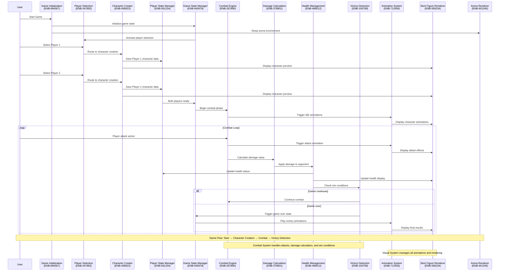

# Sequence Diagram

## Metadata
- **Type**: Sequence Diagram
- **Workspace**: stick figure fight
- **Generated**: 12/1/2025, 10:45:55 AM

## Diagram

```mermaid
sequenceDiagram
    participant User
    participant GameInit as Game Initialization<br/>(ENB-894567)
    participant PlayerSelect as Player Selection<br/>(ENB-347892)
    participant CharCreator as Character Creator<br/>(ENB-458923)
    participant PlayerState as Player State Manager<br/>(ENB-561234)
    participant GameState as Game State Manager<br/>(ENB-945678)
    participant Combat as Combat Engine<br/>(ENB-267890)
    participant Damage as Damage Calculation<br/>(ENB-378901)
    participant Health as Health Management<br/>(ENB-489012)
    participant Victory as Victory Detection<br/>(ENB-156789)
    participant Animation as Animation System<br/>(ENB-712456)
    participant Renderer as Stick Figure Renderer<br/>(ENB-590234)
    participant Arena as Arena Renderer<br/>(ENB-601345)

    User->>GameInit: Start Game
    GameInit->>GameState: Initialize game state
    GameInit->>Arena: Setup arena environment
    GameState->>PlayerSelect: Activate player selection

    User->>PlayerSelect: Select Player 1
    PlayerSelect->>CharCreator: Route to character creation
    CharCreator->>PlayerState: Save Player 1 character data
    CharCreator->>Renderer: Display character preview

    User->>PlayerSelect: Select Player 2
    PlayerSelect->>CharCreator: Route to character creation
    CharCreator->>PlayerState: Save Player 2 character data
    CharCreator->>Renderer: Display character preview

    PlayerState->>GameState: Both players ready
    GameState->>Combat: Begin combat phase
    Combat->>Animation: Trigger idle animations
    Animation->>Renderer: Display character animations

    loop Combat Loop
        User->>Combat: Player attack action
        Combat->>Animation: Trigger attack animation
        Animation->>Renderer: Display attack effects
        Combat->>Damage: Calculate damage value
        Damage->>Health: Apply damage to opponent
        Health->>PlayerState: Update health status
        Health->>Renderer: Update health display
        Health->>Victory: Check win conditions
        
        alt Game continues
            Victory->>Combat: Continue combat
        else Game over
            Victory->>GameState: Trigger game over state
            GameState->>Animation: Play victory animations
            Animation->>Renderer: Display final results
        end
    end

    Note over User, Arena: Game Flow: Start → Character Creation → Combat → Victory Detection
    Note over Combat, Victory: Combat System handles attacks, damage calculation, and win conditions
    Note over Animation, Renderer: Visual System manages all animations and rendering
```
