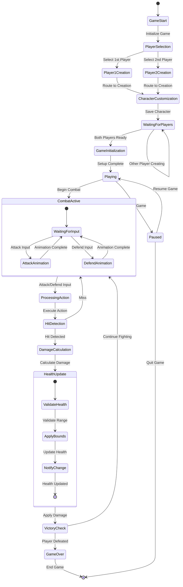

# State Diagram

## Metadata
- **Type**: State Diagram
- **Workspace**: stick figure fight
- **Generated**: 12/1/2025, 10:45:35 AM

## Diagram

```mermaid
stateDiagram-v2
    [*] --> GameStart
    
    GameStart --> PlayerSelection: Initialize Game
    
    PlayerSelection --> Player1Creation: Select 1st Player
    PlayerSelection --> Player2Creation: Select 2nd Player
    
    Player1Creation --> CharacterCustomization: Route to Creation
    Player2Creation --> CharacterCustomization: Route to Creation
    
    CharacterCustomization --> WaitingForPlayers: Save Character
    WaitingForPlayers --> WaitingForPlayers: Other Player Creating
    WaitingForPlayers --> GameInitialization: Both Players Ready
    
    GameInitialization --> Playing: Setup Complete
    
    Playing --> CombatActive: Begin Combat
    CombatActive --> ProcessingAction: Attack/Defend Input
    ProcessingAction --> HitDetection: Execute Action
    HitDetection --> DamageCalculation: Hit Detected
    HitDetection --> CombatActive: Miss
    
    DamageCalculation --> HealthUpdate: Calculate Damage
    HealthUpdate --> VictoryCheck: Apply Damage
    
    VictoryCheck --> GameOver: Player Defeated
    VictoryCheck --> CombatActive: Continue Fighting
    
    GameOver --> [*]: End Game
    
    Playing --> Paused: Pause Game
    Paused --> Playing: Resume Game
    Paused --> [*]: Quit Game
    
    state CombatActive {
        [*] --> WaitingForInput
        WaitingForInput --> AttackAnimation: Attack Input
        WaitingForInput --> DefendAnimation: Defend Input
        AttackAnimation --> WaitingForInput: Animation Complete
        DefendAnimation --> WaitingForInput: Animation Complete
    }
    
    state HealthUpdate {
        [*] --> ValidateHealth
        ValidateHealth --> ApplyBounds: Validate Range
        ApplyBounds --> NotifyChange: Update Health
        NotifyChange --> [*]: Health Updated
    }
```
